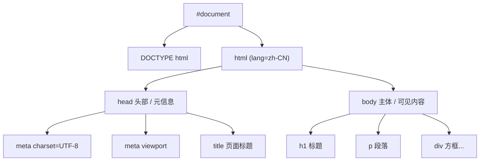

# 01 · 文档骨架（Document Structure）
> 每个 HTML 页面都有固定的「骨架」：DOCTYPE 声明 + html 根元素 + head 头部 + body 主体。理解它，是写一切网页的第一步。

## 📖 知识讲解

一个标准的 HTML5 文档由以下部分组成：

| 部分 | 作用 | 备注 |
| --- | --- | --- |
| `<!DOCTYPE html>` | 文档类型声明，让浏览器进入**标准模式**渲染 | 必须在第一行；不写会触发「怪异模式（quirks mode）」导致盒模型等表现异常 |
| `<html lang="zh-CN">` | 根元素，所有内容的容器 | `lang` 声明语言，利于无障碍、SEO、自动翻译 |
| `<head>` | 放**元信息**，不直接显示给用户 | 给浏览器和搜索引擎看 |
| `<body>` | 放**可见内容** | 一个文档只能有一个 body |

**head 里的常见标签：**

- `<meta charset="UTF-8">`：字符编码。**必须出现在 head 前 1024 字节内**，否则中文易乱码。
- `<title>`：页面标题，显示在浏览器标签页、收藏夹、搜索结果。
- `<meta name="viewport" content="width=device-width, initial-scale=1.0">`：移动端视口设置，**做响应式必备**。
- 其他常见：`<link rel="stylesheet">`（引样式）、`<meta name="description">`（SEO 描述）、`<link rel="icon">`（站点图标）。

**核心要点：**

- HTML 文档本质是一棵**树（DOM 树）**，`html` 是根，`head` 与 `body` 是它的两个直接子节点。
- 浏览器从上往下读 HTML，先解析 head 拿到编码/视口等信息，再渲染 body。

**易错点：**

- 漏写 `<!DOCTYPE html>` → 怪异模式，CSS 表现莫名其妙。
- `charset` 写在了很靠后的位置 → 中文乱码。
- 把可见内容误写进 `<head>`（如直接在 head 里写 `<p>`）→ 浏览器会把它「容错」挪到 body，但属于错误结构。

## 🔄 流程图 / 原理图

下图展示一个 HTML 文档解析后形成的文档树（DOM 树）结构：



## 💻 代码说明

```html
<!DOCTYPE html>          <!-- ① 第一行：进入标准渲染模式 -->
<html lang="zh-CN">      <!-- ② 根元素，声明中文 -->
<head>
  <meta charset="UTF-8" />                          <!-- ③ 编码，防乱码 -->
  <meta name="viewport" content="width=device-width, initial-scale=1.0" /> <!-- ④ 移动端适配 -->
  <title>01 · 文档骨架</title>                       <!-- ⑤ 标签页标题 -->
</head>
<body>
  <h1>...</h1>           <!-- ⑥ 可见内容写在 body 里 -->
</body>
</html>
```

demo 中用两个带虚线边框的方框（`.head` 蓝、`.body` 绿）来类比 head 与 body 的分工：head 的信息看不见但起作用，body 的内容才是用户看到的。

## ▶️ 运行方式

直接用浏览器打开本目录下的 `index.html` 即可（双击文件，或拖入浏览器窗口）。无需任何构建工具或服务器。

建议打开浏览器「开发者工具（F12）→ Elements/元素」面板，对照查看真实的 DOM 树。

## ⚠️ 常见坑 / 最佳实践

- ✅ `<!DOCTYPE html>` 永远写在第一行。
- ✅ `<meta charset="UTF-8">` 紧跟在 `<head>` 之后第一个写。
- ✅ 始终写 `lang` 属性（中文用 `zh-CN`）。
- ✅ 移动端项目务必加 `viewport` meta。
- ❌ 不要在 `<head>` 里放可见内容；不要省略 `</body></html>` 闭合标签。

## 🔗 官方文档

- [HTML 文档的基本结构 - MDN](https://developer.mozilla.org/zh-CN/docs/Learn/HTML/Introduction_to_HTML/Getting_started)
- [`<!DOCTYPE>` - MDN](https://developer.mozilla.org/zh-CN/docs/Glossary/Doctype)
- [`<html>` 元素 - MDN](https://developer.mozilla.org/zh-CN/docs/Web/HTML/Element/html)
- [`<head>` 元素 - MDN](https://developer.mozilla.org/zh-CN/docs/Web/HTML/Element/head)
- [`<meta>` 元素 - MDN](https://developer.mozilla.org/zh-CN/docs/Web/HTML/Element/meta)
