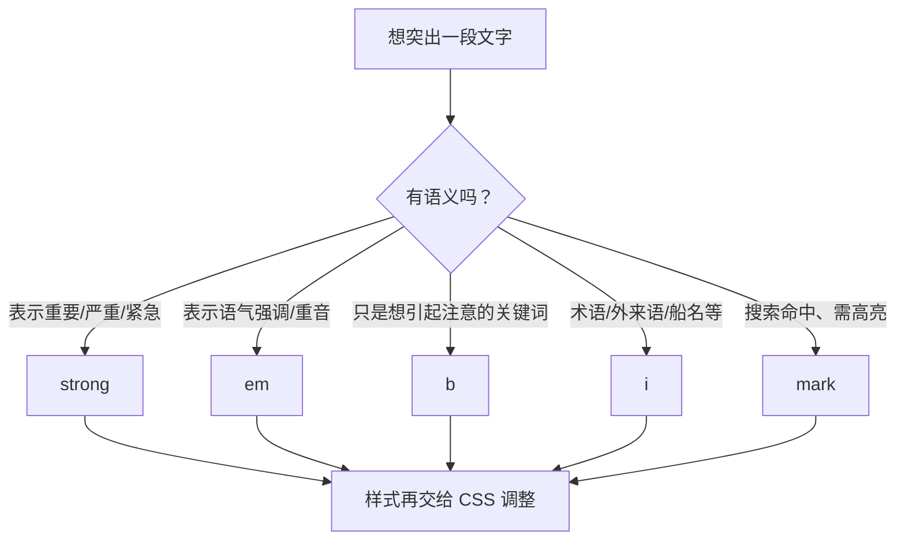

# 02 · 文本与语义（Text Semantics）
> HTML 文本标签的核心不是「让字变粗变斜」，而是用正确的标签表达内容的**含义（语义）**，样式交给 CSS。

## 📖 知识讲解

**标题 `<h1>`~`<h6>`：**

- 表示内容的**大纲层级**，h1 最重要，h6 最次要。
- 一个页面通常**只有一个 h1**；层级应**逐级使用**，不要为了字大跳级（如 h1 后直接 h4）。
- 标题的「大小」由 CSS 控制，不要用标题标签来调字号。

**段落与排版：**

- `<p>`：段落，块级元素，段落间天然有间距。
- `<br>`：强制换行，**空元素**（无内容、无闭合标签）。只在换行本身有意义时用（地址、诗歌）。**别用它来制造间距**——那是 CSS `margin` 的活。
- `<hr>`：主题性分隔（thematic break），表示话题转换，渲染为一条横线。

**语义强调 vs 纯视觉（重点）：**

| 标签 | 语义 | 默认样式 | 何时用 |
| --- | --- | --- | --- |
| `<strong>` | **重要 / 严重 / 紧急** | 加粗 | 内容真的「重要」时 |
| `<b>` | 无语义，仅引起注意 | 加粗 | 关键词、产品名等，无更合适语义标签时 |
| `<em>` | **着重强调 / 语气重音** | 斜体 | 需要强调语气时 |
| `<i>` | 无语义，仅视觉区分 | 斜体 | 术语、外来语、船名等 |

> 口诀：**能表达「重要/强调」就用 `strong`/`em`；只是单纯想变粗/斜才用 `b`/`i`。** 屏幕阅读器会对 strong/em 加重语气，对 b/i 不会。

**其他常用文本语义：**

- `<mark>`：高亮标记（默认黄底），表示与当前上下文相关、值得注意，如搜索命中词。
- `<small>`：附属细则，如版权、免责声明。
- `<sub>` / `<sup>`：下标 / 上标，如 H<sub>2</sub>O、E=mc<sup>2</sup>。

**易错点：**

- 用 `<br><br>` 拉开段落间距（应该用 `<p>` + CSS）。
- 滥用 `<b>`/`<i>` 代替 `<strong>`/`<em>`，丢失语义与无障碍价值。
- 用标题标签纯粹为了「字大一点」。

## 🔄 流程图 / 原理图

「我想强调一段文字」时如何选标签：



## 💻 代码说明

```html
<!-- 语义强调：屏幕阅读器会加重语气 -->
<p>请<strong>务必在午夜前提交</strong>。</p>   <!-- 重要 -->
<p>我是说<em>现在</em>就去。</p>               <!-- 语气强调 -->

<!-- 纯视觉：无强调语义 -->
<p><b>纯加粗</b> / <i>纯倾斜</i></p>

<!-- 高亮 / 细则 / 上下标 -->
<mark>高亮</mark>
<small>© 版权细则</small>
H<sub>2</sub>O 与 mc<sup>2</sup>
```

demo 把内容分成 4 个 `<section>`：标题层级、段落/br/hr、强调对比、mark/small/sub/sup，每段都有详细中文注释说明该标签的语义。

## ▶️ 运行方式

直接用浏览器打开本目录下的 `index.html` 即可，无需构建工具或服务器。

## ⚠️ 常见坑 / 最佳实践

- ✅ 用语义优先：`strong`/`em` 优于 `b`/`i`。
- ✅ 标题逐级使用，一页一个 `h1`。
- ✅ 段落间距用 CSS `margin`，不要用 `<br><br>`。
- ✅ `<br>`、`<hr>` 是空元素，写成 `<br>` 或 `<br />` 都行。
- ❌ 不要用标题标签调字号；不要用 `<mark>` 当普通背景色用。

## 🔗 官方文档

- [`<h1>`–`<h6>` 标题 - MDN](https://developer.mozilla.org/zh-CN/docs/Web/HTML/Element/Heading_Elements)
- [`<p>` 段落 - MDN](https://developer.mozilla.org/zh-CN/docs/Web/HTML/Element/p)
- [`<strong>` - MDN](https://developer.mozilla.org/zh-CN/docs/Web/HTML/Element/strong)
- [`<em>` - MDN](https://developer.mozilla.org/zh-CN/docs/Web/HTML/Element/em)
- [`<b>` - MDN](https://developer.mozilla.org/zh-CN/docs/Web/HTML/Element/b) ｜ [`<i>` - MDN](https://developer.mozilla.org/zh-CN/docs/Web/HTML/Element/i)
- [`<mark>` - MDN](https://developer.mozilla.org/zh-CN/docs/Web/HTML/Element/mark)
- [`<sub>` / `<sup>` - MDN](https://developer.mozilla.org/zh-CN/docs/Web/HTML/Element/sub)
