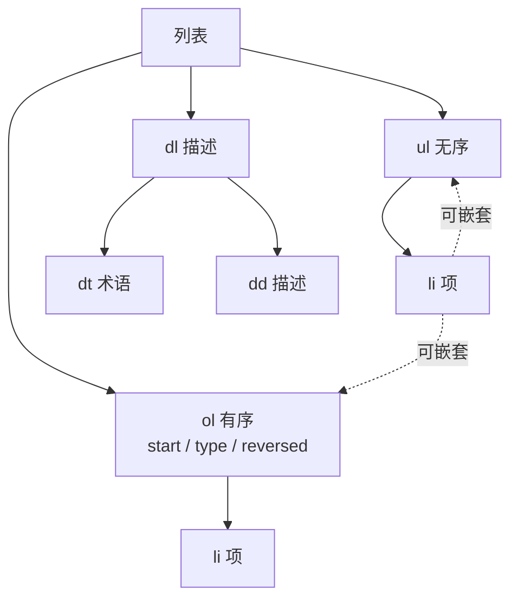

# 03 · 列表（Lists）
> HTML 提供三种列表：无序列表 `ul`、有序列表 `ol`、描述列表 `dl`。用对列表类型，能让内容结构清晰、对无障碍友好。

## 📖 知识讲解

**无序列表 `<ul>`（unordered list）：**

- 项目之间**没有先后顺序**，默认每项前面是圆点。
- 每一项用 `<li>`（list item）。
- `<ul>` / `<ol>` 的**直接子元素只能是 `<li>`**。

**有序列表 `<ol>`（ordered list）：**

- 项目**有先后顺序**，默认 1、2、3… 编号。
- 常用属性：

| 属性 | 作用 | 示例 |
| --- | --- | --- |
| `type` | 编号样式：`1`(数字)、`A`/`a`(字母)、`I`/`i`(罗马数字) | `<ol type="A">` |
| `start` | 起始编号 | `<ol start="5">` 从 5 开始 |
| `reversed` | 倒序编号（布尔属性） | `<ol reversed>` 用于排行榜倒数 |
| `value`（在 `<li>` 上） | 指定单个项的编号 | `<li value="10">` |

**描述列表 `<dl>`（description list）：**

- 用于**「名词—解释」成对**的内容，如术语表、键值对、问答。
- `<dt>` = term（术语/名称），`<dd>` = description（描述/解释）。
- 一个 `<dt>` 可以配**多个** `<dd>`；多个 `<dt>` 也可共享一个 `<dd>`。

**列表嵌套：**

- 子列表必须写在**父级 `<li>` 的内部**，而不是放在两个 `<li>` 之间。
- 三种列表可以互相嵌套（ul 里嵌 ol 等）。

**易错点：**

- 把内容直接放在 `<ul>` 下而不包 `<li>`（无效结构）。
- 嵌套时把子 `<ul>` 写在了 `<li>` 外面。
- 误把 `reversed`、`<ol>` 当样式工具——它们是**语义/语序**，视觉样式应由 CSS 决定。

## 🔄 流程图 / 原理图

三种列表的结构与各自子元素：



## 💻 代码说明

```html
<!-- 无序：圆点，无顺序 -->
<ul>
  <li>HTML</li>
  <li>CSS</li>
</ul>

<!-- 有序：可改起点/样式/倒序 -->
<ol type="A" start="5" reversed>
  <li>...</li>
</ol>

<!-- 描述：术语 + 解释 -->
<dl>
  <dt>HTML</dt>
  <dd>超文本标记语言</dd>
</dl>

<!-- 嵌套：子列表放在父 li 内部 -->
<ul>
  <li>前端
    <ul>
      <li>HTML</li>
    </ul>
  </li>
</ul>
```

demo 用 4 个 `<section>` 依次演示：无序列表、有序列表（含 `type`/`start`/`reversed` 三种变体）、描述列表、三层嵌套列表。

## ▶️ 运行方式

直接用浏览器打开本目录下的 `index.html` 即可，无需构建工具或服务器。

## ⚠️ 常见坑 / 最佳实践

- ✅ `<ul>`/`<ol>` 的直接子元素只放 `<li>`。
- ✅ 嵌套子列表写在父 `<li>` **内部**。
- ✅ 选列表类型看语义：有顺序用 `ol`，无顺序用 `ul`，名词解释用 `dl`。
- ✅ 列表的缩进、圆点样式用 CSS 调（`list-style`、`padding`），不要靠空格硬凑。
- ❌ 不要为了「让它有缩进」而滥用列表。

## 🔗 官方文档

- [`<ul>` 无序列表 - MDN](https://developer.mozilla.org/zh-CN/docs/Web/HTML/Element/ul)
- [`<ol>` 有序列表 - MDN](https://developer.mozilla.org/zh-CN/docs/Web/HTML/Element/ol)
- [`<li>` 列表项 - MDN](https://developer.mozilla.org/zh-CN/docs/Web/HTML/Element/li)
- [`<dl>` 描述列表 - MDN](https://developer.mozilla.org/zh-CN/docs/Web/HTML/Element/dl)
- [`<dt>` - MDN](https://developer.mozilla.org/zh-CN/docs/Web/HTML/Element/dt) ｜ [`<dd>` - MDN](https://developer.mozilla.org/zh-CN/docs/Web/HTML/Element/dd)
