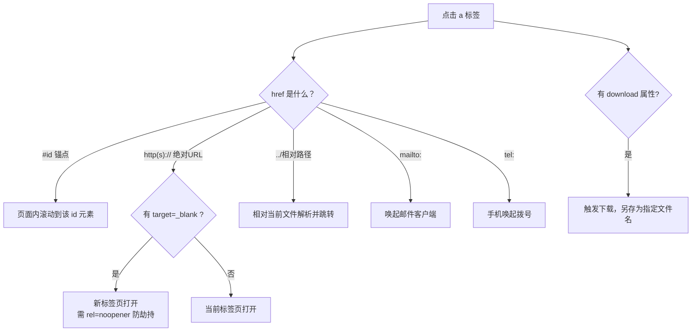

# 04 · 链接与锚点（Links & Anchors）
> `<a>` 是「超文本」的灵魂：它把页面连成网。本节讲清 href 路径、页内锚点、新窗口打开的安全写法、下载与 mailto/tel。

## 📖 知识讲解

**`<a>` 与 `href`：**

- `<a href="目标">链接文字</a>`，`href` 指定跳转目标。
- 链接文字应**有意义**（写「MDN 文档」而非「点这里」），利于无障碍与 SEO。

**href 的几种路径形式：**

| 形式 | 写法 | 含义 |
| --- | --- | --- |
| 绝对路径 | `https://example.com/a` | 完整 URL，指向任意站点 |
| 相对路径 | `../03-lists/index.html` | 相对**当前文件**定位（`../` 上一级、`./` 当前级） |
| 根相对路径 | `/img/logo.png` | 相对**网站根目录** |
| 页内锚点 | `#section1` | 跳到本页 `id="section1"` 的元素 |

**页内锚点（`#id`）：**

- 给目标元素加 `id`，再用 `<a href="#该id">` 即可点击跳转，常用于「目录导航」「回到顶部」。
- `href="#top"` 配合 `id="top"`；空 `href="#"` 会跳到页面顶部。
- CSS 伪类 `:target` 可高亮当前被锚点命中的元素；`scroll-margin-top` 避免跳转后标题贴住窗口顶。

**`target` 与安全的 `rel`：**

- `target="_blank"`：在**新标签页**打开。
- **务必加 `rel="noopener"`**：否则新页面能通过 `window.opener` 反向操纵原页面（钓鱼安全风险）。`noreferrer` 会额外隐藏来源页信息。
  - 现代浏览器对 `_blank` 已默认隐式 `noopener`，但**显式写更稳妥**，兼容老浏览器。

**`download`：**

- 让链接点击后**下载**而非打开；可给值作为默认文件名：`download="hello.txt"`。
- 注意：跨域资源的 `download` 文件名可能被浏览器忽略（同源限制）。

**协议链接：**

- `mailto:hello@example.com`：唤起邮件客户端，可带 `?subject=&body=`。
- `tel:+8613800138000`：手机上点击可直接拨号。

**易错点：**

- 用 `_blank` 却忘了 `rel="noopener"`（安全隐患）。
- 锚点 `href="#xxx"` 找不到对应 `id`（拼写不一致 / 大小写敏感）。
- 相对路径搞错层级（`../` 的数量算错）。

## 🔄 流程图 / 原理图

点击一个 `<a>` 后，浏览器如何根据 href 决定行为：



## 💻 代码说明

```html
<!-- 页内目录：跳到本页对应 id -->
<a href="#external">外部链接</a>

<!-- 新窗口打开 + 安全写法 -->
<a href="https://developer.mozilla.org/zh-CN/"
   target="_blank" rel="noopener noreferrer">MDN</a>

<!-- 相对路径，指向同工程其它文件 -->
<a href="../03-lists/index.html">上一节</a>

<!-- 下载：用 data URL 现场生成一个文本文件 -->
<a href="data:text/plain;charset=utf-8,Hello!" download="hello.txt">下载</a>

<!-- 协议链接 -->
<a href="mailto:hello@example.com">发邮件</a>
<a href="tel:+8613800138000">拨号</a>
```

demo 提供：① 顶部锚点目录导航；② 外链（同窗/新窗）与相对路径；③ 用 `data:` URL 现造文件演示 `download`（无需任何外部资源）；④ `mailto`/`tel`；⑤ 一段占位高块 + 「回到顶部」锚点，方便实际体验滚动跳转。`:target` 伪类会把被锚点命中的区块高亮成黄色。

## ▶️ 运行方式

直接用浏览器打开本目录下的 `index.html` 即可，无需构建工具或服务器。点击顶部目录可体验页内跳转，点击下载链接可体验 `download`。

## ⚠️ 常见坑 / 最佳实践

- ✅ `target="_blank"` 一定搭配 `rel="noopener"`（或 `noopener noreferrer`）。
- ✅ 链接文字写清楚含义，别用「点这里」。
- ✅ 锚点的 `href="#id"` 要和目标 `id` 完全一致（大小写敏感）。
- ✅ 用 `:target` + `scroll-margin-top` 优化锚点跳转体验。
- ❌ 跨域 `download` 文件名可能失效，别依赖它重命名外站资源。

## 🔗 官方文档

- [`<a>` 锚/链接元素 - MDN](https://developer.mozilla.org/zh-CN/docs/Web/HTML/Element/a)
- [`rel` 属性与 `noopener` - MDN](https://developer.mozilla.org/zh-CN/docs/Web/HTML/Attributes/rel/noopener)
- [`download` 属性 - MDN](https://developer.mozilla.org/zh-CN/docs/Web/HTML/Element/a#download)
- [`:target` 伪类 - MDN](https://developer.mozilla.org/zh-CN/docs/Web/CSS/:target)
- [URL 与路径（相对/绝对） - MDN](https://developer.mozilla.org/zh-CN/docs/Learn/Common_questions/Web_mechanics/What_is_a_URL)
