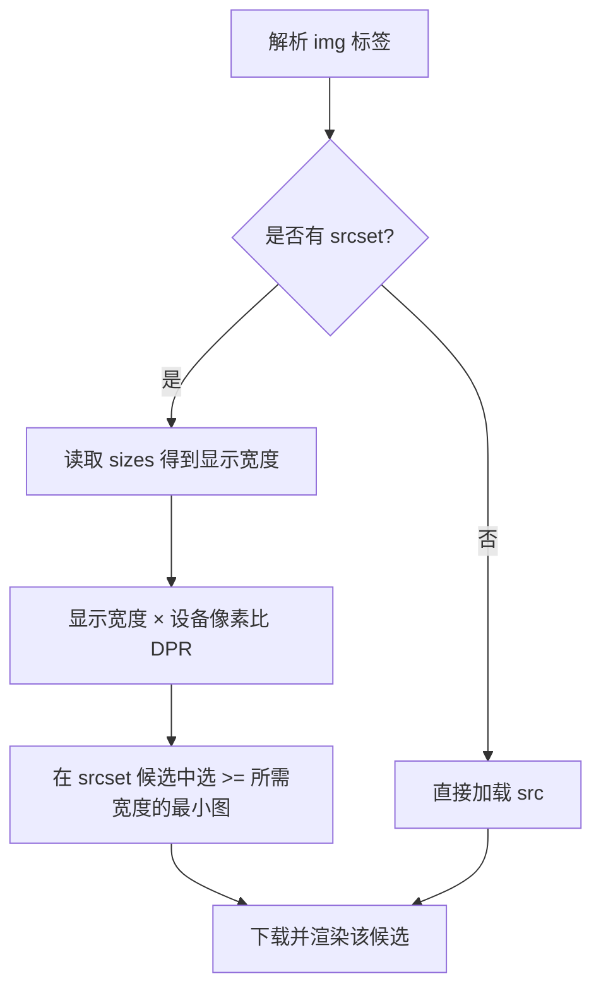

# 05 · 图片与配图（Images & Figure）
> 用 ``、响应式 `srcset/sizes`、`<picture>`、`<figure>` 在网页中正确、高效、无障碍地展示图片。

## 📖 知识讲解
对照 MDN，本模块覆盖四组核心能力：

### 1. `` 基础
- `src`：图片地址（必需）。
- `alt`：替代文本（**强烈建议必写**）。图片加载失败、屏幕阅读器朗读、纯文本环境时使用；装饰性图片可写 `alt=""` 显式表示“可忽略”。
- `width` / `height`：声明图片**固有尺寸**。浏览器据此提前预留版面，避免图片加载后内容跳动（降低 CLS / 累计布局偏移）。
- `loading="lazy"`：懒加载，图片接近视口时才下载，优化首屏性能。首屏关键图请用默认 `eager`，不要 lazy。

### 2. 响应式 `srcset` + `sizes`（同一张图、不同分辨率）
- `srcset` 用 **宽度描述符** `400w`（图片真实像素宽度）列出多个候选。
- `sizes` 描述图片在不同视口下的**显示宽度**（CSS 像素），如 `(max-width:600px) 100vw, 600px`。
- 浏览器结合 `sizes` + **设备像素比 DPR** 自动挑选最省流量又够清晰的候选，无需 JS。

### 3. `<picture>`（艺术指导 / 换格式）
- 内部多个 `<source>` 配 `media` 或 `type` 条件，浏览器从上到下取第一个匹配项。
- 末尾**必须**有一个 `` 作兜底，`alt` 写在这个 `` 上。
- 典型用途：宽屏用横构图、窄屏用方构图；或优先 `image/avif`、`image/webp`，旧浏览器回退 jpg。

### 4. `<figure>` + `<figcaption>`
- `<figure>` 是“图文一体”的独立语义单元（图片、图表、代码、引用都行）。
- `<figcaption>` 是它的标题/说明，放在 `<figure>` 内首或尾。
- 语义上二者绑定，可整体在文档中移动而不影响正文逻辑。

### 易错点
- `alt` 别写成“图片”“image”这类废话；要描述图片**内容/作用**。
- `srcset` 的 `w` 是图片真实宽度，不是显示宽度；显示宽度交给 `sizes`。
- `<picture>` 里 `srcset` 不要漏，`` 不能省。

## 🔄 流程图 / 原理图
浏览器对响应式图片的选择决策：

## 💻 代码说明
- **基础 img**：`width/height` + `loading="lazy"` 的组合，既稳布局又省流量。
- **内联 SVG**：用 `<linearGradient>` 定义渐变并 `fill="url(#g)"` 引用，整图不发任何网络请求。`role="img"` + `aria-label` 让 SVG 对屏幕阅读器可读。
- **srcset 段**：三档 `400w/800w/1200w` + `sizes="(max-width:600px) 100vw, 600px"`，改变窗口宽度刷新可见占位图上的文字切换。
- **picture 段**：`<source media="(min-width:600px)">` 宽屏横图，窄屏回退到 `` 的方图。
- **figure 段**：`` 与 `<figcaption>` 同属一个 `<figure>`，构成带说明的配图。

## ▶️ 运行方式
直接用浏览器打开本目录的 `index.html` 即可（无需任何构建或服务器）。建议拖动改变窗口宽度后刷新，观察响应式图片与 picture 的切换。

## ⚠️ 常见坑 / 最佳实践
- 始终为有信息量的图片写有意义的 `alt`；装饰图用 `alt=""`。
- 给 `` 加 `width`/`height`（或 CSS `aspect-ratio`）防止布局抖动。
- 首屏主图不要 `loading="lazy"`，否则反而拖慢 LCP。
- 用 `srcset` 优化分辨率，用 `<picture>` 切构图/格式，二者职责不同别混用。
- 占位图服务（placehold.co）仅用于教学；生产环境请自托管或用 CDN。

## 🔗 官方文档
- [`` — MDN](https://developer.mozilla.org/zh-CN/docs/Web/HTML/Element/img)
- [响应式图片 — MDN](https://developer.mozilla.org/zh-CN/docs/Web/HTML/Responsive_images)
- [`<picture>` — MDN](https://developer.mozilla.org/zh-CN/docs/Web/HTML/Element/picture)
- [`<figure>` — MDN](https://developer.mozilla.org/zh-CN/docs/Web/HTML/Element/figure)
- [`<figcaption>` — MDN](https://developer.mozilla.org/zh-CN/docs/Web/HTML/Element/figcaption)
