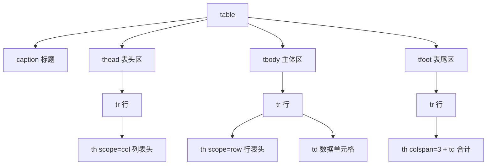

# 06 · 表格（Tables）
> 用语义化表格元素展示二维数据，并通过 `scope`、`caption` 让表格对屏幕阅读器无障碍可读。

## 📖 知识讲解
对照 MDN，表格的语义结构由一组配套元素组成：

| 元素 | 作用 |
| --- | --- |
| `<table>` | 表格根容器 |
| `<caption>` | 表格标题，应为 `<table>` 第一个子元素 |
| `<thead>` | 表头分区（列标题行） |
| `<tbody>` | 主体数据分区（可有多个） |
| `<tfoot>` | 表尾分区（合计/汇总） |
| `<tr>` | 表格行（table row） |
| `<th>` | 表头单元格（table header cell） |
| `<td>` | 数据单元格（table data cell） |

### 合并单元格
- `colspan="n"`：单元格**横向**跨越 n 列。
- `rowspan="n"`：单元格**纵向**跨越 n 行。
- 关键：被合并“占用”的相邻单元格要**删掉**，否则会多出一格导致错位。

### 无障碍：`scope`
- `<th scope="col">`：声明这是某**列**的表头。
- `<th scope="row">`：声明这是某**行**的表头。
- 屏幕阅读器据此把数据单元格和正确的行/列表头关联起来朗读。复杂表格还可用 `id` + `headers` 精确关联。

### 易错点
- `<caption>` 必须紧跟 `<table>` 开标签，放别处无效。
- 合并单元格后忘记删被占格 → 表格塌陷错位。
- 用表格做页面布局是反模式，表格只用于**表格型数据**。
- `border-collapse: collapse` 是 CSS，不是 HTML 属性；别用已废弃的 `border`/`cellpadding` HTML 属性。

## 🔄 流程图 / 原理图
表格元素的语义包含关系：

## 💻 代码说明
- **结构**：`caption → thead → tbody → tfoot`，浏览器即使源码顺序变动也会按语义渲染 tfoot 在底部，但建议按语义顺序书写。
- **列表头**：`thead` 里每个 `<th scope="col">` 标注“区域/Q1/Q2/小计”四列。
- **行表头**：每行第一格用 `<th scope="row">` 标注区域名。
- **rowspan**：`<th scope="row" rowspan="2">北方大区</th>` 让“北方大区”纵跨两行；紧接的第二行因此**少写一个单元格**。
- **colspan**：表尾 `<th scope="row" colspan="3">总计</th>` 横跨前三列，右侧 `<td>695</td>` 放合计值。
- **CSS**：`border-collapse: collapse` 合并边框；`thead/tbody/tfoot` 各自上色，直观展示语义分区。

## ▶️ 运行方式
直接用浏览器打开本目录的 `index.html` 即可，无需构建或服务器。

## ⚠️ 常见坑 / 最佳实践
- 表格仅用于展示数据，不要拿来做页面布局。
- 始终写 `<caption>` 和恰当的 `scope`，这是无障碍底线。
- 合并单元格后务必删除被占用的相邻 `<td>/<th>`。
- 用 CSS（`border-collapse`、`padding`、`nth-child`）做样式，别用废弃的表格 HTML 属性。
- 数值列可用 CSS `text-align: right` 对齐，便于比较（本 demo 为简洁未加）。

## 🔗 官方文档
- [`<table>` — MDN](https://developer.mozilla.org/zh-CN/docs/Web/HTML/Element/table)
- [`<caption>` — MDN](https://developer.mozilla.org/zh-CN/docs/Web/HTML/Element/caption)
- [`<th>`（含 scope）— MDN](https://developer.mozilla.org/zh-CN/docs/Web/HTML/Element/th)
- [`<td>`（含 colspan/rowspan）— MDN](https://developer.mozilla.org/zh-CN/docs/Web/HTML/Element/td)
- [HTML 表格无障碍入门 — MDN](https://developer.mozilla.org/zh-CN/docs/Learn/HTML/Tables/Advanced)
