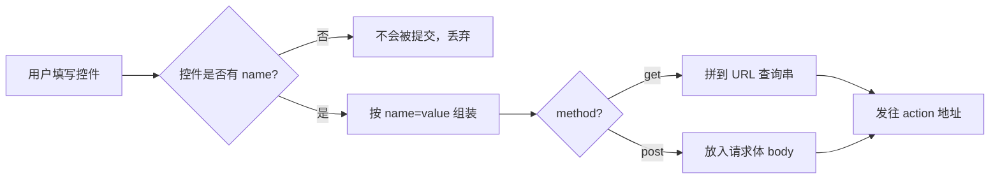

# 07 · 表单与输入控件（Forms & Inputs）
> 用 `<form>` 收集用户输入，掌握 `label` 关联、各类 `<input>`、`<select>`、`<textarea>`、`<button>` 以及 `name` 的提交机制。

## 📖 知识讲解
对照 MDN：

### `<form>`
- `action`：提交目标 URL。
- `method`：`get`（数据拼到 URL 查询串，适合幂等查询）或 `post`（数据放请求体，适合提交/含敏感数据）。
- **`name` 是关键**：只有带 `name` 的控件才会被提交；`name=value` 构成提交字段。

### `label` 关联（无障碍核心）
- 方式一：`<label for="控件id">` + 控件 `id`，二者相等即关联。
- 方式二：把控件直接嵌进 `<label>` 内部（隐式关联）。
- 关联后点击文字也能聚焦/勾选控件，并被屏幕阅读器正确朗读。

### 常用 `<input type>`
| type | 说明 |
| --- | --- |
| `text` | 单行文本 |
| `password` | 密码（显示为圆点） |
| `email` | 邮箱，带格式校验与邮箱键盘 |
| `number` | 数字，配 `min/max/step` |
| `radio` | 单选，**同组 `name` 相同**互斥，`value` 区分 |
| `checkbox` | 复选，可多选，同名多值提交 |
| `date` | 日期选择器 |
| `range` | 滑块，配 `min/max/value` |
| `color` | 取色器，值 `#RRGGBB` |
| `file` | 选文件，配 `accept` 限类型 |

### 其它控件
- `<textarea rows>`：多行文本（注意默认值写在标签**之间**，不是 `value` 属性）。
- `<select>` + `<option value>`：下拉，`value` 是提交值，`selected` 设默认。
- `<button type>`：`submit`（默认，提交）/ `reset`（重置）/ `button`（普通，需自绑事件）。

### 易错点
- 忘了写 `name` → 控件数据不会被提交。
- `radio` 同组 `name` 不一致 → 变成各自独立、无法互斥。
- `<label for>` 写成了 `name` 而非 `id` → 关联失败。
- `<button>` 默认 `type=submit`，在表单内点击会触发提交。

## 🔄 流程图 / 原理图
表单从输入到提交的数据流：

## 💻 代码说明
- **`<form action="#demo" method="get">`**：演示用，JS 拦截了真实提交。
- **`<fieldset>` + `<legend>`**：把控件按主题分组，提升可读性与无障碍。
- **`label for` ↔ `input id`**：每个文本/选择控件都成对关联。
- **radio 组**：`name="gender"` 统一，`value` 各异，`checked` 设默认。
- **checkbox 组**：`name="hobby"` 同名，勾多个即多值提交。
- **range 实时回显**：`oninput` 把滑块当前值写到旁边 ``。
- **底部脚本**：`e.preventDefault()` 阻止跳转，用 `new FormData(form)` 一次性收集所有 `name` 字段并在 `<output>` 回显，直观看到“哪些会被提交”。

## ▶️ 运行方式
直接用浏览器打开本目录的 `index.html` 即可。填写后点“提交”，下方 `<output>` 会列出将提交的 `name=value`；不写 `name` 的控件不会出现。

## ⚠️ 常见坑 / 最佳实践
- 每个可交互控件都配 `<label>`，这是无障碍底线。
- 给控件起有意义的 `name`，后端按 `name` 取值。
- 单选/复选用 `value` 表达“选了什么”，光靠 `checked` 不够。
- 敏感数据用 `method="post"`，不要用 `get`（会暴露在 URL 与历史记录）。
- `textarea` 的初始内容放标签之间，不能用 `value` 属性。

## 🔗 官方文档
- [`<form>` — MDN](https://developer.mozilla.org/zh-CN/docs/Web/HTML/Element/form)
- [`<input>` — MDN](https://developer.mozilla.org/zh-CN/docs/Web/HTML/Element/input)
- [`<label>` — MDN](https://developer.mozilla.org/zh-CN/docs/Web/HTML/Element/label)
- [`<select>` — MDN](https://developer.mozilla.org/zh-CN/docs/Web/HTML/Element/select)
- [`<textarea>` — MDN](https://developer.mozilla.org/zh-CN/docs/Web/HTML/Element/textarea)
- [`<button>` — MDN](https://developer.mozilla.org/zh-CN/docs/Web/HTML/Element/button)
