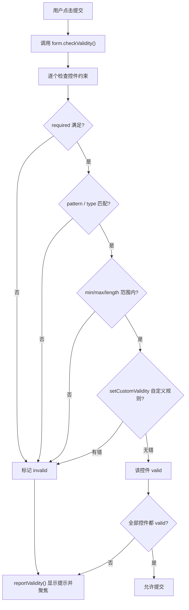

# 08 · 表单原生校验（Form Validation）
> 用 HTML5 内置约束属性 + `:valid/:invalid` 伪类 + Constraint Validation API，零依赖实现表单校验与实时反馈。

## 📖 知识讲解
对照 MDN：

### 内置约束属性
| 属性 | 作用 |
| --- | --- |
| `required` | 必填，为空即 invalid |
| `pattern="正则"` | 文本须匹配正则（隐含锚定整串） |
| `minlength` / `maxlength` | 文本长度下/上限 |
| `min` / `max` | 数值/日期范围 |
| `step` | 数值步进 |
| `type=email` / `type=url` / `type=number` | 类型本身自带格式校验 |

### `:valid` / `:invalid` 伪类
- 浏览器按控件当前校验状态自动匹配，可直接写 CSS 改边框色等。
- 体验技巧：`input:not(:placeholder-shown):invalid` —— 只有用户开始输入后才标红，避免“一进页面全红”。

### `novalidate`
- 放在 `<form>` 上会**关闭浏览器默认的提交拦截与错误气泡**。
- 适合“完全用 JS 接管校验/提示”的场景；此时需自行调用 `checkValidity()` / `reportValidity()`。

### Constraint Validation API（JS）
- `input.validity`：`ValidityState` 对象，含 `valid`、`valueMissing`、`patternMismatch`、`typeMismatch`、`rangeOverflow` 等布尔标志。
- `input.validationMessage`：浏览器生成的本地化错误文案。
- `input.setCustomValidity('msg')`：注入**自定义**错误（非空串=无效）；传 `''` 清除恢复有效。常用于“两次密码一致”等跨字段规则。
- `form.checkValidity()`：返回整体是否有效（不弹 UI）。
- `form.reportValidity()`：校验并聚焦/弹出第一个错误（带 UI）。

### 易错点
- `setCustomValidity` 设了错误信息后，**条件恢复时必须再调用 `setCustomValidity('')` 清除**，否则永远无效。
- `pattern` 是整串匹配，无需写 `^...$`。
- 前端校验只为体验，**不能替代后端校验**（可被绕过）。
- 加了 `novalidate` 就别指望浏览器自动拦截，要自己触发校验。

## 🔄 流程图 / 原理图
点击提交后的校验流程：

## 💻 代码说明
- **用户名**：`required` + `pattern="[A-Za-z0-9]{3,10}"` + `minlength/maxlength`，多重约束叠加。
- **邮箱/网址**：`type=email` / `type=url` 自带格式校验，邮箱再加 `required`。
- **年龄**：`type=number` + `min=18 max=60` 限定范围。
- **CSS `:valid/:invalid`**：配合 `:not(:placeholder-shown)`，输入后才显示红/绿边框。
- **`showHint()`**：读取 `input.validity.valid` 与 `input.validationMessage`，把本地化错误写到字段下方。
- **`setCustomValidity` 演示**：确认密码须等于 `123456`，否则注入自定义错误；满足时用 `setCustomValidity('')` 清除。
- **提交处理**：`form` 加了 `novalidate`，故在 `submit` 里手动 `checkValidity()`；通过则回显成功，否则 `reportValidity()` 聚焦首个错误。

## ▶️ 运行方式
直接用浏览器打开本目录的 `index.html` 即可。边输入边看边框颜色与下方红字提示；全部合法（确认密码填 `123456`）后点“注册”显示成功。

## ⚠️ 常见坑 / 最佳实践
- 前端校验提升体验，**服务端必须再校验一次**。
- `setCustomValidity` 用完别忘了用 `''` 清除，否则控件一直无效。
- 用 `:not(:placeholder-shown)` 等用户输入后再标红，体验更好。
- `pattern` 整串匹配，别多余加 `^$`；复杂规则配合 `title` 属性给提示。
- 需要完全自定义 UI/文案时用 `novalidate` + Constraint Validation API 接管。

## 🔗 官方文档
- [客户端表单校验 — MDN](https://developer.mozilla.org/zh-CN/docs/Learn/Forms/Form_validation)
- [Constraint Validation — MDN](https://developer.mozilla.org/zh-CN/docs/Web/HTML/Constraint_validation)
- [`ValidityState` — MDN](https://developer.mozilla.org/zh-CN/docs/Web/API/ValidityState)
- [`setCustomValidity()` — MDN](https://developer.mozilla.org/zh-CN/docs/Web/API/HTMLObjectElement/setCustomValidity)
- [`:valid` 伪类 — MDN](https://developer.mozilla.org/zh-CN/docs/Web/CSS/:valid)
- [`:invalid` 伪类 — MDN](https://developer.mozilla.org/zh-CN/docs/Web/CSS/:invalid)
