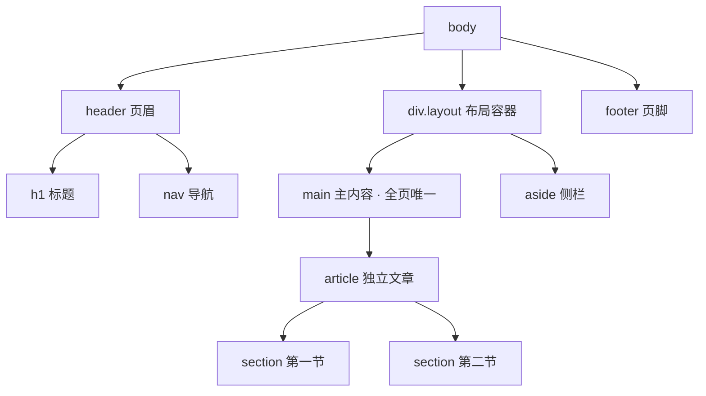

# 09 · 语义化布局标签（Semantic Layout Elements）
> 用 `header / nav / main / article / section / aside / footer` 等带含义的标签搭页面骨架，取代满屏无意义的 `
`，让机器和人都能读懂页面结构。

## 📖 知识讲解

HTML5 引入了一批**语义化区块标签**，它们本身在浏览器里没有特殊外观（除了 `display: block`），但名字本身表达了"这块内容是什么角色"。对照 MDN，核心标签如下：

| 标签 | 含义 | 关键规则 |
| --- | --- | --- |
| `<header>` | 页眉，放标题、logo、主导航 | 可出现多次（页面级、article 级） |
| `<nav>` | 主要导航链接区域 | 只标主导航，零散链接不必用 |
| `<main>` | 页面唯一主内容区 | **整个页面只能有一个** `main`，且不可嵌套在 article/aside 内 |
| `<article>` | 可独立分发、自成一体的内容 | 博客文章、评论、商品卡——拿出去单独看也成立 |
| `<section>` | 有主题的内容分段 | 通常应带一个标题（h2~h6） |
| `<aside>` | 与主内容相关但可独立的旁支 | 侧栏、广告、相关链接 |
| `<footer>` | 页脚，放版权、联系方式 | 同样可出现在 article 内部作为文章脚注 |

**article vs section 怎么选**：内容能"独立拿出去复用/分发"用 `article`；只是"文章内部的一个章节"用 `section`。判断口诀：能不能配一个独立标题且语义完整。

**易错点：**
- `<main>` 全页只能有一个，不能放进 `article`、`aside`、`header`、`footer` 里。
- `<section>` 不是"通用容器"，纯粹为布局/样式分组应该用 `
`，`section` 要有主题和标题。
- `<nav>` 不要包住页面里所有链接，只用于**主要导航块**。
- 语义标签不能替代 ARIA，但能减少手动加 `role` 的需要（如 `<nav>` 自带 `role="navigation"`）。

## 🔄 流程图 / 原理图

页面区块层级结构（本 demo 的 DOM 树）：

## 💻 代码说明

- `<header>` 内部嵌了 `<nav>`：页眉里放主导航是最常见的组合。
- `.layout` 是一个普通 `
` + flex：**纯布局用 div 是正确的**，不要为了用语义标签而滥用 `section`。
- `<main>` 内放 `<article>`，`article` 内再分 `<section>`：体现了"主内容 → 一篇独立文章 → 文章的若干章节"的层级。
- `<aside>` 与 `main` 并列：侧栏是旁支内容，放在 main 之外。
- CSS 里用 `::before { content: attr(data-tag) }` 把标签名打在每个区块角上，只是为了教学时看清结构，真实项目不需要。

## ▶️ 运行方式

直接用浏览器打开本目录下的 `index.html` 即可，无需任何构建或服务器。

## ⚠️ 常见坑 / 最佳实践

- 一个页面**只放一个 `<main>`**，且不嵌套在其它语义区块内。
- 别把 `<section>` 当 `
` 用：没有主题/标题就用 `
`。
- `<article>` 的判断标准是"可独立分发"，不要给所有内容块都套 article。
- 语义标签提升无障碍与 SEO，但不是样式工具——外观仍由 CSS 决定。
- `header` / `footer` 可以在 `article` 内部再出现一次（作为文章自己的页眉页脚）。

## 🔗 官方文档

- [HTML 元素参考（MDN 中文）](https://developer.mozilla.org/zh-CN/docs/Web/HTML/Element)
- [`<main>`（MDN 中文）](https://developer.mozilla.org/zh-CN/docs/Web/HTML/Element/main)
- [`<article>`（MDN 中文）](https://developer.mozilla.org/zh-CN/docs/Web/HTML/Element/article)
- [`<section>`（MDN 中文）](https://developer.mozilla.org/zh-CN/docs/Web/HTML/Element/section)
- [`<nav>`（MDN 中文）](https://developer.mozilla.org/zh-CN/docs/Web/HTML/Element/nav)
- [`<aside>`（MDN 中文）](https://developer.mozilla.org/zh-CN/docs/Web/HTML/Element/aside)
