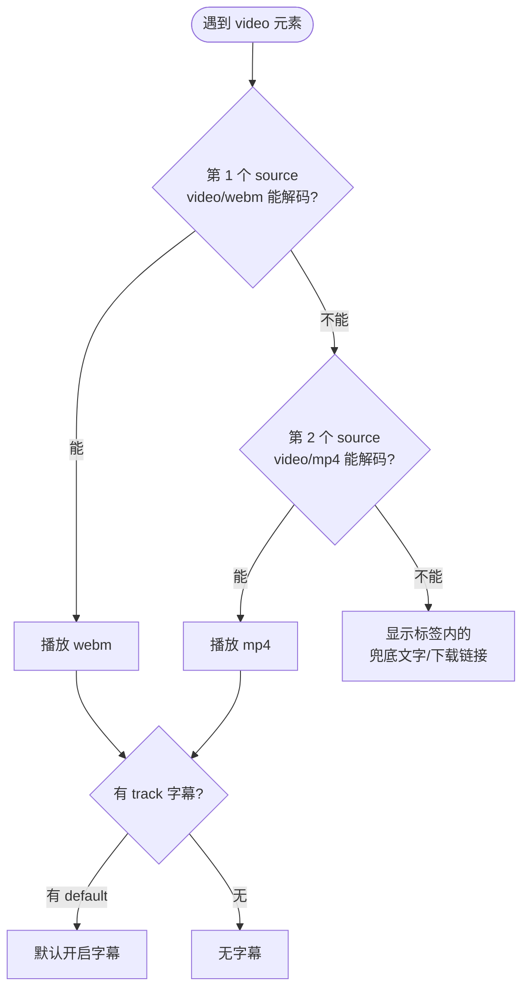

# 10 · 多媒体音视频（Audio & Video）
> 用 `<video>` / `<audio>` 在网页里原生播放音视频，配合 `<source>` 做多格式回退、`<track>` 加字幕，解决"不同浏览器支持的编码格式不同"和"无障碍"两大问题。

## 📖 知识讲解

`<video>` 和 `<audio>` 是 HTML5 的原生媒体元素，无需任何插件即可播放。对照 MDN，核心属性如下：

| 属性 | 作用 | 备注 |
| --- | --- | --- |
| `controls` | 显示浏览器自带的播放控制条 | 几乎必加，否则用户无法操作 |
| `autoplay` | 自动播放 | **必须配合 `muted`** 才会被多数浏览器允许 |
| `muted` | 静音 | 自动播放的前提 |
| `loop` | 循环播放 | 背景视频常用 |
| `poster` | 视频封面图（未播放时显示） | 仅 `<video>` 有 |
| `preload` | 预加载策略 | `none` / `metadata` / `auto` |
| `playsinline` | iOS 上内联播放而非强制全屏 | 移动端背景视频常用 |

**`preload` 三个值：**
- `none`：不预加载，最省流量，等用户点播放才下载。
- `metadata`：只加载时长、尺寸等元信息（默认推荐）。
- `auto`：浏览器可以预加载整段媒体。

**`<source>` 多格式回退**：把多个 `<source>` 放进 `<video>`，浏览器从上往下挑**第一个能解码的格式**。`type` 属性（如 `video/webm`、`video/mp4`）让浏览器无需下载就能判断能否播放。常见做法：webm 在前（开源、体积小），mp4 在后（兼容性最广）兜底。

**`<track>` 字幕**：指向一个 WebVTT（`.vtt`）文件，为视频提供字幕、说明或章节。`kind="subtitles"` 是字幕，`srclang` 是语言代码，`label` 是菜单显示名，`default` 表示默认开启。`<track>` 对无障碍和 SEO 都有帮助。

**易错点：**
- 只写 `autoplay` 不写 `muted`，浏览器会拦截自动播放。
- 不写 `controls`，用户没有任何播放按钮。
- `<source>` 顺序写反，把不常见格式放前面会增加回退开销。
- `<track>` 的 `.vtt` 文件如果跨域加载，需服务器允许 CORS，否则字幕不显示。

## 🔄 流程图 / 原理图

浏览器在多个 `<source>` 间选择可播放格式的流程：

## 💻 代码说明

- **第 1 个 demo**：`<video controls preload="metadata" poster="...">` 里放了 webm + mp4 两个 `<source>` 做回退，再加一个 `<track ... default>` 字幕轨，最后留一段兜底文字。
- **第 2 个 demo**：`<audio controls preload="none">` 用法与 video 一致，只是没有画面；`preload="none"` 表示点击前不下载。
- **第 3 个 demo**：`autoplay muted loop playsinline` 的组合，是"打开页面就静音循环自动播放"的标准写法，常用于背景视频。
- 所有媒体均使用 MDN 官方公开示例资源（`interactive-examples.mdn.mozilla.net`），可直接联网播放。

## ▶️ 运行方式

直接用浏览器打开本目录下的 `index.html` 即可（需要联网以加载 MDN 示例媒体）。若离线，可把 `src` 换成本地 `.mp4` / `.mp3` 文件路径。

## ⚠️ 常见坑 / 最佳实践

- 自动播放：`autoplay` 必须 + `muted`，否则被浏览器策略拦截。
- 始终为 `<video>`/`<audio>` 加 `controls`，给用户控制权。
- 提供多个 `<source>`（至少 mp4 兜底）保证跨浏览器可播。
- 用 `poster` 提升首屏体验，用 `preload="metadata"` 或 `none` 节省流量。
- 为视频配 `<track>` 字幕，提升无障碍可访问性。
- 跨域加载 `.vtt` 字幕需服务器配置 CORS。

## 🔗 官方文档

- [`<video>`（MDN 中文）](https://developer.mozilla.org/zh-CN/docs/Web/HTML/Element/video)
- [`<audio>`（MDN 中文）](https://developer.mozilla.org/zh-CN/docs/Web/HTML/Element/audio)
- [`<source>`（MDN 中文）](https://developer.mozilla.org/zh-CN/docs/Web/HTML/Element/source)
- [`<track>`（MDN 中文）](https://developer.mozilla.org/zh-CN/docs/Web/HTML/Element/track)
- [Web 视频与音频指南（MDN 中文）](https://developer.mozilla.org/zh-CN/docs/Web/Media/Audio_and_video_delivery)
