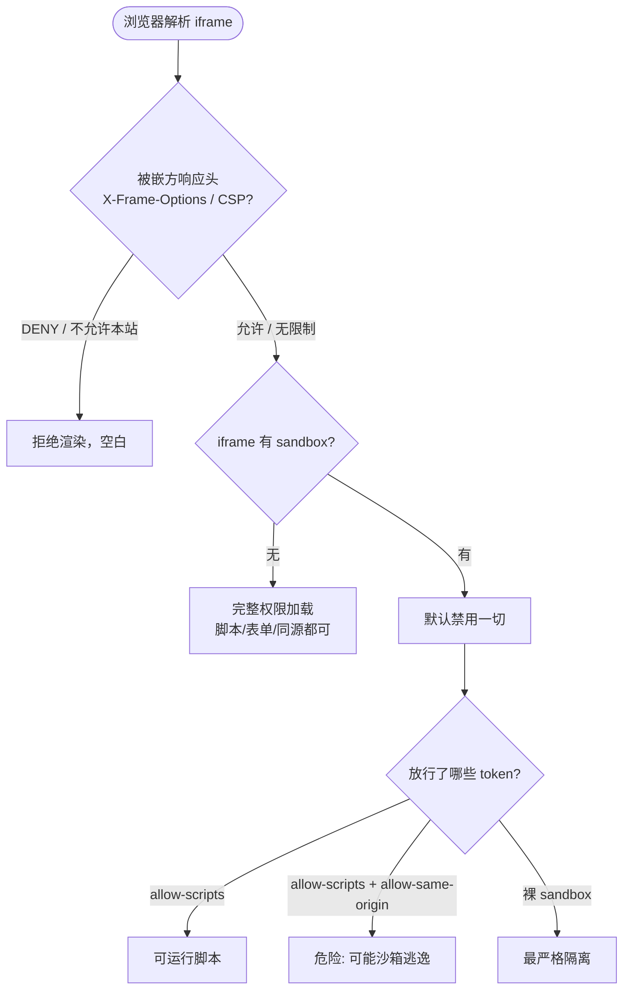

# 11 · 内嵌框架与安全（iframe & Embedding）
> 用 `<iframe>` 把另一个网页嵌进当前页面（地图、视频、第三方组件），并用 `sandbox`、`allow`、X-Frame-Options 等手段控制安全风险。

## 📖 知识讲解

`<iframe>`（inline frame）在页面里开一个独立的浏览上下文，加载另一个 HTML 文档。对照 MDN，核心属性：

| 属性 | 作用 | 备注 |
| --- | --- | --- |
| `src` | 要嵌入的页面地址 | 也可用 `srcdoc` 直接写内容字符串 |
| `width` / `height` | iframe 视口尺寸 | 也可用 CSS 控制 |
| `title` | 描述内嵌内容 | **无障碍必填**，供屏幕阅读器朗读 |
| `loading` | 加载时机 | `lazy` 懒加载，进视口附近才加载 |
| `allow` | 特性策略 | 控制嵌入页能否用地理位置、摄像头、全屏等 |
| `sandbox` | 安全沙箱 | 默认禁用一切，按需放行 |

**`sandbox` 是核心安全机制**：一旦写上 `sandbox`，iframe 默认被剥夺所有权限（脚本、表单、弹窗、同源、自动播放……），然后用空格分隔的 token 逐项放行：

| token | 放行的能力 |
| --- | --- |
| `allow-scripts` | 运行脚本 |
| `allow-forms` | 提交表单 |
| `allow-popups` | 弹出新窗口 |
| `allow-same-origin` | 把内容当作同源（可访问 Cookie/storage） |
| `allow-top-navigation` | 允许跳转顶层窗口 |

**安全红线**：`allow-scripts` 与 `allow-same-origin` **同时**开启时，被嵌页面的脚本可以移除自己的 sandbox 限制（逃逸），等于沙箱形同虚设。嵌入不可信内容时务必避免这个组合。

**X-Frame-Options / CSP frame-ancestors（响应头，防别人嵌你）**：这是**被嵌方**网站设置的 HTTP 响应头，用来防止自己被钓鱼网站套进 iframe（点击劫持）：
- `X-Frame-Options: DENY`：禁止任何页面嵌入。
- `X-Frame-Options: SAMEORIGIN`：只允许同源页面嵌入。
- 现代用 CSP 的 `frame-ancestors 'self' https://trusted.com` 替代，更灵活。

这也是为什么很多网站（如 Google、银行页）无法被 iframe 嵌入——它们设置了这个头。

**embed / object 简介**：更老的嵌入标签。`<embed>` 自闭合，无回退内容；`<object>` 可在标签内写回退内容。今天多被 `iframe`、`video`、`img` 取代，偶尔用于嵌 PDF。

**易错点：**
- 忘了 `title`，影响无障碍。
- 嵌不可信内容时同开 `allow-scripts` + `allow-same-origin`，导致沙箱逃逸。
- 想嵌某网站却空白——多半对方设了 `X-Frame-Options`，这是对方的限制，你改不了。

## 🔄 流程图 / 原理图

iframe 加载与 sandbox / X-Frame-Options 的安全决策：

## 💻 代码说明

- **demo 1**：用 OpenStreetMap 官方 `export/embed.html` 接口嵌入真实可交互地图，演示 `src`、`width/height`、`title`、`loading="lazy"`、`allow`。
- **demo 2**：`sandbox="allow-scripts"` + `srcdoc` 内联写内嵌页。脚本能跑（按钮可点），但因为没放行 `allow-same-origin`，脚本拿不到父页面的 Cookie/storage。
- **demo 3**：裸 `sandbox`（不带任何 token）+ `about:blank`，演示最严格的隔离。
- **demo 4**：文字讲解 `<embed>` / `<object>` 的用途与现代替代方案。

## ▶️ 运行方式

直接用浏览器打开本目录下的 `index.html` 即可（demo 1 的地图需要联网；其余沙箱演示离线也可运行）。

## ⚠️ 常见坑 / 最佳实践

- 始终给 `<iframe>` 加 `title`，满足无障碍。
- 嵌入第三方/不可信内容一律加 `sandbox`，按最小权限放行。
- **绝不**对不可信内容同时开 `allow-scripts` + `allow-same-origin`（会沙箱逃逸）。
- 用 `loading="lazy"` 让屏幕外 iframe 延迟加载，提升性能。
- 某网站嵌不进来通常是对方设了 `X-Frame-Options`/CSP，属正常安全策略。
- 自己的网站想防被人 iframe 套用，设置 `X-Frame-Options: SAMEORIGIN` 或 CSP `frame-ancestors`。

## 🔗 官方文档

- [`<iframe>`（MDN 中文）](https://developer.mozilla.org/zh-CN/docs/Web/HTML/Element/iframe)
- [`<embed>`（MDN 中文）](https://developer.mozilla.org/zh-CN/docs/Web/HTML/Element/embed)
- [`<object>`（MDN 中文）](https://developer.mozilla.org/zh-CN/docs/Web/HTML/Element/object)
- [X-Frame-Options（MDN 中文）](https://developer.mozilla.org/zh-CN/docs/Web/HTTP/Headers/X-Frame-Options)
- [CSP: frame-ancestors（MDN 中文）](https://developer.mozilla.org/zh-CN/docs/Web/HTTP/Headers/Content-Security-Policy/frame-ancestors)
