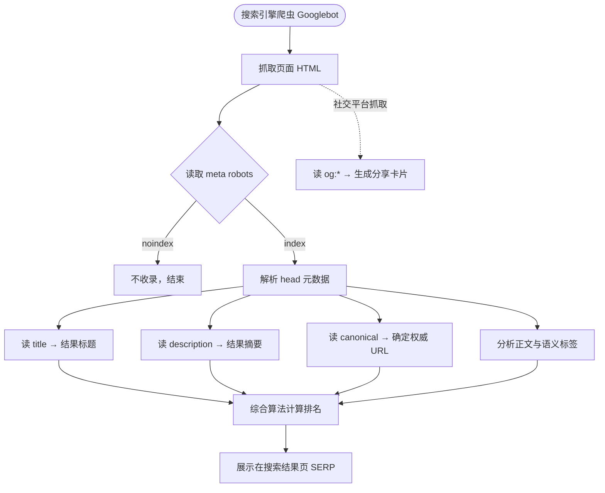

# 12 · 元数据与 SEO 基础（Metadata & SEO）
> `<head>` 里的元数据虽然用户看不见，却决定了搜索引擎怎么收录你、社交平台怎么展示你的分享卡片。掌握 `meta`、`title`、`link` 是 SEO 的第一步。

## 📖 知识讲解

`<head>` 装的是关于页面的"元信息"（metadata），不直接显示在正文里，但被浏览器、搜索引擎、社交平台读取。对照 MDN，核心元数据：

| 标签 | 作用 | SEO 重要度 |
| --- | --- | --- |
| `<meta charset="UTF-8">` | 字符编码，防中文乱码 | 必备（放最前面） |
| `<meta name="viewport">` | 移动端按设备宽度渲染 | 高（移动友好是排名因素） |
| `<title>` | 标签页标题 + 搜索结果大蓝标题 | **极高**（建议 < 60 字） |
| `<meta name="description">` | 搜索结果下方的摘要文字 | 高（建议 120~160 字，影响点击率） |
| `<meta name="keywords">` | 关键词 | 已基本无效，主流引擎忽略 |
| `<meta name="robots">` | 控制爬虫行为 | 高 |
| `<meta name="author">` | 作者 | 低 |

**`robots` 常用值**：`index`/`noindex`（是否收录本页）、`follow`/`nofollow`（是否跟踪页内链接）。例如 `noindex, nofollow` 让搜索引擎完全忽略本页。

**Open Graph（`og:*`）**：Facebook 提出、现已成为通用标准，控制页面被分享到社交平台（微信、Twitter、Slack 等）时的卡片样式。用 `property` 而非 `name`：
- `og:title` 卡片标题、`og:description` 卡片描述
- `og:image` 缩略图（建议 1200×630）、`og:type`（article/website）、`og:url` 规范地址

**`<link>` 系列：**
- `rel="canonical"`：规范链接。当同一内容有多个 URL（带参数、http/https、www/非 www）时，告诉搜索引擎"哪个是权威地址"，避免**重复内容**分散权重。
- `rel="icon"`：favicon，标签页/收藏夹小图标。

**易错点：**
- `charset` 没放在 `<head>` 最前面 → 可能乱码。
- 多个页面用相同 `<title>`/`description` → 搜索引擎判定为低质量。
- 误写 `noindex` 上线 → 整页从搜索结果消失。
- `og:image` 用相对路径 → 社交平台抓不到图，必须用绝对 URL。
- 把 SEO 寄托在 `keywords` 上 → 早已无效。

## 🔄 流程图 / 原理图

搜索引擎抓取、索引与排名中元数据扮演的角色：

## 💻 代码说明

本 demo 的核心在 `<head>`，正文只是把用到的标签列成一张表方便对照。关键片段：

- `<meta charset="UTF-8">` 放在 head 第一行，确保编码正确。
- `<title>` 与 `<meta name="description">` 一起决定搜索结果里的标题和摘要。
- `<meta name="robots" content="index, follow">` 显式允许收录与跟踪链接。
- 一组 `og:*` 标签（用 `property`）配置社交分享卡片，`og:image` 用了**绝对 URL**。
- `<link rel="canonical">` 声明本页权威地址。
- `<link rel="icon">` 用一个内联 SVG（emoji）做 favicon，免去外部图标文件。

## ▶️ 运行方式

直接用浏览器打开本目录下的 `index.html` 即可。重点是**右键"查看网页源代码"**，对照 head 里的注释逐条理解。

## ⚠️ 常见坑 / 最佳实践

- `<meta charset>` 必须在 head 最前面。
- 每个页面写**独一无二**的 `title` 和 `description`。
- 上线前检查没有误留 `noindex`。
- `og:image`、`canonical` 一律用**绝对 URL**。
- `keywords` 可不写，别指望它做 SEO。
- 配合语义化标签（见模块 09）和高质量内容，元数据才能发挥最大作用。

## 🔗 官方文档

- [`<meta>`（MDN 中文）](https://developer.mozilla.org/zh-CN/docs/Web/HTML/Element/meta)
- [`<head>`：文档元数据（MDN 中文）](https://developer.mozilla.org/zh-CN/docs/Web/HTML/Element/head)
- [`<title>`（MDN 中文）](https://developer.mozilla.org/zh-CN/docs/Web/HTML/Element/title)
- [`<link>`（MDN 中文）](https://developer.mozilla.org/zh-CN/docs/Web/HTML/Element/link)
- [在 HTML 中使用元数据（MDN 中文）](https://developer.mozilla.org/zh-CN/docs/Learn/HTML/Introduction_to_HTML/The_head_metadata_in_HTML)
