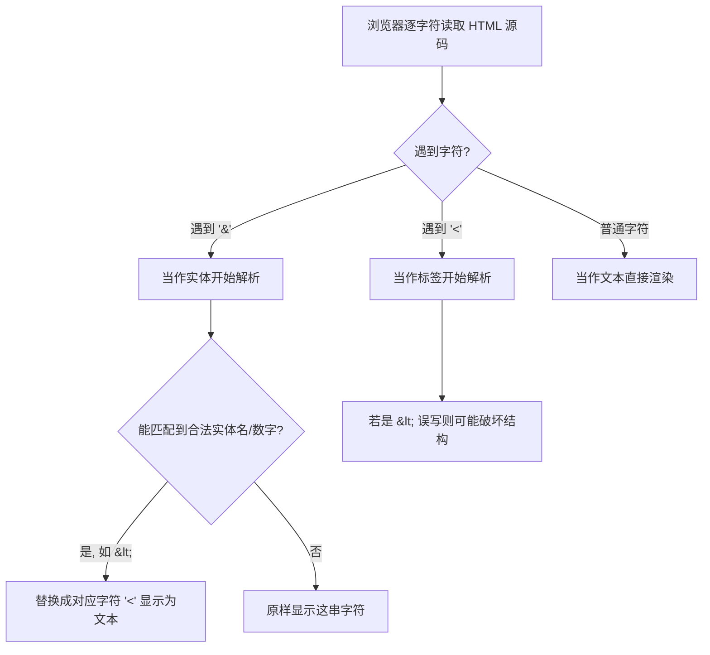

# 13 · HTML 实体字符（HTML Entities & Special Characters）
> 当你想在网页里“原样显示”那些对 HTML 有特殊含义的字符（比如 `<`、`>`、`&`）时，必须用实体转义；实体也是输入版权号 ©、不换行空格等符号的标准方式。

## 📖 知识讲解

HTML 解析器在读取源码时，会把某些字符当作“控制字符”而不是普通文字：

- `<`：标签的开始（如 `
`）。
- `>`：标签的结束。
- `&`：实体的开始（如 `&nbsp;`）。
- `"` 和 `'`：在属性值里用于包裹字符串。

如果你想把这些字符**当作文字内容显示出来**，就必须用“字符实体（character reference）”来转义。实体有三种写法：

| 写法 | 例子 | 说明 |
| --- | --- | --- |
| 命名实体 | `&lt;` `&amp;` `&copy;` | 好记，对照 MDN 实体表 |
| 十进制数字实体 | `&#169;` | `&#` + Unicode 码点（十进制）+ `;` |
| 十六进制数字实体 | `&#x00A9;` | `&#x` + 码点（十六进制）+ `;` |

核心必记的 5 个：

- `&lt;` → `<`
- `&gt;` → `>`
- `&amp;` → `&`
- `&quot;` → `"`
- `&nbsp;` → 不换行空格（non-breaking space）

**易错点：**
- `&nbsp;` 不只是“空格”，它还会阻止该处换行，并且**不会被浏览器合并**（普通空格连续多个会被压缩成一个）。
- `&` 本身必须写成 `&amp;`，否则 `&copy` 这种没分号的写法在某些情况下会被“宽容”解析，但规范上不可靠。
- 在 UTF-8 编码下，大部分符号（如 ©、♥、中文）其实可以直接打字输入，不一定要用实体；实体的**刚需场景是 `<`、`>`、`&` 这三个保留字符**。

## 🔄 流程图 / 原理图

## 💻 代码说明

`index.html` 关键点逐段说明：

1. 用一个 `<table>` 列出实体：**左列展示“源码写法”**。为了让左列能显示出 `&lt;` 这串字面文字，源码里要再转义一层，写成 `&amp;lt;`。这一“双层转义”是初学者最容易绕晕的地方。
2. `&nbsp;` 演示：`a&nbsp;&nbsp;&nbsp;b` 之间的三个空格会全部保留，而普通三个空格会被合并成一个。
3. 数字实体演示：`&#169;` 和 `&#x00A9;` 都渲染成 `©`，证明命名实体和数字实体是等价的。
4. 末尾 `<script>` 用 `textContent` 接收一段“危险用户输入” ``，浏览器会自动把它转义成纯文本而不执行——这正是实体转义在**防 XSS** 上的实际意义。

## ▶️ 运行方式

直接用浏览器打开本目录下的 `index.html` 即可，无需任何构建工具或服务器。

## ⚠️ 常见坑 / 最佳实践

- 输出**用户提供的内容**时永远要转义（用 `textContent` 或后端模板的自动转义），否则会有 XSS 风险。
- 不要滥用 `&nbsp;` 来做排版缩进/间距，那是 CSS（`margin`/`padding`/`gap`）的活；`&nbsp;` 只用于“逻辑上不该断开”的地方（如 `10&nbsp;kg`、`第&nbsp;1&nbsp;章`）。
- 记得加结尾的分号 `;`，省略分号是常见 bug。
- 页面顶部务必声明 `<meta charset="UTF-8">`，否则直接输入的符号/中文可能乱码。

## 🔗 官方文档

- [HTML 中的实体引用：特殊字符（MDN）](https://developer.mozilla.org/zh-CN/docs/Glossary/Entity)
- [HTML 入门 · 实体引用一节（MDN）](https://developer.mozilla.org/zh-CN/docs/Learn/HTML/Introduction_to_HTML/Getting_started#实体引用在_html_中包含特殊字符)
- [跨站脚本攻击 XSS（MDN）](https://developer.mozilla.org/zh-CN/docs/Glossary/Cross-site_scripting)
