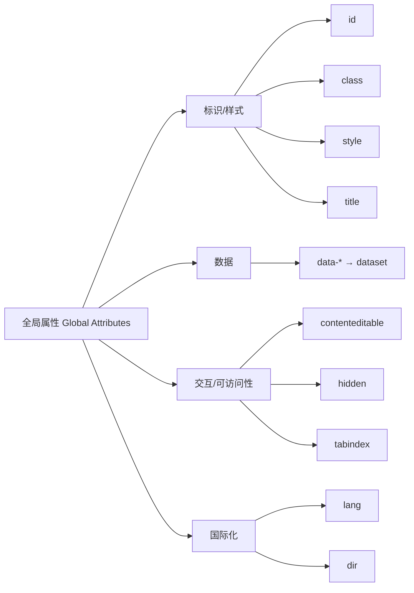

# 14 · 全局属性（Global Attributes）
> 全局属性是几乎所有 HTML 元素都能使用的“通用属性”，用来标识、样式化、附带数据、控制可访问性与交互行为。

## 📖 知识讲解

“全局属性”不属于某个特定标签，而是对所有元素都生效。常用的有：

- **id**：元素在整个文档中的**唯一**标识符，用于 CSS（`#id`）、JS（`getElementById`）、锚点跳转。
- **class**：可复用的分组标识，一个元素可有多个 class（空格分隔），是 CSS 选择的主力。
- **style**：行内样式（内联 CSS）。优先级高，但不利于维护，少用。
- **title**：鼠标悬停时显示的提示文字（tooltip）。
- **data-***：自定义数据属性。在 HTML 上挂任意业务数据，JS 通过 `element.dataset` 读取。`data-product-id` → `dataset.productId`（短横线转驼峰）。
- **contenteditable**：值为 `true` 时元素内容可被用户直接编辑。
- **hidden**：布尔属性，元素被隐藏（视觉与可访问性树都移除），等价于 `display:none` 的语义版。
- **tabindex**：控制键盘 Tab 聚焦。`0`=加入自然 Tab 顺序；`-1`=可脚本聚焦但不进 Tab 流；正数=自定义优先顺序（不推荐）。
- **lang**：标注该元素内容的语言（如 `lang="en"`），帮助翻译、朗读、断词。
- **dir**：文字方向，`ltr`（从左到右）/ `rtl`（从右到左）/ `auto`。

**易错点：**
- `id` 必须唯一，重复 id 会导致 `getElementById` 行为不可靠。
- `data-*` 的值永远是字符串，读出来要自己 `Number()` 转换。
- `tabindex` 用正数会破坏自然阅读顺序，造成可访问性灾难，实战几乎只用 `0` 和 `-1`。
- `hidden` 可以被 CSS `display` 覆盖（如 `[hidden]{display:flex}` 会让它重新显示），要小心。

## 🔄 流程图 / 原理图

## 💻 代码说明

`index.html` 分 5 个 section 演示：

1. **id/class/style/title**：一个 `
` 同时用了四者，悬停可见 `title` 提示。
2. **data-***：按钮挂了 `data-product-id` / `data-price` / `data-user-id`，点击后 JS 用 `prodBtn.dataset.productId` 等读取，注意短横线名变成了驼峰。
3. **contenteditable**：`
` 可直接编辑，`input` 事件实时统计字符数，演示读取编辑内容。
4. **hidden/tabindex**：按钮切换 `secret.hidden` 布尔值；三个 `` 用 `tabindex="1/2/3"` 演示 Tab 聚焦顺序被显式控制。
5. **lang/dir**：标注英文段落、演示 `dir="rtl"` 的右到左排版。

关键 JS：`element.dataset` 读自定义数据、监听 `input` 事件读 `contenteditable` 内容、直接赋值 `element.hidden` 控制显隐。

## ▶️ 运行方式

直接用浏览器打开本目录下的 `index.html` 即可，无需任何构建工具或服务器。

## ⚠️ 常见坑 / 最佳实践

- 优先用 `class` 配合外部 CSS，尽量避免行内 `style`。
- `data-*` 适合存“少量、与 DOM 绑定的”数据；大量/复杂状态应放在 JS 数据层。
- `contenteditable` 产生的是浏览器自带富文本，HTML 结构不可控，做正式富文本编辑器建议用成熟库。
- 可访问性优先：`tabindex` 用 `0`/`-1`，给非标准交互元素补 `role` 与 `aria-*`（见第 16 模块）。
- 凡是不同语言的局部内容，加上 `lang`，对屏幕阅读器发音很重要。

## 🔗 官方文档

- [全局属性（MDN）](https://developer.mozilla.org/zh-CN/docs/Web/HTML/Global_attributes)
- [data-* 自定义数据属性（MDN）](https://developer.mozilla.org/zh-CN/docs/Web/HTML/Global_attributes/data-*)
- [使用 dataset 操作 data-* （MDN）](https://developer.mozilla.org/zh-CN/docs/Web/API/HTMLElement/dataset)
- [contenteditable（MDN）](https://developer.mozilla.org/zh-CN/docs/Web/HTML/Global_attributes/contenteditable)
- [tabindex（MDN）](https://developer.mozilla.org/zh-CN/docs/Web/HTML/Global_attributes/tabindex)
