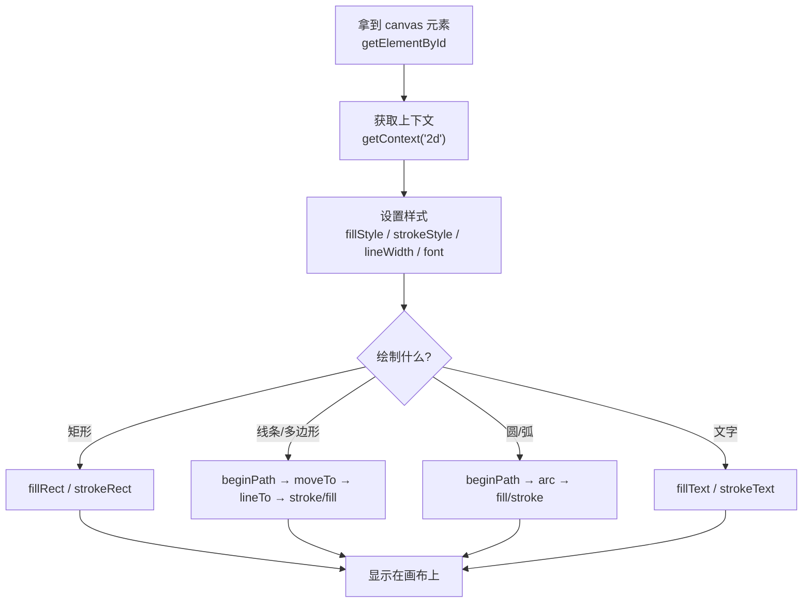

# 15 · Canvas 入门（Canvas Basics）
> `<canvas>` 提供一块可用脚本绘制的位图画布，常用于图表、游戏、图像处理、可视化等需要逐像素绘制的场景。

## 📖 知识讲解

`<canvas>` 元素本身只是一块“空白画布”，**所有图形都靠 JavaScript 调用 2D 上下文 API 绘制**。基本流程：拿元素 → 取上下文 → 设样式 → 调用绘制方法。

核心 API：

- `canvas.getContext('2d')`：获取 2D 绘图上下文对象 `ctx`，后续所有绘制都在它上面。
- **矩形（直接绘制，无需路径）：**
  - `ctx.fillRect(x, y, w, h)`：填充矩形。
  - `ctx.strokeRect(x, y, w, h)`：描边矩形。
  - `ctx.clearRect(x, y, w, h)`：擦除矩形区域。
- **路径（线、多边形、自由形状）：**
  - `ctx.beginPath()`：开始一条新路径。
  - `ctx.moveTo(x, y)`：抬笔移动到起点。
  - `ctx.lineTo(x, y)`：画线到某点。
  - `ctx.closePath()`：闭合路径。
  - `ctx.stroke()` / `ctx.fill()`：把当前路径描边 / 填充。
- **圆与弧：** `ctx.arc(x, y, r, startAngle, endAngle, anticlockwise?)`，角度单位是**弧度**，整圆是 `0` 到 `Math.PI*2`。
- **文字：** `ctx.fillText(text, x, y)` / `ctx.strokeText(...)`，配合 `ctx.font` 设置字体。
- **样式：** `ctx.fillStyle`（填充色）、`ctx.strokeStyle`（描边色）、`ctx.lineWidth`（线宽）。

**坐标系：** 原点 (0,0) 在左上角，x 向右、**y 向下**增大。

**易错点：**
- canvas 的尺寸要用 HTML 属性 `width`/`height` 设置（决定像素分辨率），用 CSS 设宽高只会**拉伸**画布导致变形/模糊。
- 画新形状前要 `beginPath()`，否则新路径会和上一条路径连在一起被一起描边。
- `arc` 的角度是弧度不是角度，`Math.PI` = 180°。
- `fillText` 的 `y` 是文字**基线**位置，不是顶部。

## 🔄 流程图 / 原理图

## 💻 代码说明

`index.html` 的 `<script>` 依次演示：

1. `getContext('2d')` 拿到上下文 `ctx`。
2. `fillRect` 画蓝色实心矩形、`strokeRect` 画红色描边矩形。
3. 路径折线：`beginPath` → `moveTo` 起点 → 两次 `lineTo` → `closePath` → `stroke`，演示路径绘制。
4. `arc(360,150,50,0,Math.PI*2)` 画整圆并 `fill`+`stroke`；又用 `arc(...,0,Math.PI)` 画半圆，说明弧度与 y 向下的关系。
5. `fillText` / `strokeText` 配合 `ctx.font` 写实心与描边文字。

每一段绘制前都重新设置 `fillStyle`/`strokeStyle`，并在画路径/圆前调用 `beginPath()`。

## ▶️ 运行方式

直接用浏览器打开本目录下的 `index.html` 即可，无需任何构建工具或服务器。

## ⚠️ 常见坑 / 最佳实践

- 用 `width`/`height` 属性设分辨率；高清屏可把属性设为 CSS 尺寸的 `devicePixelRatio` 倍再 `ctx.scale` 以防模糊。
- 每次画独立形状前 `beginPath()`，避免路径粘连。
- canvas 是位图，画完即“烤”进像素，要修改只能擦除重画（动画用 `clearRect` + `requestAnimationFrame`）。
- canvas 内容对屏幕阅读器不可见，重要信息要用 `<canvas>` 内的后备文本或旁边的可访问描述（见第 16 模块）。

## 🔗 官方文档

- [Canvas API（MDN）](https://developer.mozilla.org/zh-CN/docs/Web/API/Canvas_API)
- [Canvas 教程：绘制图形（MDN）](https://developer.mozilla.org/zh-CN/docs/Web/API/Canvas_API/Tutorial/Drawing_shapes)
- [CanvasRenderingContext2D（MDN）](https://developer.mozilla.org/zh-CN/docs/Web/API/CanvasRenderingContext2D)
- [arc() 方法（MDN）](https://developer.mozilla.org/zh-CN/docs/Web/API/CanvasRenderingContext2D/arc)
