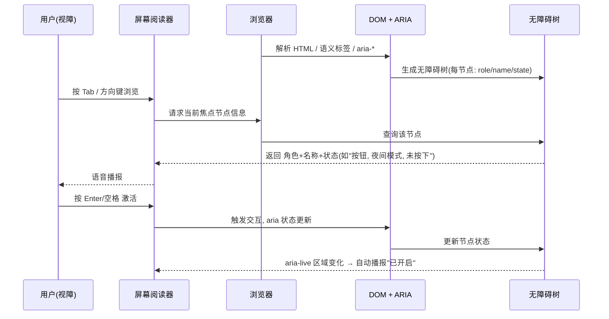

# 16 · 无障碍 a11y 与 ARIA（Accessibility & ARIA）
> 无障碍（accessibility，简称 a11y）让残障用户（视障、听障、肢体障碍等）也能正常使用网页；ARIA 属性在原生语义不够用时，为辅助技术补充“角色、状态、名称”等信息。

## 📖 知识讲解

辅助技术（最典型是**屏幕阅读器** screen reader）不看页面的视觉外观，而是读取浏览器根据 DOM 生成的**无障碍树（accessibility tree）**。我们写的语义化标签和 ARIA 属性，决定了这棵树里每个节点的“角色 role / 名称 name / 状态 state”。

**做无障碍的优先级（第一法则）：能用原生语义就别用 ARIA。**

核心要点：

- **语义化标签**：`<header> <nav> <main> <button> <a> <input>` 等天生带角色和键盘行为。用 `
` 模拟按钮则一切都得自己补。
- **图片 `alt`**：有信息的图片写描述性 `alt`；纯装饰图片写 `alt=""`（空 alt，让读屏跳过）。
- **表单 `label`**：`<label for="id">` 与 `<input id="id">` 关联，点击标签即聚焦，读屏会念出标签名。
- **ARIA 属性：**
  - `role`：定义元素角色，如 `role="button"`、`role="img"`。
  - `aria-label`：直接给元素一个可访问名称（文字）。
  - `aria-labelledby`：用**其他元素的 id**作为名称来源。
  - `aria-describedby`：关联补充描述（如输入提示、错误信息）。
  - `aria-hidden="true"`：把元素从无障碍树移除（如纯装饰图标/emoji）。
  - `aria-pressed` / `aria-expanded` / `aria-checked`：表达组件状态。
  - `aria-live`：动态区域，内容变化时自动播报（`polite` 排队播报、`assertive` 立即打断）。
- **键盘可达性**：所有可交互元素都要能用键盘操作。`tabindex="0"` 让自定义元素可 Tab 聚焦；自定义按钮要手动监听 Enter/空格。聚焦轮廓（`:focus-visible` 的 outline）**不要去掉**。
- **对比度**：文字与背景颜色对比度要足够（WCAG 标准：正文至少 4.5:1，大字至少 3:1），否则弱视用户看不清。

**易错点：**
- `outline: none` 去掉聚焦框是常见可访问性事故。
- 用 `
`/`` 当按钮却忘了 `role` + `tabindex` + 键盘事件。
- `aria-label` 会**覆盖**元素内的可见文字作为名称，乱用会让读屏念错。
- 装饰性 emoji/图标要 `aria-hidden="true"`，否则读屏会念出无意义内容。

## 🔄 流程图 / 原理图

## 💻 代码说明

`index.html` 做了一个无障碍优化的小页面：

1. **语义地标**：`<header>/<nav>/<main>`，`<nav aria-label="主导航">` 给导航命名，读屏可快速跳转。
2. **表单关联**：`<label for="username">` ↔ `<input id="username">`；`aria-describedby="nameHint"` 把提示文字关联给输入框。
3. **自定义开关按钮**：用 `
` 模拟，补齐 `role="button"`、`tabindex="0"`、`aria-pressed`、`aria-label`；JS 里 `click` + `keydown`(Enter/空格) 都能触发，状态变化同步 `aria-pressed` 与 `aria-live` 区域文字（读屏自动播报“开启/关闭”）。
4. **替代文本**：内联 SVG 笑脸用 `role="img"` + `aria-label` 提供 alt；装饰 emoji 🌙 用 `aria-hidden="true"`。
5. **聚焦样式**：`.switch:focus-visible` 保留明显蓝色轮廓，保证键盘用户看得到焦点。
6. `.visually-hidden` 工具类：视觉隐藏但读屏可读，用于补充屏幕外标题。

## ▶️ 运行方式

直接用浏览器打开本目录下的 `index.html` 即可。建议用 Tab 键遍历、用系统自带读屏（macOS VoiceOver: Cmd+F5；Windows: Narrator）体验播报效果。

## ⚠️ 常见坑 / 最佳实践

- **第一法则**：优先用原生语义标签（`<button>`、`<a>`、`<input>`），它们自带角色和键盘支持，ARIA 只在原生不够时补充。
- 绝不要 `outline:none` 删掉聚焦框；要改样式就用 `:focus-visible` 自定义。
- 所有可交互的自定义元素都要可键盘操作（Tab 到达 + Enter/空格激活）。
- 图片按用途写 alt：信息图写描述、装饰图写 `alt=""`。
- 注意颜色对比度，别只靠颜色传达信息（如只用红绿表示对错，色盲用户分不清）。
- 用浏览器 DevTools 的 Accessibility 面板 / Lighthouse 检查无障碍评分。

## 🔗 官方文档

- [无障碍（MDN 学习区）](https://developer.mozilla.org/zh-CN/docs/Learn/Accessibility)
- [ARIA（MDN）](https://developer.mozilla.org/zh-CN/docs/Web/Accessibility/ARIA)
- [WAI-ARIA 基础（MDN）](https://developer.mozilla.org/zh-CN/docs/Learn/Accessibility/WAI-ARIA_basics)
- [img 元素的 alt 属性（MDN）](https://developer.mozilla.org/zh-CN/docs/Web/HTML/Element/img#alt)
- [使用 tabindex 实现键盘可达（MDN）](https://developer.mozilla.org/zh-CN/docs/Web/HTML/Global_attributes/tabindex)
