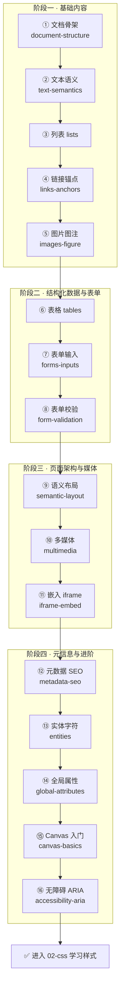

# 01 · HTML 超文本标记语言（HyperText Markup Language）

> HTML 是构建一切网页的基石：它用「标签」描述内容的**结构与语义**（这是标题、那是段落、这是一张图、那是一个表单），浏览器据此把纯文本渲染成可阅读、可交互、可被搜索引擎和屏幕阅读器理解的页面。

本工程对照 [MDN Web Docs（中文）](https://developer.mozilla.org/zh-CN/docs/Web/HTML) 的官方学习路线，把 HTML 拆成 16 个由易到难的小模块，每个模块一个可直接在浏览器打开的最小 demo + 一份中文讲解 README。

---

## 📚 HTML 是什么

- **超文本（HyperText）**：通过 `<a>` 超链接把文档互相连接，构成 Web。
- **标记（Markup）**：用一对对「标签」（如 `
...
`）包裹内容，赋予其含义。
- **语义优先**：现代 HTML 强调「用正确的标签做正确的事」——`<button>` 就该是按钮，`<nav>` 就该是导航。语义化让代码可维护、利于 SEO、对无障碍友好。
- **三剑客分工**：HTML 管**结构/内容**，CSS 管**样式/表现**，JavaScript 管**行为/交互**。本工程只聚焦 HTML。

---

## 🗂️ 模块索引

| 序号 | 模块 | 知识点 | 关键标签 / API |
| --- | --- | --- | --- |
| 01 | [document-structure](./01-document-structure/) | 文档骨架 | `<!DOCTYPE>` `html` `head` `body` |
| 02 | [text-semantics](./02-text-semantics/) | 文本语义 | `h1`~`h6` `p` `strong` `em` `br` `hr` `mark` |
| 03 | [lists](./03-lists/) | 列表 | `ul` `ol` `li` `dl` `dt` `dd` |
| 04 | [links-anchors](./04-links-anchors/) | 链接与锚点 | `a` `href` `target` `download` 锚点 `#id` |
| 05 | [images-figure](./05-images-figure/) | 图片与图注 | `img` `srcset` `sizes` `picture` `figure` `figcaption` |
| 06 | [tables](./06-tables/) | 表格 | `table` `thead` `tbody` `th` `colspan` `rowspan` |
| 07 | [forms-inputs](./07-forms-inputs/) | 表单与输入 | `form` `input` `label` `select` `textarea` `button` |
| 08 | [form-validation](./08-form-validation/) | 表单校验 | `required` `pattern` `type` `:valid` 约束校验 API |
| 09 | [semantic-layout](./09-semantic-layout/) | 语义化布局 | `header` `nav` `main` `article` `section` `aside` `footer` |
| 10 | [multimedia](./10-multimedia/) | 音视频多媒体 | `audio` `video` `source` `track` |
| 11 | [iframe-embed](./11-iframe-embed/) | 内联框架与嵌入 | `iframe` `sandbox` `embed` `object` |
| 12 | [metadata-seo](./12-metadata-seo/) | 元数据与 SEO | `meta` `title` `link` `viewport` Open Graph |
| 13 | [entities-special-chars](./13-entities-special-chars/) | 实体与特殊字符 | `&nbsp;` `&lt;` `&amp;` `&copy;` `&#数字;` |
| 14 | [global-attributes](./14-global-attributes/) | 全局属性 | `id` `class` `data-*` `contenteditable` `title` `hidden` |
| 15 | [canvas-basics](./15-canvas-basics/) | Canvas 绘图入门 | `canvas` `getContext('2d')` `fillRect` `arc` |
| 16 | [accessibility-aria](./16-accessibility-aria/) | 无障碍与 ARIA | `alt` `label` `role` `aria-*` `tabindex` |

---

## 🧭 学习路线

> 建议顺序：**01→16 由易到难**。前 5 个模块掌握「写出有语义的内容」；06~08 学会承载结构化数据与用户输入；09~11 搭建完整页面与媒体；12~16 补齐元信息、字符、属性、绘图与无障碍。

---

## ▶️ 运行方式

本工程**纯免构建**，无需 npm、无需任何打包工具：

1. 进入任意模块目录（如 `01-document-structure/`）。
2. **直接用浏览器双击打开 `index.html`** 即可看到效果。
3. 配合 README.md 阅读中文讲解、Mermaid 流程图与常见坑。

> 提示：少数模块（如多媒体、iframe、Canvas）涉及网络资源或 JS，建议用 VS Code 的 **Live Server** 插件或任意本地静态服务器打开，体验更稳定（避免个别浏览器对 `file://` 协议的限制）。

---

## 🔗 官方文档

- HTML 总览：<https://developer.mozilla.org/zh-CN/docs/Web/HTML>
- HTML 元素参考：<https://developer.mozilla.org/zh-CN/docs/Web/HTML/Element>
- HTML 学习教程：<https://developer.mozilla.org/zh-CN/docs/Learn/HTML>
- W3C HTML 规范：<https://html.spec.whatwg.org/>
