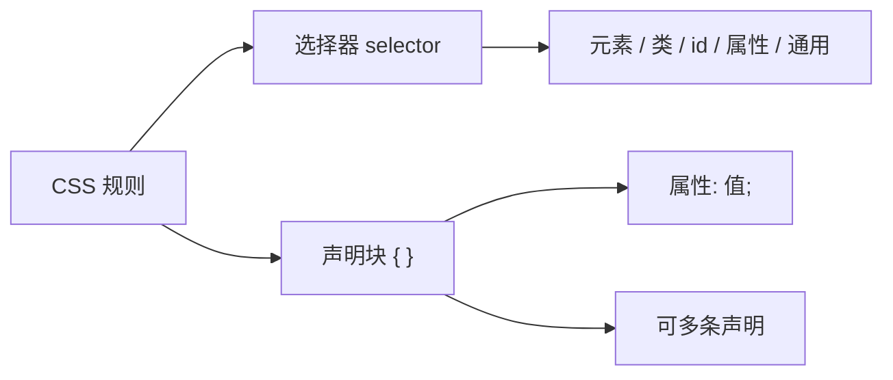

# 01 · 语法与基础选择器（Syntax & Basic Selectors）
> CSS 通过「选择器 + 声明块」把样式绑定到 HTML 元素上；本模块讲清楚 CSS 的语法骨架、引入方式与最常用的基础选择器。

## 📖 知识讲解

### CSS 规则的基本结构
一条 CSS 规则由 **选择器（selector）** 和 **声明块（declaration block）** 组成：

```css
选择器 {
  属性: 值;   /* 一条声明 declaration */
  属性: 值;
}
```

- **选择器**：决定这条规则作用在哪些元素上。
- **声明块**：用 `{}` 包裹，内部是若干 `属性: 值;`，每条声明以分号 `;` 结尾（最后一条也建议加，方便后续追加）。
- **属性（property）**：如 `color`、`font-size`，是英文 API。
- **值（value）**：属性的取值，如 `red`、`16px`。

### 三种引入方式

| 方式 | 写法 | 优先级 | 适用场景 |
| --- | --- | --- | --- |
| 外链样式表 | `<link rel="stylesheet" href="style.css">` | 普通 | 推荐，结构与样式分离、可缓存复用 |
| 内嵌样式 | `<style> ... </style>` 放在 `<head>` | 普通 | 单页 demo / 教学 |
| 行内样式 | `<p style="color:red">` | 最高（1,0,0,0） | 临时覆盖，应尽量少用 |

### 注释
CSS 只有块注释一种：`/* 这是注释 */`，**没有** `//` 单行注释。

### 基础选择器一览

| 选择器 | 语法 | 含义 |
| --- | --- | --- |
| 通用选择器 | `*` | 命中所有元素（权重为 0，慎用于全局重置） |
| 元素/类型选择器 | `p`、`div` | 按标签名命中 |
| 类选择器 | `.note` | 命中 `class="note"` 的元素，可复用、可多个 |
| id 选择器 | `#msg` | 命中 `id="msg"` 的元素，**页面内 id 必须唯一** |
| 属性选择器 | `[attr]` 等 | 按属性是否存在/取值命中 |
| 选择器列表 | `a, b, c` | 逗号分组，多个选择器共享一套声明 |

### 属性选择器的子类型

| 写法 | 含义 | 例子命中 |
| --- | --- | --- |
| `[href]` | 含有 href 属性 | 任何带 href 的元素 |
| `[type="text"]` | 属性值完全等于 | `type="text"` |
| `[href^="https"]` | 以指定值**开头**（^ 联想“开始”） | `https://...` |
| `[href$=".pdf"]` | 以指定值**结尾**（$ 联想“结束”） | `a.pdf` |
| `[href*="mdn"]` | **包含**指定子串 | `...mdn...` |

### 易错点
- 类用 `.`、id 用 `#`，不要混。
- CSS 属性与值之间是冒号 `:`，不是等号。
- `class` 可以重复使用并叠加多个（`class="a b"`），`id` 一个页面只能出现一次。
- 通用选择器 `*` 命中范围极广，配合后代写 `.box *` 限定范围更安全。

## 🔄 流程图 / 原理图



## 💻 代码说明

- 通用选择器演示：`.universal-box *` 给演示区内每个元素加红色虚线 `outline`，直观看到 `*` 命中范围。
- 类型选择器：`.type-box p` 只把 `p` 标签染绿，旁边的 `div` 不受影响，对比出“按标签命中”。
- 属性选择器组合：
  ```css
  a[href^="https"] { font-weight: bold; }   /* 开头匹配 */
  a[href$=".pdf"]  { color: #e67e22; }       /* 结尾匹配 */
  a[href*="mdn"]   { text-decoration: underline wavy; } /* 包含匹配 */
  ```
- 选择器列表：`.group h3, .group .tag { ... }` 用逗号让标题和标签共享同一套蓝色下划线样式。

## ▶️ 运行方式
直接用浏览器打开 index.html 即可。

## ⚠️ 常见坑 / 最佳实践
- **不要用单行 `//` 注释**，CSS 里它无效甚至会破坏后续样式。
- **少用行内样式**：它优先级最高、不可复用、难维护。
- **优先用 class 而非 id 做样式**：id 优先级高、不可复用，过度使用会让覆盖变难。
- 通用选择器 `*` 做全局 `margin/padding` 重置可以，但避免写复杂规则导致性能与可读性下降。
- 属性选择器记忆口诀：`^` 开头、`$` 结尾、`*` 包含。

## 🔗 官方文档
- [CSS 基础语法 - MDN](https://developer.mozilla.org/zh-CN/docs/Web/CSS/Syntax)
- [CSS 选择器 - MDN](https://developer.mozilla.org/zh-CN/docs/Web/CSS/CSS_selectors)
- [属性选择器 - MDN](https://developer.mozilla.org/zh-CN/docs/Web/CSS/Attribute_selectors)
