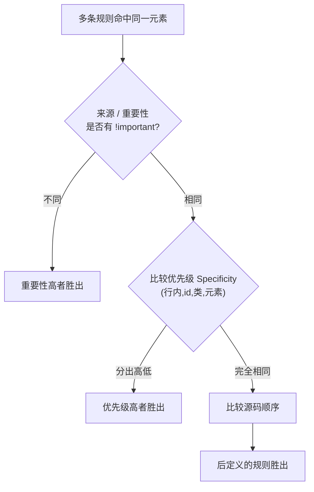

# 02 · 优先级、层叠与 !important（Specificity, Cascade & !important）
> 当多条 CSS 规则命中同一个元素时，浏览器靠「层叠」算法决定谁最终生效；本模块讲清层叠三要素、优先级计算与 `!important`。

## 📖 知识讲解

### 层叠（Cascade）的三大要素
浏览器解决冲突时**依次**比较以下三项，前一项能分出胜负就不再看后面：

1. **来源与重要性（origin & importance）**：用户代理样式、作者样式、用户样式，以及是否带 `!important`。
2. **优先级（specificity）**：选择器的“权重”，越具体越优先。
3. **源码顺序（source order）**：前两项都相同时，**后定义的规则胜出**。

### 优先级（Specificity）的计算
权重用四元组表示 `(行内, id, 类/属性/伪类, 元素/伪元素)`，**从左到右逐位比较**，高位大者直接胜出（不进位）：

| 类别 | 例子 | 权重 |
| --- | --- | --- |
| 行内样式 | `style="..."` | (1,0,0,0) |
| id 选择器 | `#msg` | (0,1,0,0) |
| 类 / 属性 / 伪类 | `.note`、`[type]`、`:hover` | (0,0,1,0) |
| 元素 / 伪元素 | `p`、`::before` | (0,0,0,1) |
| 通用选择器与组合器 | `*`、空格、`>`、`+`、`~` | **不计权重** |

例：`#nav .item a` = (0,1,1,1)；`ul li a` = (0,0,0,3)。逐位比：第二位 1 > 0，前者直接赢。

### !important
- 在声明后加 `!important`（如 `color: red !important;`）会把该声明提升到**更高的重要性层级**，凌驾于所有普通声明之上，**包括行内样式**。
- 多条 `!important` 之间，再按正常的优先级与源码顺序比较。
- 它本质上是“跳出常规层叠”的逃生舱，滥用会让样式系统失控。

### 易错点
- 优先级是**逐位比较，不会进位**：256 个类（0,0,256,0）也比不过一个 id（0,1,0,0）。
- 组合器（`>`、`+`、空格）不增加权重，但它们连接的选择器各自计权。
- `:not()` 自身不计权重，但其括号内的参数计权。
- `!important` 不是“更高优先级”，而是“更高重要性来源”，是独立的一层比较。

## 🔄 流程图 / 原理图



## 💻 代码说明

- **演示一**：同一个 `<p id="msg" class="note" style="color:#e67e22">` 被四条规则命中。
  ```css
  p     { color:#95a5a6; } /* (0,0,0,1) 灰 */
  .note { color:#27ae60; } /* (0,0,1,0) 绿 */
  #msg  { color:#2980b9; } /* (0,1,0,0) 蓝 */
  /* 行内 style 为 (1,0,0,0) 橙 → 最终胜出 */
  ```
  逐位比较，行内的第一位 1 最大，直接生效为橙色。

- **演示二**：`.note.win { color:#c0392b !important; }` 即便行内写了橙色，`!important` 仍把文字变红，展示其越级威力。

- **演示三**：两条同为 `.order-demo` 单类选择器（权重相同），后写的蓝色覆盖先写的红色，证明“源码顺序”是最后的裁判。

## ▶️ 运行方式
直接用浏览器打开 index.html 即可。

## ⚠️ 常见坑 / 最佳实践
- **能不用 `!important` 就不用**：它会让后续覆盖只能用更多 `!important`，陷入军备竞赛。
- 想提高优先级，优先**增加选择器具体度**或调整源码顺序，而非动用 `!important`。
- **避免用 id 写样式**：id 权重过高，难以被类覆盖，复用性差。
- 保持选择器扁平、权重可控（如约定都用单层 class），团队协作时更可维护。
- 调试时打开浏览器 DevTools 的 Styles 面板，被划掉的规则就是“层叠中落败”的规则。

## 🔗 官方文档
- [层叠 Cascade - MDN](https://developer.mozilla.org/zh-CN/docs/Web/CSS/Cascade)
- [优先级 Specificity - MDN](https://developer.mozilla.org/zh-CN/docs/Web/CSS/Specificity)
- [!important - MDN](https://developer.mozilla.org/zh-CN/docs/Web/CSS/important)
