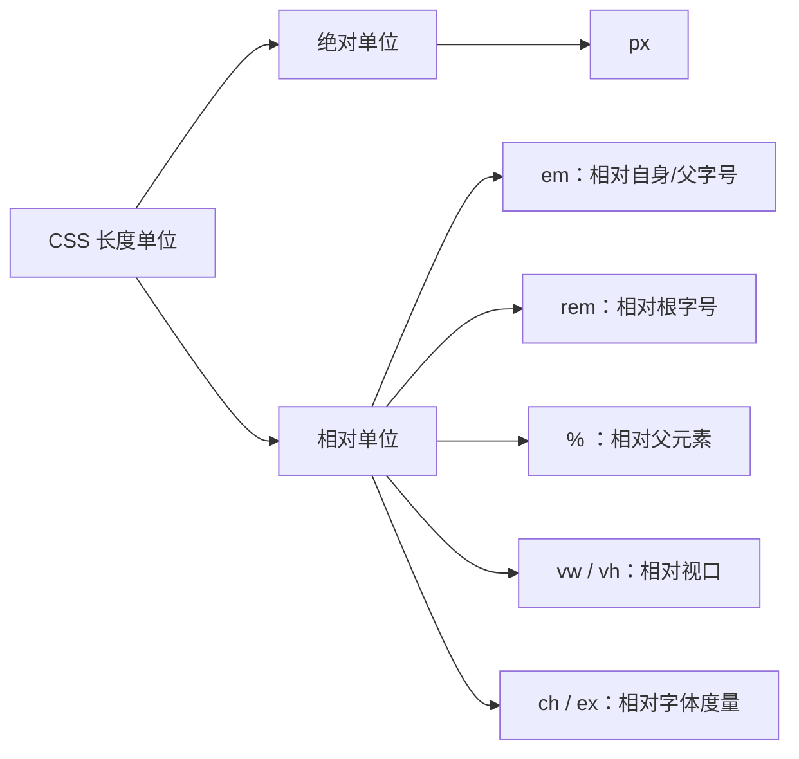

# 03 · 颜色与单位（Colors & Units）
> CSS 用多种语法表示颜色，用绝对/相对单位表示长度；本模块讲清各种颜色写法与单位的区别，以及最容易踩的 em 嵌套放大陷阱。

## 📖 知识讲解

### 颜色表示方式

| 写法 | 例子 | 说明 |
| --- | --- | --- |
| 关键字 | `tomato`、`red` | 预定义颜色名，可读性好 |
| 十六进制 `#rgb` | `#09f` | 简写，等价于 `#0099ff` |
| 十六进制 `#rrggbb` | `#3366cc` | 标准 6 位 |
| 十六进制 `#rrggbbaa` | `#33cc6688` | 末两位是透明度（alpha） |
| `rgb()` | `rgb(231, 76, 60)` | 红绿蓝各 0-255 |
| `rgba()` | `rgba(142,68,173,0.6)` | 多一个 0-1 的透明度 |
| `hsl()` | `hsl(145, 63%, 42%)` | 色相(0-360)/饱和度/亮度，调色更直观 |
| `hsla()` | `hsla(45,100%,50%,0.7)` | hsl 加透明度 |
| `currentColor` | `border-color: currentColor` | 取当前元素 `color` 的值，常用于图标/边框联动 |

> 现代 CSS 中 `rgb()`/`hsl()` 也支持带 alpha 的新语法（如 `rgb(0 0 0 / 50%)`），`rgba`/`hsla` 仍兼容可用。

### 长度单位

**绝对单位**（不随环境变化）：

| 单位 | 说明 |
| --- | --- |
| `px` | 像素，最常用的绝对单位 |

**相对单位**（相对某个基准）：

| 单位 | 相对于 | 说明 |
| --- | --- | --- |
| `em` | **当前元素的字号**（用于 font-size 时相对父级字号） | 会逐层叠乘，易放大 |
| `rem` | **根元素 `<html>` 的字号** | 全局统一基准，最可控 |
| `%` | 父元素对应属性（宽度相对父宽等） | 布局常用 |
| `vw` / `vh` | 视口宽 / 高的 1% | 随窗口缩放 |
| `ch` | 字符 `0` 的宽度 | 适合按字符数定宽 |
| `ex` | 字体 x 高度 | 较少用 |

**行高 `line-height` 推荐用无单位数字**（如 `1.5`）：表示当前字号的倍数，且子元素继承的是“倍数”而非计算后的固定值，避免继承出错。

### 绝对 vs 相对单位
- 绝对单位（px）：所见即所得，但不利于响应式与无障碍缩放。
- 相对单位（rem/em/%/vw）：能随字号、视口自适应，做响应式更友好。
- **em 嵌套陷阱**：`font-size: 1.5em` 相对父级字号，层层嵌套会连乘放大（20 → 30 → 45px…）。需要全局统一时改用 `rem`，它恒定相对根字号。

### 易错点
- `#rgb` 简写只能在每位重复时用（`#09f` = `#0099ff`），不能简写任意值。
- `rgb()` 通道是 0-255，`hsl()` 的 S/L 是百分比，别写混。
- `vw` 是视口宽度的 1%，不是父元素宽度（那是 `%`）。
- 给 `line-height` 写带单位的值（如 `24px`）会被子元素按固定值继承，字号变了行高不跟随。

## 🔄 流程图 / 原理图



## 💻 代码说明

- **颜色样例块**：每个 `.swatch` 用不同语法上色，并排展示关键字、`#rgb`、`#rrggbbaa`、`rgb()`、`hsl()` 等效果，半透明块能看到底色透出。
- **currentColor**：`.current-demo { color:#e67e22; border:3px solid currentColor; }` 边框颜色自动等于文字颜色，改一处即可联动。
- **单位对比盒子**：`w-px / w-pct / w-vw / w-ch` 分别用 `200px / 50% / 30vw / 20ch` 设宽，拖动窗口可见 `vw` 盒子随视口变化。
- **em 放大陷阱**：
  ```css
  .em-outer { font-size: 20px; }
  .em-child { font-size: 1.5em; }       /* 30px */
  .em-grandchild { font-size: 1.5em; }  /* 45px，逐层叠乘 */
  ```
- **rem 对照**：`.rem-demo { font-size: 1.5rem; }` 恒等于 24px，不受父级字号影响。

## ▶️ 运行方式
直接用浏览器打开 index.html 即可。

## ⚠️ 常见坑 / 最佳实践
- 需要全局可控的字号体系时用 **rem**；只想相对当前组件内部缩放时再用 em。
- `line-height` 用**无单位数字**，避免继承出固定值的坑。
- 颜色优先用语义清晰的写法（hsl 便于调明暗，hex 便于复制设计稿色值）。
- 响应式布局多用 `%`、`rem`、`vw`，少写死 `px`，兼顾无障碍缩放。
- 透明度需求下，`rgba()`/`hsla()` 或 `#rrggbbaa` 都可，团队内统一一种风格。

## 🔗 官方文档
- [CSS 颜色 `<color>` - MDN](https://developer.mozilla.org/zh-CN/docs/Web/CSS/color_value)
- [CSS 长度 `<length>` - MDN](https://developer.mozilla.org/zh-CN/docs/Web/CSS/length)
- [CSS 值与单位 - MDN](https://developer.mozilla.org/zh-CN/docs/Web/CSS/CSS_Values_and_Units)
