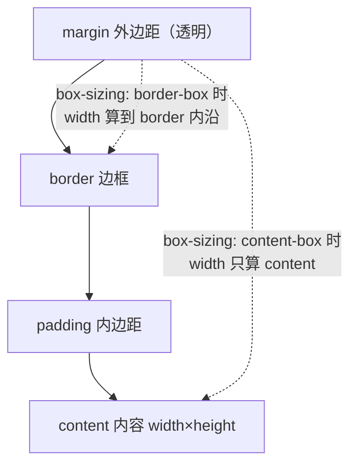

# 04 · 盒模型（Box Model）
> 浏览器把每个元素都渲染成一个矩形盒子；盒模型描述了这个盒子从内到外的四层结构以及它们如何决定元素的最终占位尺寸。

## 📖 知识讲解

### 一、四层结构（由内到外）
| 层 | 属性 | 说明 |
|----|------|------|
| content（内容） | `width` / `height` | 真正放文字、图片的区域 |
| padding（内边距） | `padding` | 内容与边框之间的空白，背景色会延伸到这里 |
| border（边框） | `border` | 包裹 padding 的边线 |
| margin（外边距） | `margin` | 盒子与外部其他元素之间的距离，透明 |

### 二、标准盒模型 vs 替代盒模型
`box-sizing` 决定 `width`/`height` 指的是哪一部分：

| box-sizing | width 含义 | 元素实际占位宽度 |
|------------|-----------|----------------|
| `content-box`（默认/标准盒模型） | 仅 content 宽度 | `width + padding×2 + border×2` |
| `border-box`（替代盒模型） | content+padding+border 总宽 | 就等于 `width`（padding/border 向内挤压内容） |

举例：`width:200px; padding:20px; border:10px`
- content-box → 实际占位 `200 + 40 + 20 = 260px`
- border-box → 实际占位 `200px`（内容区被压缩到 `140px`）

### 三、简写与分写
- 四值（上 右 下 左，顺时针）：`margin: 10px 20px 30px 40px;`
- 三值（上 / 左右 / 下）：`padding: 10px 20px 30px;`
- 两值（上下 / 左右）：`margin: 10px 20px;`
- 一值（四边相同）：`padding: 10px;`
- 分写：`margin-top` / `margin-right` / `margin-bottom` / `margin-left`
- border 三要素：`border: 1px solid #333;`（宽度 样式 颜色）

### 四、margin 折叠（margin collapsing）
**相邻**的垂直外边距会合并成一个，取**较大值**（不是相加）。常见三种场景：
1. 相邻兄弟元素：上块 `margin-bottom` 与下块 `margin-top` 折叠。
2. 父子元素：父无 border/padding/内容隔开时，子的 `margin-top` 会“穿透”到父外。
3. 空块自身的上下 margin 折叠。

> ⚠️ 折叠只发生在**垂直方向**（block 方向），水平 margin 不折叠；Flex/Grid 子项也不发生折叠。

### 五、易错点
- 设了 `width:100%` 又加 `padding`，在 content-box 下会溢出父容器。
- `outline` 不占盒模型空间（不影响布局），`border` 占。
- `margin` 可为负值，`padding` 不可为负。

## 🔄 流程图 / 原理图

## 💻 代码说明
`index.html` 包含三个演示区：
1. **四层结构可视化**：用四个嵌套 `div`，不同背景色（黄/橙/绿/蓝）直观展示 margin→border→padding→content。
2. **content-box vs border-box 对比**：两个盒子同样设 `width:200px`，配 300px 红色虚线标尺，可肉眼看到 content-box 盒子更宽（260px）。
3. **margin 折叠演示**：上块 `margin-bottom:40px`、下块 `margin-top:30px`，实际间距只有 40px。

## ▶️ 运行方式
直接用浏览器打开 index.html 即可。

## ⚠️ 常见坑 / 最佳实践
- **全局推荐**：`*{ box-sizing: border-box; }`，让宽度计算更符合直觉，避免加 padding 撑破布局。
- 想要两个块之间精确间距时，避免双方都设垂直 margin（会折叠），可只给一侧设。
- 居中块级元素用 `margin: 0 auto;`（需有明确 width）。
- 调试盒子尺寸：打开浏览器 DevTools 的 “Computed → Box Model” 面板。

## 🔗 官方文档
- [CSS 盒模型 - MDN](https://developer.mozilla.org/zh-CN/docs/Learn/CSS/Building_blocks/The_box_model)
- [box-sizing - MDN](https://developer.mozilla.org/zh-CN/docs/Web/CSS/box-sizing)
- [掌握外边距折叠 - MDN](https://developer.mozilla.org/zh-CN/docs/Web/CSS/CSS_Box_Model/Mastering_margin_collapsing)
