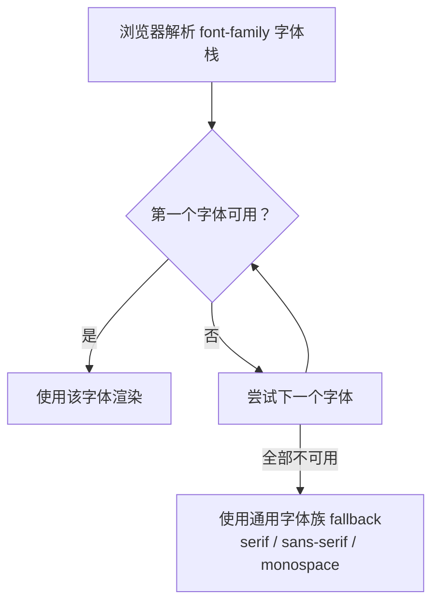

# 05 · 文本与字体（Text & Fonts）
> CSS 控制文字外观的一组属性：字体、字号、字重、行高、对齐、装饰等，决定页面文字的可读性与排版美感。

## 📖 知识讲解

### 一、字体相关属性
| 属性 | 作用 | 常用值 |
|------|------|--------|
| `font-family` | 字体栈 | 多个字体 + 通用字体族兜底 |
| `font-size` | 字号 | `16px` / `1.2em` / `1rem` |
| `font-weight` | 字重 | `normal`(400) / `bold`(700) / `100~900` |
| `font-style` | 斜体 | `normal` / `italic` / `oblique` |
| `line-height` | 行高 | `1.5`（推荐无单位倍数） |
| `font`（简写） | 一次性设置 | `font: style weight size/line-height family` |

**字体栈与通用字体族**：`font-family` 从左到右匹配，第一个可用的生效，最后写一个**通用字体族**兜底：
```css
font-family: "Segoe UI", "Microsoft YaHei", Arial, sans-serif;
```
五大通用字体族：`serif`（衬线）、`sans-serif`（无衬线）、`monospace`（等宽）、`cursive`（手写）、`fantasy`（装饰）。

**web-safe 字体与 fallback**：不同操作系统预装字体不同，应优先用跨平台“安全字体”（Arial、Georgia、Times New Roman 等），并在末尾用通用字体族做 fallback，避免某字体缺失时排版崩坏。

### 二、文本排版属性
| 属性 | 作用 | 常用值 |
|------|------|--------|
| `text-align` | 水平对齐 | `left` / `center` / `right` / `justify`(两端对齐) |
| `text-decoration` | 装饰线 | `underline` / `line-through` / `overline` / `none` |
| `text-transform` | 大小写转换 | `uppercase` / `lowercase` / `capitalize`（对英文有效） |
| `text-indent` | 首行缩进 | `2em`（中文常用首行缩进 2 字符） |
| `letter-spacing` | 字符间距 | `2px` |
| `word-spacing` | 单词间距 | `8px`（按空格分词，主要对英文有效） |
| `color` | 文字颜色 | `#333` / `rgb()` / `hsl()` |
| `white-space` | 空白与换行处理 | `normal` / `nowrap` / `pre` / `pre-wrap` |

### 三、white-space 取值速查
| 值 | 合并空白 | 自动换行 | 保留换行符 |
|----|---------|---------|-----------|
| `normal` | 是 | 是 | 否 |
| `nowrap` | 是 | 否（不换行） | 否 |
| `pre` | 否 | 否 | 是 |
| `pre-wrap` | 否 | 是 | 是 |

> 单行文本省略号经典组合：`white-space:nowrap; overflow:hidden; text-overflow:ellipsis;`

### 四、易错点
- `line-height` 推荐用**无单位数字**（如 `1.5`），子元素按自身字号计算，避免继承固定 px 出问题。
- `font` 简写中 `font-size` 和 `font-family` **必填**，且二者不可省略，否则整条声明失效。
- `text-transform` / `word-spacing` 对中文基本无效（中文没有大小写、不靠空格分词）。
- `text-align` 只对**行内级内容**水平对齐，不能让块级盒子自身居中（块级居中用 `margin:auto`）。

## 🔄 流程图 / 原理图


## 💻 代码说明
`index.html` 分 6 个区块，用同一段中英文混排文本演示：
1. 三类字体族（衬线/无衬线/等宽）对比；
2. 字号、字重、斜体；
3. 行高、字符间距、词间距；
4. 四种 `text-align`；
5. 装饰线、大小写转换、首行缩进；
6. `white-space`（截断省略号 / 保留空白）、`color`、`font` 简写。

## ▶️ 运行方式
直接用浏览器打开 index.html 即可。

## ⚠️ 常见坑 / 最佳实践
- 中文优先在字体栈靠后补一个中文字体（如“微软雅黑”“苹方”），否则英文字体可能让中文回退到默认丑字体。
- 正文行高建议 `1.5~1.8`，过紧影响阅读。
- 使用相对单位 `rem`/`em` 设 `font-size`，方便整体缩放与无障碍。
- 两端对齐 `justify` 对中文段落效果好，对英文最后一行可能产生大空隙。

## 🔗 官方文档
- [font-family - MDN](https://developer.mozilla.org/zh-CN/docs/Web/CSS/font-family)
- [文本样式基础 - MDN](https://developer.mozilla.org/zh-CN/docs/Learn/CSS/Styling_text/Fundamentals)
- [white-space - MDN](https://developer.mozilla.org/zh-CN/docs/Web/CSS/white-space)
