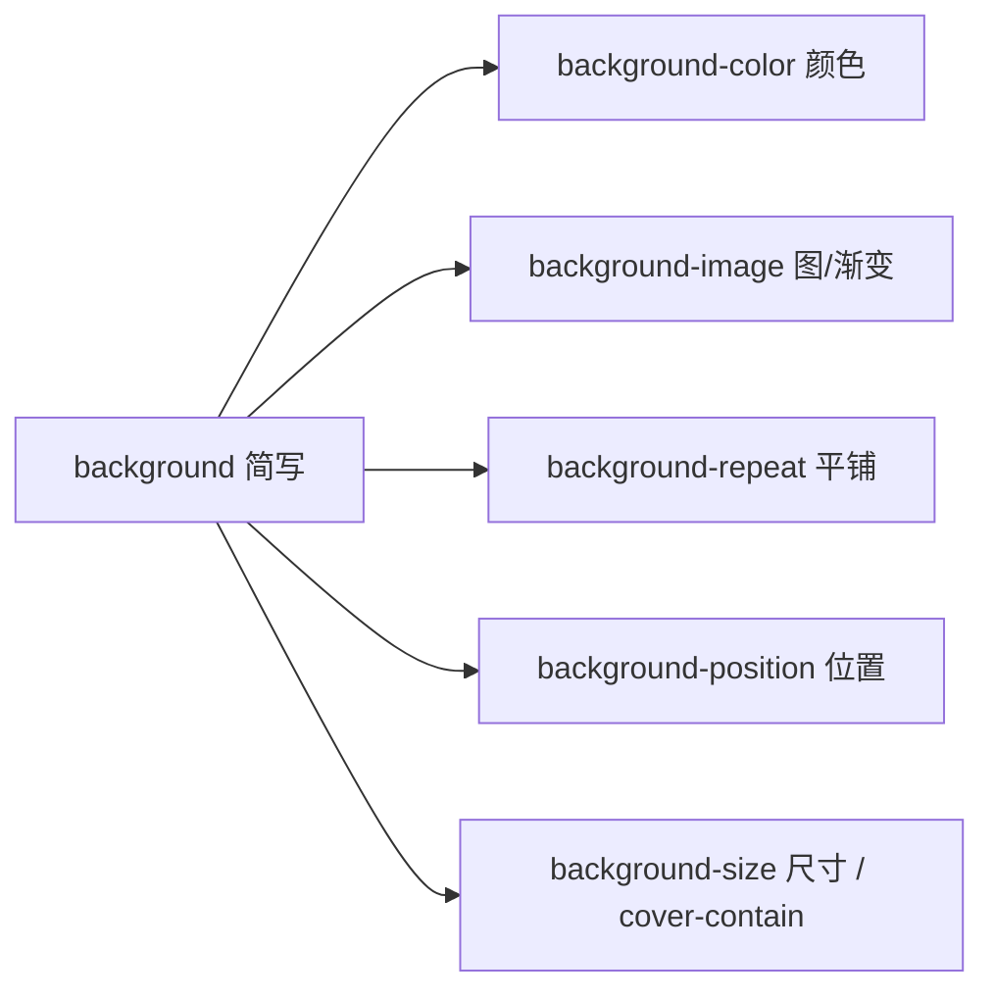

# 06 · 背景与边框（Backgrounds & Borders）
> CSS 用一组背景属性和边框属性装饰盒子的“外观皮肤”：纯色/渐变/图片背景、各种边框样式、圆角与阴影，是做卡片、按钮等组件的基础。

## 📖 知识讲解

### 一、背景相关属性
| 属性 | 作用 | 常用值 |
|------|------|--------|
| `background-color` | 背景颜色 | `#fff` / `rgb()` / `transparent` |
| `background-image` | 背景图/渐变 | `url(...)` / `linear-gradient()` / `radial-gradient()` |
| `background-repeat` | 平铺方式 | `repeat` / `no-repeat` / `repeat-x` / `repeat-y` |
| `background-position` | 定位 | `center` / `top left` / `50% 50%` / `20px 10px` |
| `background-size` | 尺寸 | `cover` / `contain` / `100% 100%` / 具体值 |
| `background`（简写） | 一次性设置 | 见下 |

**渐变**本质上是图片，写在 `background-image` 里：
- 线性渐变：`linear-gradient(135deg, #6c5ce7, #00cec9)`（角度 + 颜色断点）
- 径向渐变：`radial-gradient(circle, #fd79a8, #e84393)`

**cover vs contain**（背景图缩放）：
| 值 | 效果 | 结果 |
|----|------|------|
| `cover` | 等比缩放铺满容器 | 可能裁剪图片边缘 |
| `contain` | 等比缩放完整显示 | 可能在容器内留白 |

**background 简写**顺序（可按需省略）：
```css
background: color image repeat position / size;
/* 例： */
background: #2d3436 url(bg.png) no-repeat center / cover;
```
> ⚠️ 简写里 `position` 和 `size` 之间必须用 `/` 分隔，且 size 必须写在 position 之后。

**多重背景**：用逗号分隔多组，**先写的在上层**（更靠近用户）：
```css
background-image:
  radial-gradient(circle, rgba(255,255,255,.6), transparent),  /* 上层 */
  linear-gradient(135deg, #fd79a8, #fdcb6e);                   /* 下层 */
```

### 二、边框相关属性
| 属性 | 作用 | 说明 |
|------|------|------|
| `border-width` | 边框宽度 | `1px` / `thin` / `medium` |
| `border-style` | 边框样式 | `solid` `dashed` `dotted` `double` `none` |
| `border-color` | 边框颜色 | 颜色值 |
| `border`（简写） | 三要素 | `border: 1px solid #333;` |
| 单边 | 某一条边 | `border-top` / `border-right` / `border-bottom` / `border-left` |
| `border-radius` | 圆角 | `8px` / `50%`(正圆) / `40px 8px 40px 8px`(四角) |
| `outline` | 轮廓线 | 不占布局空间、可加 `outline-offset` |
| `box-shadow` | 盒子阴影 | `x y blur spread color` + 可选 `inset` |

**border-radius 做正圆**：元素须为正方形（等宽高），设 `border-radius: 50%`。

**box-shadow 语法**：`box-shadow: 水平偏移 垂直偏移 模糊半径 扩展半径 颜色 [inset];`
- 多层阴影逗号分隔可叠加发光效果。
- `inset` 关键字变为内阴影。

### 三、outline 与 border 的区别（重点）
| | border | outline |
|---|--------|---------|
| 占据盒模型空间 | 是（影响布局） | 否（不影响布局） |
| 能否单边设置 | 能 | 不能（四边一起） |
| 能否设圆角 | 能（border-radius） | 多数浏览器跟随元素圆角 |
| 与盒子间距 | 紧贴 | 可用 `outline-offset` 外移 |
| 典型用途 | 视觉边框 | 焦点高亮（无障碍，勿随意 `outline:none`） |

## 🔄 流程图 / 原理图


## 💻 代码说明
`index.html` 分 7 个区块演示：
1. 纯色 / 线性渐变 / 径向渐变背景；
2. 背景图 `repeat`、`cover`、`contain`（用内联 SVG 作图，免外部资源）；
3. `background` 简写与多重背景叠加；
4. 五种边框样式 + 单边边框；
5. 圆角：普通圆角 / 四角不同 / 50% 正圆；
6. `outline` vs `border` 对比 + 三种 `box-shadow`（外阴影/内阴影/多层发光）；
7. 综合卡片：渐变背景 + 圆角 + 边框 + 阴影。

## ▶️ 运行方式
直接用浏览器打开 index.html 即可。

## ⚠️ 常见坑 / 最佳实践
- 设 `border-radius` 时背景与阴影会自动跟随圆角裁剪。
- 不要随意写 `outline: none` 去掉焦点轮廓，会损害键盘无障碍；要去除时请提供替代的 `:focus` 样式。
- 渐变是 `background-image`，与 `background-color` 不冲突，可作为图片加载失败时的兜底色。
- `box-shadow` 的 `spread`（扩展半径）为正向外扩、为负向内收，可做描边/光晕效果。
- 多重背景注意层级：第一个写的盖在最上面。

## 🔗 官方文档
- [background - MDN](https://developer.mozilla.org/zh-CN/docs/Web/CSS/background)
- [使用 CSS 渐变 - MDN](https://developer.mozilla.org/zh-CN/docs/Web/CSS/CSS_images/Using_CSS_gradients)
- [border - MDN](https://developer.mozilla.org/zh-CN/docs/Web/CSS/border)
- [box-shadow - MDN](https://developer.mozilla.org/zh-CN/docs/Web/CSS/box-shadow)
