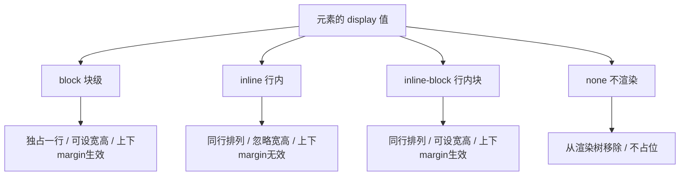

# 07 · 显示类型（Display Types）
> `display` 决定一个元素如何"摆放"——是独占一行还是与别人挤在一行，能否设宽高，是否参与文档流。它是 CSS 布局的基石。

## 📖 知识讲解

每个 HTML 元素都有一个默认的 `display` 值：`
`、`
`、`<h1>` 默认是 `block`；``、`<a>`、`<em>` 默认是 `inline`。本模块只讲 4 个**基础值**（`flex`、`grid` 属于 03-css3 工程）。

### 四种基础值

| display 值 | 独占一行 | 能否设 width/height | 上下 margin/padding | 参与文档流 | 典型元素 |
|---|---|---|---|---|---|
| `block` | 是 | 能 | 生效 | 是 | `div` `p` `h1` |
| `inline` | 否（同行排） | **不能**（被内容撑开） | 上下 margin **不生效** | 是 | `span` `a` `em` |
| `inline-block` | 否（同行排） | 能 | 生效 | 是 | `img` `button` |
| `none` | —— | —— | —— | **否，不渲染** | —— |

- **block（块级）**：从新的一行开始，默认宽度撑满父容器，可自由设置宽高、四个方向的 margin/padding。
- **inline（行内）**：和文字一样从左到右排，遇到边界才换行。**忽略 width/height**，上下 margin 不会撑开行高（左右 margin/padding 生效，但视觉上会有"破裂"问题）。
- **inline-block（行内块）**：折中方案——既能同行排列（像 inline），又能设置宽高和上下 margin（像 block）。做水平导航、按钮组很常用。
- **none**：元素及其所有子元素从渲染树中移除，**完全不占位**，相当于不存在。

### 三种"隐藏"方式的区别（高频考点）

| 方式 | 是否占位 | 是否可交互/点击 | 是否触发重排 | 子元素 |
|---|---|---|---|---|
| `display: none` | **不占位** | 否 | 是（重排 reflow） | 一并消失 |
| `visibility: hidden` | **占位** | 否 | 否（仅重绘） | 可单独设 `visible` 重新显示 |
| `opacity: 0` | **占位** | **是，仍可点击** | 否（仅重绘/合成） | 整体透明 |

- 想要"彻底移除、不留空白" → `display:none`。
- 想要"留个坑、内容暂时不可见" → `visibility:hidden`。
- 想要"渐隐动画 / 视觉透明但仍能交互" → `opacity:0`（注意它仍会响应鼠标事件，常需配合 `pointer-events:none`）。

### inline / inline-block 的间隙问题

行内元素之间，HTML 源码里的**换行符和空格**会被渲染成一个空白字符，导致盒子之间出现约 4px 的缝隙。常见解决办法：

1. 给父元素设 `font-size: 0`，再给子元素单独设字号（本 demo 用法）。
2. HTML 标签首尾相连，不留换行（可读性差）。
3. 用注释 `<!--\n-->` 吃掉空白。
4. 直接改用 `flex` 布局（最现代，03-css3 工程讲）。

### 易错点

- inline 元素设了 `width:200px` 却"没反应"——因为 inline 忽略宽高，应改用 `inline-block` 或 `block`。
- 给 `<a>`（默认 inline）设上下 padding 看起来生效，但**上下 margin 不生效**，且背景可能溢出到相邻行。
- 误以为 `visibility:hidden` 能腾出空间——它仍然占位。

## 🔄 流程图 / 原理图

## 💻 代码说明

`index.html` 用同一组 `.box` 盒子，分别套上 `block`、`inline`、`inline-block`、`none` 四种 display 进行排布对比；再用一个可点击按钮演示 `none` 的显隐切换；并用一行盒子并排展示 `none / visibility:hidden / opacity:0` 三者的占位与可交互差异（透明盒子点击会弹窗证明它仍响应事件）；最后演示行内块的间隙问题及 `font-size:0` 修复。

## ▶️ 运行方式
直接用浏览器打开 index.html 即可。

## ⚠️ 常见坑 / 最佳实践
- inline 元素设宽高无效，需要宽高就用 inline-block 或 block。
- `display:none` 会触发重排且无法做过渡动画；需要淡入淡出用 `opacity` + `transition`。
- `opacity:0` 仍可点击，做"假隐藏"时记得加 `pointer-events:none`。
- 水平排列优先考虑 flex（03-css3），inline-block 是老方案、需处理间隙。
- 想保留 SEO/无障碍信息但视觉隐藏，用 `visibility:hidden` 或专门的视觉隐藏类，而非 `display:none`。

## 🔗 官方文档
- [MDN: display](https://developer.mozilla.org/zh-CN/docs/Web/CSS/display)
- [MDN: visibility](https://developer.mozilla.org/zh-CN/docs/Web/CSS/visibility)
- [MDN: 块级与行内布局](https://developer.mozilla.org/zh-CN/docs/Web/CSS/CSS_flow_layout/Block_and_inline_layout_in_normal_flow)
