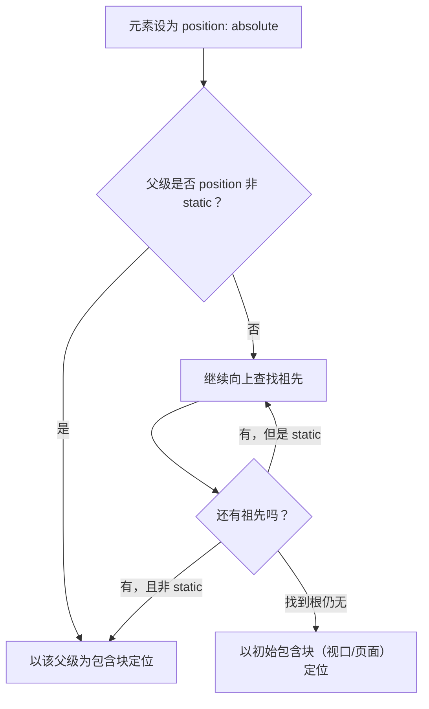

# 08 · 定位（Position）
> `position` 让元素脱离或微调它在文档流中的位置，是实现弹层、吸顶导航、回到顶部按钮、绝对居中等效果的核心属性。

## 📖 知识讲解

`position` 共有 5 个值，配合 `top` / `right` / `bottom` / `left` 这 4 个**偏移属性**和 `z-index` 使用。

### 五个值

| 值 | 是否脱离文档流 | 定位参照（包含块） | 偏移属性是否生效 | 典型用途 |
|---|---|---|---|---|
| `static` | 否（默认） | 正常文档流 | **否** | 默认值，复位 |
| `relative` | 否，**仍占原位** | 元素自身原位置 | 是 | 微调位置 / 作 absolute 的参照 |
| `absolute` | **是** | 最近的非 static 祖先 | 是 | 弹层、角标、绝对居中 |
| `fixed` | **是** | 视口 viewport | 是 | 回到顶部、悬浮按钮、固定头部 |
| `sticky` | 否（混合态） | 最近的滚动容器 | 是（作为吸附阈值） | 吸顶导航、表头冻结 |

### 逐个说明

- **static**：默认值，元素老老实实待在文档流里，`top/left` 等**完全无效**。
- **relative**：相对**自身原来的位置**偏移，但**原空间仍然保留**（不会有别的元素来填补）。常用作 `absolute` 子元素的"定位祖先"。
- **absolute**：**脱离文档流**（原空间被释放），相对**最近的 `position` 不为 static 的祖先**定位；若找不到这样的祖先，则相对初始包含块（≈ 页面）。这就是"子绝父相"口诀的由来——父元素加 `position:relative`，子元素 `absolute` 才会以父为参照。
- **fixed**：相对**视口**定位，页面滚动它也不动，做悬浮/固定元素。
- **sticky**：平时像 `relative` 一样跟随文档流；当滚动到设定的阈值（如 `top:0`）时，**粘住**变得像 `fixed`；滚出父容器范围后又恢复。**必须指定 top/bottom 等阈值**才生效。

### 偏移属性与包含块

- `top/right/bottom/left` 的百分比是相对**包含块**的尺寸计算的。
- "包含块"由 position 类型决定：relative→自身原框；absolute→最近非 static 祖先的 padding 盒；fixed→视口。

### z-index 与层叠上下文

- `z-index` 只对**定位元素**（position 非 static）生效，数值越大越靠前。
- 设置了 `z-index`（且非 auto）的定位元素、`opacity<1`、`transform` 等会创建**层叠上下文**：子元素的 z-index 被"困"在父上下文内部，无法跨越父级与外部元素比较。这是 z-index 设了很大却仍被盖住的常见原因。

### 绝对居中经典写法

```css
.box{ position:absolute; top:50%; left:50%; transform:translate(-50%,-50%); }
```
先把左上角移到容器中心，再用 `translate` 回退自身一半尺寸。

## 🔄 流程图 / 原理图



## 💻 代码说明

`index.html` 完整演示五种定位：顶部 `sticky` 吸顶导航在滚动时粘住；`relative` 盒子相对自身偏移并保留原占位（虚线幽灵框）；`absolute` 把角标钉在父容器右上角、并用 `translate(-50%,-50%)` 实现绝对居中；`z-index` 三色块演示层叠；右下角 `fixed` "回到顶部"按钮始终固定在视口。

## ▶️ 运行方式
直接用浏览器打开 index.html 即可。

## ⚠️ 常见坑 / 最佳实践
- absolute 找不到 `relative` 父级时会跑到页面级别——记住"子绝父相"。
- sticky **不写 `top`（或 bottom 等阈值）不会吸附**；父容器有 `overflow:hidden` 也可能让它失效。
- z-index 失效多半是被父级的层叠上下文限制了，先排查父级是否有 `transform/opacity/z-index`。
- fixed 元素在某些移动端会因父级 `transform` 退化为相对该父级定位，需留意。
- z-index 只对定位元素有效，普通 static 元素设了也没用。

## 🔗 官方文档
- [MDN: position](https://developer.mozilla.org/zh-CN/docs/Web/CSS/position)
- [MDN: z-index](https://developer.mozilla.org/zh-CN/docs/Web/CSS/z-index)
- [MDN: 层叠上下文](https://developer.mozilla.org/zh-CN/docs/Web/CSS/CSS_positioned_layout/Stacking_context)
- [MDN: 包含块](https://developer.mozilla.org/zh-CN/docs/Web/CSS/CSS_display/Containing_block)
