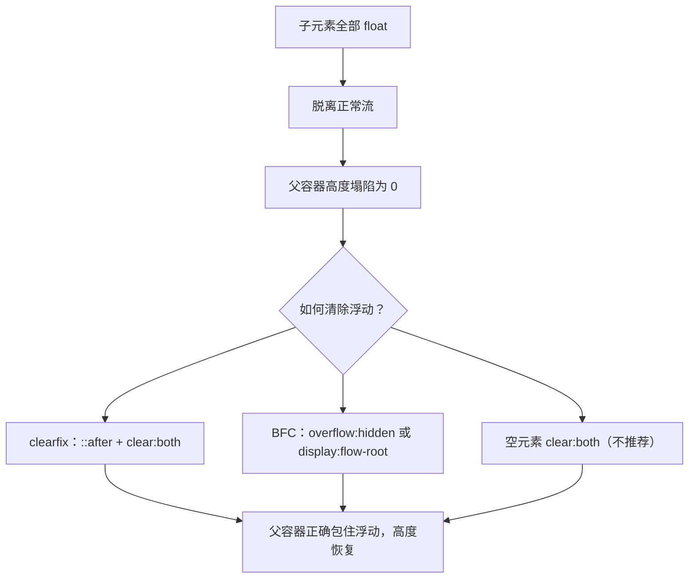

# 09 · 浮动与清除（Float & Clear）
> `float` 让元素脱离正常流靠向一侧、实现文字环绕；但会引发父容器"高度塌陷"，需要用 `clear` / clearfix / BFC 清除浮动。

## 📖 知识讲解

`float` 最初是为"文字环绕图片"设计的，后来一度被滥用来做整页布局。如今**多列、居中、等高布局已被 flex / grid 取代**，`float` 主要价值回归到它的本职——**图文环绕**。

### float 基础

| 值 | 说明 |
|---|---|
| `float: left` | 元素靠左浮动，后续内容环绕到它右侧 |
| `float: right` | 元素靠右浮动，后续内容环绕到它左侧 |
| `float: none` | 默认，不浮动 |

浮动元素的特点：
- **脱离正常文档流**（但仍影响周围的行内内容，让文字环绕它）。
- 自动变成类似 `block` 的行为（可设宽高），即使原来是 inline。
- 多个浮动元素会并排排列，空间不够则换行。

### 问题：高度塌陷（collapse）

当父容器里**所有子元素都浮动**时，父容器会"以为自己没有内容"，高度塌陷为 0（只剩 padding/border），导致背景、边框、后续布局全部错乱。这是使用 float 必然遇到的坑。

### 清除浮动的三种方案

| 方案 | 写法 | 原理 | 评价 |
|---|---|---|---|
| **clearfix 伪元素** | `.clearfix::after{content:"";display:block;clear:both;}` | 在父容器末尾生成一个块级伪元素并清除两侧浮动，把父容器撑开 | ✅ **最推荐**：无多余标签、无副作用 |
| **BFC** | 父容器 `overflow:hidden`（或 auto） | 触发块格式化上下文（BFC），BFC 会包含内部浮动元素 | 简洁，但 `overflow` 可能裁切溢出内容/阴影 |
| **空元素清除** | 浮动后加 `

` | 额外块级元素阻断浮动 | ❌ 增加无语义标签，不推荐 |

### clear 属性

`clear` 用在**被影响的元素**上，规定它的哪一侧不允许挨着浮动元素：
- `clear:left` / `clear:right` / `clear:both`（最常用，左右都清）。
- clearfix 的核心就是给伪元素设 `clear:both`。

### 关于 BFC

BFC（Block Formatting Context，块格式化上下文）是一个独立的渲染区域，内部布局不影响外部。**触发 BFC** 的常见方式：`overflow` 非 visible、`display:flow-root`（最干净、无副作用）、`position:absolute/fixed`、浮动元素本身等。BFC 的特性之一就是**会计算并包含内部的浮动元素**，因此能解决高度塌陷。

> 小贴士：`display:flow-root` 是专门用来创建 BFC 清除浮动的现代属性，比 `overflow:hidden` 更语义化、无裁切副作用。

## 🔄 流程图 / 原理图

## 💻 代码说明

`index.html` 先演示 `float:left` 实现的图片文字环绕；接着用红框父容器展示**高度塌陷**（未清除时父容器几乎没有高度）；再分别用 **clearfix 伪元素**、**overflow:hidden（BFC）**、**空 div clear:both** 三种方案修复，绿框正确包住浮动子元素，并附对比表说明各方案优劣。

## ▶️ 运行方式
直接用浏览器打开 index.html 即可。

## ⚠️ 常见坑 / 最佳实践
- 别再用 float 做整页布局，请用 flex / grid（03-css3 工程），float 现在主要用于图文环绕。
- 父容器只要有浮动子元素，几乎一定要清除浮动，否则后续布局错乱。
- clearfix 是首选；`overflow:hidden` 简单但会裁切超出内容和阴影；`display:flow-root` 是最干净的现代方案。
- `clear` 必须用在受浮动影响的元素或伪元素上，给浮动元素自身设 clear 无意义。
- 浮动元素会被父容器忽略高度，但仍会推开周围文字，这正是文字环绕的原理。

## 🔗 官方文档
- [MDN: float](https://developer.mozilla.org/zh-CN/docs/Web/CSS/float)
- [MDN: clear](https://developer.mozilla.org/zh-CN/docs/Web/CSS/clear)
- [MDN: 块格式化上下文 BFC](https://developer.mozilla.org/zh-CN/docs/Web/CSS/CSS_display/Block_formatting_context)
