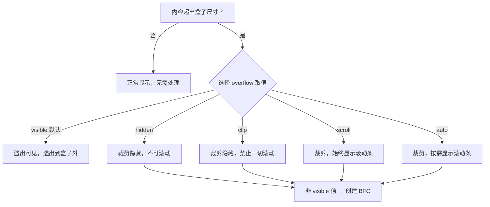

# 10 · 溢出处理（Overflow）
> 当内容超出盒子尺寸时，用 `overflow` 控制溢出部分是显示、裁剪还是滚动，并实现文本省略号。

## 📖 知识讲解

### 1. 什么是「溢出」
当一个元素设置了固定的宽高（或被父容器限制），而内部内容（文字、图片、子元素）的尺寸超过了这个范围时，超出的部分就叫做**溢出（overflow）**。默认情况下溢出内容会**照常显示**，溢出到盒子边界之外。

### 2. overflow 取值
`overflow` 是 `overflow-x` 和 `overflow-y` 的简写，可分别控制水平/垂直方向。

| 取值 | 含义 | 滚动条 |
| --- | --- | --- |
| `visible` | **默认值**，溢出内容可见，溢出到盒子外 | 无 |
| `hidden` | 裁剪溢出部分，不可见，但可被脚本滚动 | 无 |
| `scroll` | 裁剪溢出部分，**始终显示**滚动条 | 始终有 |
| `auto` | 裁剪溢出部分，**需要时才**显示滚动条 | 按需 |
| `clip` | 裁剪溢出部分，**禁止一切滚动**（含脚本） | 无 |

- 当只设置 `overflow-x` 或 `overflow-y` 其中一个为非 `visible` 值时，另一个 `visible` 会被浏览器**当作 `auto`** 处理。
- `clip` 是较新的值，比 `hidden` 更彻底、性能更好，可配合 `overflow-clip-margin` 控制裁剪边距。

### 3. 重要副作用：创建 BFC
当 `overflow` 取值为 **非 `visible`**（如 `hidden`/`auto`/`scroll`）时，元素会创建一个 **BFC（块级格式化上下文）**。这常被用来：
- 清除浮动（包裹内部浮动子元素，撑开高度）
- 阻止外边距合并

### 4. 文本溢出省略号
#### 单行省略号（三件套缺一不可）
```css
white-space: nowrap;       /* 1. 强制不换行 */
overflow: hidden;          /* 2. 隐藏溢出 */
text-overflow: ellipsis;   /* 3. 溢出处显示 … */
```

#### 多行省略号（webkit 方案）
```css
display: -webkit-box;
-webkit-box-orient: vertical;
-webkit-line-clamp: 2;     /* 限制行数 */
overflow: hidden;
```

### 5. 易错点
- `text-overflow: ellipsis` **只在 `overflow` 不为 `visible` 时生效**，且单行必须配 `white-space: nowrap`。
- 多行省略号依赖 `-webkit-line-clamp`，必须同时有 `display:-webkit-box` 和 `-webkit-box-orient:vertical`，且不能给元素设置 `padding-bottom` 过大（可能露出第三行）。
- 元素需要有明确或受限的**宽度**，省略号才会出现。

## 🔄 流程图 / 原理图



## 💻 代码说明
- 演示一：5 个相同尺寸（110px 高）的盒子塞入超长文字，分别应用 `.ov-visible / .ov-hidden / .ov-scroll / .ov-auto / .ov-clip`，直观对比五种取值。
- 演示二：`.ellipsis-single` 展示单行省略号三件套；`.ellipsis-multi` 展示 `-webkit-line-clamp:2` 多行省略号。
- 所有关键 CSS 处均有中文注释。

## ▶️ 运行方式
直接用浏览器打开 index.html 即可。

## ⚠️ 常见坑 / 最佳实践
- 想要清除浮动 / 撑开高度时，给父元素加 `overflow: hidden` 或 `auto` 可创建 BFC，但要注意它会裁剪掉子元素的阴影、下拉菜单等溢出内容。
- 单行省略号忘记 `white-space: nowrap` 是最常见错误，会导致文字换行而不出现 `…`。
- 优先用 `auto` 而非 `scroll`，避免内容不溢出时也占着滚动条空间。
- 移动端横向滚动时，给容器加 `-webkit-overflow-scrolling: touch` 可获得惯性滚动体验。

## 🔗 官方文档
- [overflow - MDN](https://developer.mozilla.org/zh-CN/docs/Web/CSS/overflow)
- [text-overflow - MDN](https://developer.mozilla.org/zh-CN/docs/Web/CSS/text-overflow)
- [-webkit-line-clamp - MDN](https://developer.mozilla.org/zh-CN/docs/Web/CSS/-webkit-line-clamp)
