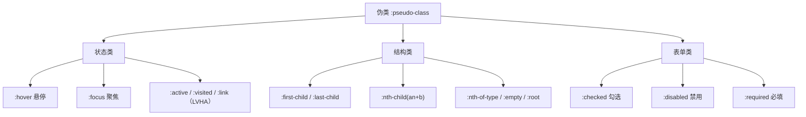

# 11 · 伪类（Pseudo-classes）
> 伪类用单冒号 `:` 选中元素的「特定状态」或「文档树中的特定位置」，无需为它额外添加 class。

## 📖 知识讲解

### 1. 什么是伪类
伪类（pseudo-class）是加在选择器后面的关键字，用来描述元素的某种**状态**或**位置**，例如「被鼠标悬停」「是父元素的第一个子元素」「复选框被勾选」。语法：`选择器:伪类 { ... }`，**单冒号**。

### 2. 状态伪类（动态伪类）
| 伪类 | 含义 |
| --- | --- |
| `:link` | 未访问过的链接 |
| `:visited` | 已访问过的链接 |
| `:hover` | 鼠标悬停 |
| `:active` | 被激活（鼠标按下） |
| `:focus` | 获得焦点（输入框、按钮等） |

> **LVHA 顺序**：链接的这几个伪类必须按 `:link → :visited → :hover → :active` 的顺序书写，否则后面的会被前面的覆盖（口诀 LoVe-HAte）。

### 3. 结构伪类
| 伪类 | 含义 |
| --- | --- |
| `:first-child` / `:last-child` | 父元素的第一个 / 最后一个子元素 |
| `:nth-child(n)` | 第 n 个子元素（不分类型） |
| `:nth-of-type(n)` | 同类型中的第 n 个 |
| `:first-of-type` | 同类型中的第一个 |
| `:empty` | 没有任何子节点（含文本）的元素 |
| `:root` | 文档根元素（即 `<html>`），常用于定义 CSS 变量 |

#### nth-child 公式 `an+b`（n 从 0 开始计数）
| 写法 | 选中 |
| --- | --- |
| `2n` 或 `even` | 偶数：2、4、6… |
| `2n+1` 或 `odd` | 奇数：1、3、5… |
| `3n+1` | 每 3 个取第 1 个：1、4、7… |
| `-n+3` | 前 3 个 |

### 4. 表单伪类
- `:checked`：被勾选的复选框 / 单选框 / 被选中的 option。
- `:disabled` / `:enabled`：禁用 / 可用的表单控件。
- `:required` / `:optional`：必填 / 选填项。
- `:valid` / `:invalid`：校验通过 / 失败。

### 5. 其他常用
- `:not(选择器)`：否定伪类，匹配「不符合括号内条件」的元素。
- `:hover` 也可作用于非链接元素（如列表行、卡片）。

### 6. 易错点
- `:nth-child(n)` 是按**所有兄弟节点**算位置，混入其它类型标签时容易选错，需要按类型筛选时改用 `:nth-of-type`。
- `:empty` 中，元素内即使只有一个空格或换行也**不算空**。
- LVHA 顺序写反会导致 `:hover` 失效。

## 🔄 流程图 / 原理图

## 💻 代码说明
- 演示一：`.zebra` 列表用 `:nth-child(odd)` 做斑马纹，`:first-child`/`:last-child` 修饰首尾，`:hover` 实现整行高亮。
- 演示二：`:nth-child(3n+1)` 公式效果，紫色块即被选中项。
- 演示三：表单控件的 `:focus`、`:required`、`:disabled`、`:checked`（配合相邻兄弟选择器 `+` 让文字变色）。
- 演示四：`:not(.active)` 否定伪类把非激活标签变灰。

## ▶️ 运行方式
直接用浏览器打开 index.html 即可。

## ⚠️ 常见坑 / 最佳实践
- 写链接样式严格遵循 LVHA 顺序。
- 表格 / 列表斑马纹优先用 `:nth-child(odd/even)`，避免手写 class。
- 需要按「元素类型」定位时用 `:nth-of-type`，按「所有子元素」定位时用 `:nth-child`，二者结果常常不同。
- `:not()` 可叠加书写 `:not(.a):not(.b)`，但避免嵌套过深影响可读性与性能。

## 🔗 官方文档
- [伪类 - MDN](https://developer.mozilla.org/zh-CN/docs/Web/CSS/Pseudo-classes)
- [:nth-child() - MDN](https://developer.mozilla.org/zh-CN/docs/Web/CSS/:nth-child)
- [:not() - MDN](https://developer.mozilla.org/zh-CN/docs/Web/CSS/:not)
