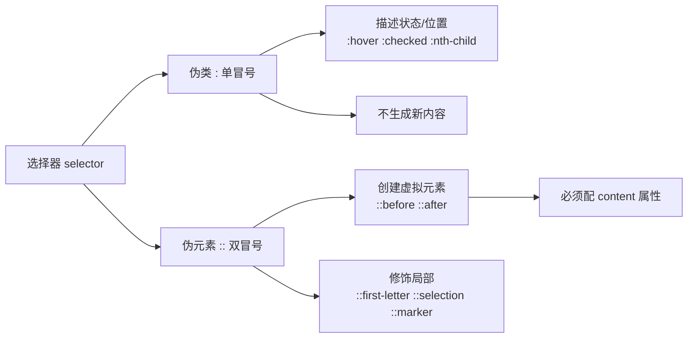

# 12 · 伪元素（Pseudo-elements）
> 伪元素用双冒号 `::` 创建一个不存在于 DOM 树中的「虚拟元素」，用来给元素的特定部分或自动生成的内容设置样式。

## 📖 知识讲解

### 1. 什么是伪元素
伪元素（pseudo-element）允许你为元素的**某个部分**或**额外生成的内容**设置样式，而无需在 HTML 中真的添加标签。最典型的用途是 `::before` / `::after` 在元素内容前后插入装饰性内容。

- **语法**：`选择器::伪元素 { ... }`，使用**双冒号** `::`（CSS3 规范，用以和伪类区分）。
- 为兼容旧浏览器，`::before` 等也可写成单冒号 `:before`，但现代代码推荐双冒号。

### 2. 常用伪元素
| 伪元素 | 作用 |
| --- | --- |
| `::before` | 在元素内容**之前**插入虚拟元素 |
| `::after` | 在元素内容**之后**插入虚拟元素 |
| `::first-letter` | 选中首字母 / 首字（首字下沉） |
| `::first-line` | 选中第一行文字 |
| `::placeholder` | 表单占位符文字样式 |
| `::selection` | 被用户**选中**的文字样式 |
| `::marker` | 列表项的项目符号 / 序号 |

### 3. content 属性（::before / ::after 的灵魂）
使用 `::before` / `::after` 时，**`content` 是必填项**，否则伪元素不会生成。`content` 可取：

| 写法 | 说明 |
| --- | --- |
| `content: "★"` | 普通文字 / 图标字符 |
| `content: ""` | 空字符串（常用于纯装饰方块、清除浮动） |
| `content: attr(data-x)` | 读取 HTML 属性值 |
| `content: "\201C"` | Unicode 转义（如引号） |
| `content: counter(n)` | CSS 计数器 |

### 4. 经典用法
- **图标**：`::before { content: "✅" }`。
- **清除浮动**（clearfix）：`::after { content:""; display:block; clear:both; }`。
- **装饰角标 / 红点**：`::after` + 绝对定位。
- **装饰引号**：`::before { content: "\201C" }`。

### 5. 伪类 vs 伪元素（核心区别）
| 对比项 | 伪类 pseudo-class | 伪元素 pseudo-element |
| --- | --- | --- |
| 符号 | 单冒号 `:` | 双冒号 `::` |
| 作用 | 选中元素的**状态/位置** | 创建/修饰**虚拟内容或局部** |
| 是否生成新内容 | 否 | `::before/::after` 会生成 |
| 例子 | `:hover` `:nth-child` | `::before` `::first-letter` |

> 记忆：伪类描述「元素是什么状态」，伪元素描述「元素的哪一部分 / 额外造一块」。

### 6. 易错点
- `::before` / `::after` 忘写 `content` → 伪元素**完全不显示**。
- 生成的伪元素默认是 `display: inline`，要设宽高需改成 `block` / `inline-block`。
- 伪元素**不能**作用于「替换元素」（如 ``、`<input>`），因为它们没有内容文档树（`::placeholder` 等专用伪元素除外）。
- 一个元素同名伪元素只能有一个 `::before` 和一个 `::after`。

## 🔄 流程图 / 原理图

## 💻 代码说明
- 演示一：`.with-icon::before` 用 `content` 插入 ✅ / ⚠️ 图标。
- 演示二：`.badge-box::after` + 绝对定位制作右上角 `NEW` 角标。
- 演示三：`.article::first-letter` 首字下沉、`::first-line` 首行加粗。
- 演示四：`.select-me::selection` 改变选中文字的高亮底色。
- 演示五：`.quote::before` 插入装饰大引号；`.link-attr::after` 用 `attr(data-host)` 读取属性值。
- 演示六：`.marker-list li::marker` 自定义列表标记颜色。

## ▶️ 运行方式
直接用浏览器打开 index.html 即可。

## ⚠️ 常见坑 / 最佳实践
- 凡是用 `::before` / `::after`，第一时间写上 `content`（哪怕是 `content:""`）。
- 用伪元素做纯装饰（图标、分隔线、角标），既能保持 HTML 语义干净，又方便统一维护。
- 需要给伪元素设尺寸 / 定位时记得加 `display:block` 或 `position:absolute`（父级设 `position:relative`）。
- 替换元素（img、input）上请用专用伪元素（如 `::placeholder`），普通 `::before` 无效。

## 🔗 官方文档
- [伪元素 - MDN](https://developer.mozilla.org/zh-CN/docs/Web/CSS/Pseudo-elements)
- [::before - MDN](https://developer.mozilla.org/zh-CN/docs/Web/CSS/::before)
- [content - MDN](https://developer.mozilla.org/zh-CN/docs/Web/CSS/content)
