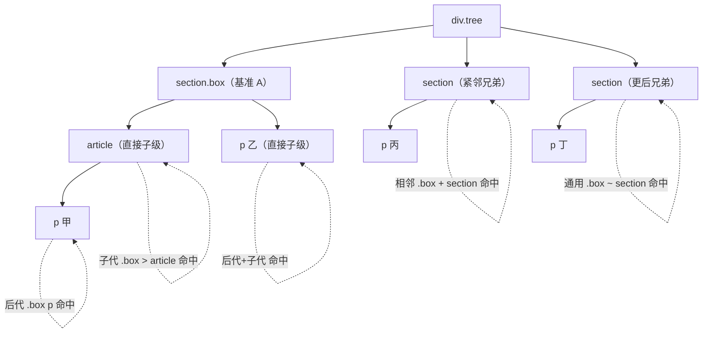

# 13 · 组合器 / 关系选择器（Combinators）

> 组合器通过元素之间的「位置关系」（后代、子级、兄弟）来选取目标元素，而不是只看元素自身的标签、class 或 id。

## 📖 知识讲解

CSS 提供四种组合器，把两个简单选择器连接起来，表达它们之间的**结构关系**。

### 四种组合器

| 组合器 | 写法 | 含义 | 关系约束 |
| --- | --- | --- | --- |
| 后代选择器 | `A B`（空格） | 选中 A 内部**任意深度**的所有 B | 无深度限制 |
| 子代选择器 | `A > B` | 选中 A 的**直接子元素** B | 只看一层 |
| 相邻兄弟选择器 | `A + B` | 选中**紧跟**在 A 后的**第一个**同级 B | 必须紧邻 |
| 通用兄弟选择器 | `A ~ B` | 选中 A **之后所有**同级 B | 不要求紧邻 |

### 关键区别图解

```text
<section class="box">          A = .box
  <article>
    <p>甲</p>   ← .box p 命中（后代），.box > p 不命中（隔了 article）
  </article>
  <p>乙</p>     ← .box p 命中，.box > p 也命中（直接子级）
</section>
<section>...</section>          ← .box + section 命中（紧邻），.box ~ section 命中
<section>...</section>          ← .box + section 不命中，.box ~ section 命中
```

### 易错点

- **后代 vs 子代**：`A B` 是“在里面就行”，`A > B` 必须是“亲儿子”。最常见的混淆点。
- **相邻 vs 通用**：`A + B` 只命中后面**紧挨着的那一个**；`A ~ B` 命中后面**所有**符合条件的兄弟。
- **兄弟组合器只能向“后”选**：CSS 没有“前一个兄弟”的组合器（不能选 A 前面的元素）。
- **组合器不增加优先级权重**：`.box > p` 与 `.box p` 的优先级完全相同，权重只由其中的简单选择器（这里都是一个 class + 一个标签）决定。组合符号本身不计入特异度。
- 空格本身就是后代组合器，所以 `.a.b`（无空格，同一元素同时有 a 和 b 两个 class）与 `.a .b`（有空格，b 是 a 的后代）含义完全不同。

## 🔄 流程图 / 原理图

下面用一棵 DOM 树标注四种组合器（基准元素为 `.box`）各自命中的节点：



## 💻 代码说明

- `index.html` 构建了一棵带多层级、多兄弟的 DOM 树。
- 四个按钮切换 `.tree` 上的 class（`descendant` / `child` / `adjacent` / `sibling`）。
- CSS 中四条高亮规则分别对应四种组合器，例如 `.tree.child .box > article` 只在“子代”模式下把 `.box` 的直接子 `article` 高亮成蓝色。
- 这样同一棵树在不同模式下高亮的节点不同，可直观对比命中差异。

## ▶️ 运行方式

直接用浏览器打开 index.html 即可。

## ⚠️ 常见坑 / 最佳实践

- 不要滥用后代选择器 `A B`，层级太深会让样式难以维护且匹配成本高；能用子代 `>` 精确表达时就用。
- 兄弟组合器常用于“点击/勾选某元素后影响后面的元素”，配合 `:checked`、`:hover` 等很强大（纯 CSS 交互）。
- 记住组合器**不加权重**，调试优先级时别把 `>`、`+`、`~` 当成提升特异度的手段。
- 写 `.a .b` 时务必确认是否真的需要那个空格——多/少一个空格语义完全不同。

## 🔗 官方文档

- [组合器 - MDN](https://developer.mozilla.org/zh-CN/docs/Learn/CSS/Building_blocks/Selectors/Combinators)
- [后代组合器 - MDN](https://developer.mozilla.org/zh-CN/docs/Web/CSS/Descendant_combinator)
- [子代组合器 - MDN](https://developer.mozilla.org/zh-CN/docs/Web/CSS/Child_combinator)
- [相邻兄弟组合器 - MDN](https://developer.mozilla.org/zh-CN/docs/Web/CSS/Next-sibling_combinator)
- [通用兄弟组合器 - MDN](https://developer.mozilla.org/zh-CN/docs/Web/CSS/Subsequent-sibling_combinator)
