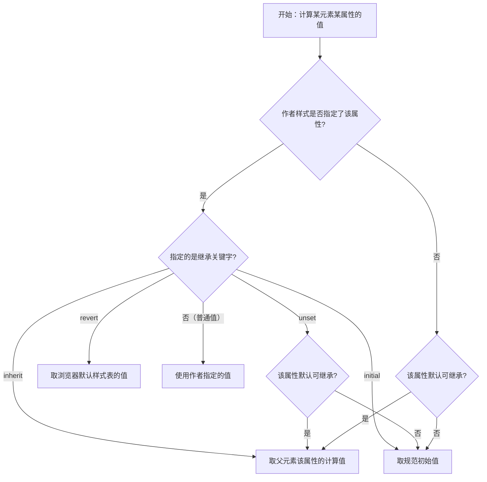

# 14 · 继承与控制（Inheritance）

> 部分 CSS 属性会自动从父元素传递给后代（继承），减少重复书写；当默认行为不符合需求时，可用 `inherit` / `initial` / `unset` / `revert` 四个关键字精确控制。

## 📖 知识讲解

### 什么是继承

当某个属性是「可继承」的，且子元素**没有为该属性指定值**时，子元素会自动取父元素的计算值。继承让“在容器上设一次字体颜色，内部所有文字都生效”成为可能。

### 哪些属性默认继承

继承的属性几乎都与**文本/排版**相关：

| 默认继承（常见） | 默认不继承（常见） |
| --- | --- |
| `color` | `margin` / `padding` / `border` |
| `font-family` / `font-size` / `font-weight` / `font-style` | `width` / `height` |
| `line-height` / `letter-spacing` / `word-spacing` | `background`（及其简写） |
| `text-align` / `text-indent` / `white-space` | `display` / `float` / `position` |
| `visibility` / `cursor` / `list-style` | `top/right/bottom/left` / `overflow` |

> 经验法则：**文本相关属性会继承；盒模型、背景、定位/布局类属性不继承。** 不确定时查 MDN 该属性页的「是否继承（Inherited）」字段。

### 控制继承的四个关键字

每个 CSS 属性都可以显式赋这四个关键字之一：

| 关键字 | 含义 |
| --- | --- |
| `inherit` | **强制继承**父元素该属性的计算值（即使该属性默认不继承，也强制取父值） |
| `initial` | 重置为该属性的**初始值**（CSS 规范定义的默认值，注意不是浏览器默认样式） |
| `unset` | **可继承属性** → 表现得像 `inherit`；**不可继承属性** → 表现得像 `initial` |
| `revert` | 回退到**用户代理（浏览器）默认样式表**的值（与 `initial` 不同，`initial` 是规范初始值） |

### `all` 属性

`all` 是一个简写，可一次性把元素**几乎所有属性**设为继承关键字：

```css
.reset { all: unset; }     /* 把元素几乎所有属性重置：可继承的继承、不可继承的回到初始 */
.revert-all { all: revert; }
```

常用于“去掉某元素全部样式后重新定制”，比如重置 `<button>`。

### currentColor 与继承

`currentColor` 是一个关键字，表示**当前元素 `color` 属性的计算值**。由于 `color` 可继承，`currentColor` 常用来让边框、背景、SVG 填充等“跟着文字颜色走”：

```css
.box { color: #2a9d8f; border: 2px solid currentColor; } /* 边框自动同色 */
```

## 🔄 流程图 / 原理图

属性取值时的「继承计算」流程：



## 💻 代码说明

- **演示 1**：`.parent` 同时设了文本属性（color/font/line-height/text-align）和盒模型属性（border/padding/background）。子元素未写任何文字样式，却继承了全部文本属性，但边框、背景没被继承——直观证明“哪些传、哪些不传”。
- **演示 2**：四个 `<span>` 分别用 `inherit` / `initial` / `unset`（作用于可继承的 color）/ `unset`（作用于不可继承的 border），观察颜色与边框变化。
- **演示 3**：`.cc-box` 只设 `color`，边框和小圆点 background 都用 `currentColor`，自动同色。

## ▶️ 运行方式

直接用浏览器打开 index.html 即可。

## ⚠️ 常见坑 / 最佳实践

- `initial` 取的是**规范初始值**，不是“浏览器默认外观”。例如 `display: initial` 是 `inline`，并不会还原成元素本来的 `block`；想还原浏览器默认用 `revert`。
- 想让本不继承的属性继承时，显式写 `inherit`（如让子元素 `box-sizing: inherit`）。
- `all: unset` 可快速“清零”元素样式，但会连可访问性相关的默认外观一起去掉，重置 `button` 后记得补回必要样式。
- 善用 `currentColor` 做图标/边框与文字同色，主题切换时只改一个 `color` 即可联动。

## 🔗 官方文档

- [继承 - MDN](https://developer.mozilla.org/zh-CN/docs/Web/CSS/Inheritance)
- [inherit - MDN](https://developer.mozilla.org/zh-CN/docs/Web/CSS/inherit)
- [initial - MDN](https://developer.mozilla.org/zh-CN/docs/Web/CSS/initial)
- [unset - MDN](https://developer.mozilla.org/zh-CN/docs/Web/CSS/unset)
- [revert - MDN](https://developer.mozilla.org/zh-CN/docs/Web/CSS/revert)
- [all - MDN](https://developer.mozilla.org/zh-CN/docs/Web/CSS/all)
