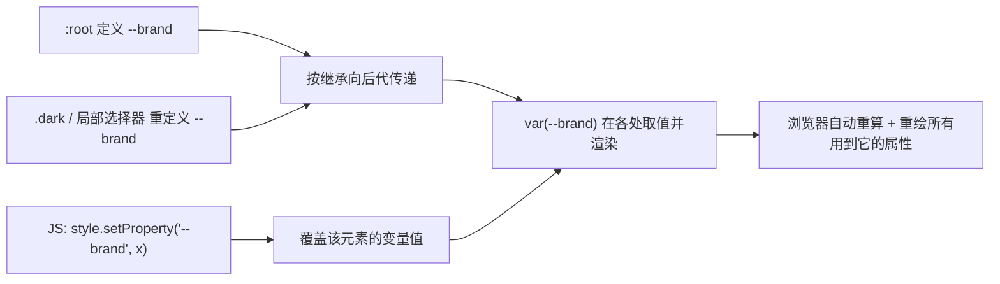

# 15 · CSS 自定义属性 / 变量（CSS Variables）

> 用 `--name` 定义可复用的值，用 `var(--name, 回退值)` 引用。它们遵循继承与层叠、可作用域化，并能被 JavaScript 在运行时修改，是实现主题切换的原生方案。

## 📖 知识讲解

### 定义与使用

```css
:root {
  --brand: #4361ee;       /* 定义：自定义属性必须以两个连字符 -- 开头 */
}
.btn {
  background: var(--brand);            /* 使用 */
  color: var(--text, #000);            /* 第二个参数是回退值：变量无效/未定义时用它 */
}
```

- 名字**大小写敏感**：`--Brand` 与 `--brand` 是两个变量。
- `var()` 只能用于**属性值**，不能用于属性名、选择器或媒体查询条件里。
- 回退值可以嵌套：`var(--a, var(--b, red))`。

### 作用域与继承

自定义属性**跟随 DOM 继承**，作用域就是“定义它的元素及其后代”：

| 定义位置 | 作用范围 |
| --- | --- |
| `:root { --x }` | 全局（整篇文档都能用） |
| `.card { --x }` | 仅 `.card` 及其后代 |
| 元素内联 `style="--x:..."` | 该元素及其后代 |

子元素就近取值：内层重新定义同名变量会**覆盖**外层的值（层叠 + 继承共同作用）。这正是暗色主题的原理——在 `html.dark` 上重定义同名变量即可整页生效。

### 配合 JavaScript 动态修改

```js
const root = document.documentElement;       // :root 对应 <html>
root.style.setProperty('--brand', '#e63946'); // 写入/修改变量
const v = getComputedStyle(root).getPropertyValue('--brand').trim(); // 读取计算值
```

改一个变量，所有 `var(--brand)` 的地方会**自动重新计算并重绘**，无需逐个改样式。

### 与预处理器变量（Sass `$var`）的区别

| 维度 | CSS 自定义属性 `--x` | Sass 变量 `$x` |
| --- | --- | --- |
| 生效时机 | **运行时**（浏览器中实时） | **编译时**（生成 CSS 前就被替换掉） |
| 能否被 JS 修改 | 能（`setProperty`） | 不能（编译后已消失） |
| 是否参与继承/层叠 | 是，跟随 DOM | 否，纯文本替换 |
| 能否响应主题/媒体查询动态变化 | 能 | 不能（需重新编译） |

一句话：Sass 变量是“写代码时的常量”，CSS 变量是“运行时活的值”。

## 🔄 流程图 / 原理图

变量从定义到被 JS 动态修改的关系：



## 💻 代码说明

- `:root` 里集中定义全局变量（主题色、背景、文字、圆角、阴影），所有卡片与按钮都用 `var()` 引用。
- `html.dark` 重新定义同名变量，「切换明/暗」按钮只是 `classList.toggle('dark')`，整页配色随之改变。
- 色块点击通过 `root.style.setProperty('--brand', color)` 直接改全局主题色，并用 `getComputedStyle` 读回实时值显示。
- 第二张卡片 `.local-scope` 自己定义 `--brand`，演示**局部作用域覆盖**：它不受上方全局色块影响。

## ▶️ 运行方式

直接用浏览器打开 index.html 即可。

## ⚠️ 常见坑 / 最佳实践

- `var()` 的回退值不是“变量不存在才用”，而是“变量值无效或未定义就用”，写上回退值更健壮。
- 自定义属性的值是“未解析的记号”，`--gap: 10` 不带单位时，`margin: var(--gap)` 无效；需要 `calc(var(--gap) * 1px)` 或直接写 `--gap: 10px`。
- 变量遵循继承，不能在 `@media (max-width: var(--x))` 这类条件里用（媒体查询不读自定义属性）。
- 主题集中放在 `:root`，命名语义化（`--text` 而非 `--gray`），切主题只改变量、不改结构，可维护性最好。
- `setProperty` 写的是内联样式，优先级高于选择器里定义的同名变量，注意覆盖关系。

## 🔗 官方文档

- [使用 CSS 自定义属性（变量） - MDN](https://developer.mozilla.org/zh-CN/docs/Web/CSS/Using_CSS_custom_properties)
- [自定义属性 (--*) - MDN](https://developer.mozilla.org/zh-CN/docs/Web/CSS/--*)
- [var() - MDN](https://developer.mozilla.org/zh-CN/docs/Web/CSS/var)
