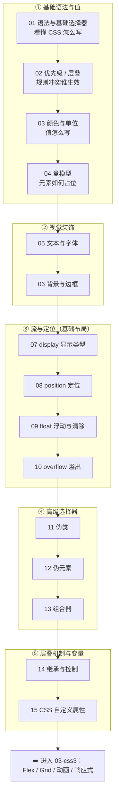

# 02 · CSS 基础（CSS Basics）

> CSS（Cascading Style Sheets，层叠样式表）负责网页的「外观与排版」——颜色、字体、间距、布局、定位等。HTML 决定「有什么内容」，CSS 决定「内容长什么样」。本工程聚焦 CSS **基础**，进阶的 Flexbox / Grid / 动画 / 过渡 / 响应式放在 `03-css3` 工程，本工程不重复。

## 📚 这是什么

CSS 通过「选择器（选中谁）+ 声明块（怎么样）」给 HTML 元素附加样式：

```css
选择器 {
  属性: 值;   /* 一条声明 */
  属性: 值;
}
```

它的核心特性是 **层叠（Cascade）** 与 **继承（Inheritance）**：当多条规则作用于同一元素时，浏览器按「来源/重要性 → 优先级 → 源码顺序」决出胜者；很多文本类属性还会自动从父元素继承下来。理解这两点，是看懂一切 CSS 行为的钥匙。

## 🗂️ 模块索引

| 序号 | 模块 | 知识点 | 一句话说明 |
| --- | --- | --- | --- |
| 01 | [syntax-selectors](./01-syntax-selectors/) | 语法 / 基础选择器 | CSS 语法结构、引入方式、元素/类/id/属性选择器 |
| 02 | [specificity-cascade](./02-specificity-cascade/) | 优先级 / 层叠 / !important | 多条规则冲突时谁生效，权重如何计算 |
| 03 | [colors-units](./03-colors-units/) | 颜色 / 单位 | 颜色表示法与 px/em/rem/%/vw 等单位 |
| 04 | [box-model](./04-box-model/) | 盒模型 | content/padding/border/margin 与 box-sizing |
| 05 | [text-fonts](./05-text-fonts/) | 文本 / 字体 | 字体栈、字号、行高、对齐、文本装饰 |
| 06 | [backgrounds-borders](./06-backgrounds-borders/) | 背景 / 边框 | 背景图渐变、边框、圆角、阴影、简写 |
| 07 | [display-types](./07-display-types/) | 显示类型 | block / inline / inline-block / none |
| 08 | [position](./08-position/) | 定位 | static / relative / absolute / fixed / sticky |
| 09 | [float-clear](./09-float-clear/) | 浮动与清除 | float、文字环绕、高度塌陷与清除浮动 |
| 10 | [overflow](./10-overflow/) | 溢出处理 | overflow 取值、文本省略号 |
| 11 | [pseudo-classes](./11-pseudo-classes/) | 伪类 | :hover / :focus / :nth-child 等状态选择 |
| 12 | [pseudo-elements](./12-pseudo-elements/) | 伪元素 | ::before / ::after / ::first-letter 等 |
| 13 | [combinators](./13-combinators/) | 组合器 | 后代 / 子代 / 相邻兄弟 / 通用兄弟选择器 |
| 14 | [inheritance](./14-inheritance/) | 继承与控制 | 继承规则、inherit / initial / unset |
| 15 | [css-variables](./15-css-variables/) | 自定义属性 | --变量 与 var()，运行时主题切换 |

## 🧭 学习路线



学习建议：

1. **先打地基（01-04）**：语法 → 优先级 → 值与单位 → 盒模型，这四个是理解后续一切的前提，尤其「盒模型」和「优先级」要反复练。
2. **再做视觉（05-06）**：文本字体和背景边框，能让页面「好看」起来。
3. **掌握基础布局（07-10）**：display、position、float、overflow 是传统布局的核心；现代布局（Flex/Grid）建立在对 display 的理解之上。
4. **吃透选择器与机制（11-15）**：伪类伪元素、组合器让选择更精准；继承与 CSS 变量是层叠机制的高级应用，也是工程化与主题化的基础。

## ▶️ 运行说明

本工程所有模块均为 **免构建** demo：

- 直接用浏览器（Chrome / Edge / Firefox / Safari）**双击打开**任意模块下的 `index.html` 即可看到效果。
- 无需安装任何依赖、无需启动服务器、无需打包工具。
- 建议配合每个模块的 `README.md` 一起看：README 讲原理，`index.html` 看效果与源码注释。

```bash
# 例如查看「盒模型」模块（macOS）
open 02-css/04-box-model/index.html
```

## 🔗 官方文档

- [MDN · CSS](https://developer.mozilla.org/zh-CN/docs/Web/CSS)
- [MDN · 学习 CSS](https://developer.mozilla.org/zh-CN/docs/Learn/CSS)
- [MDN · CSS 样式基础](https://developer.mozilla.org/zh-CN/docs/Learn/CSS/Building_blocks)
