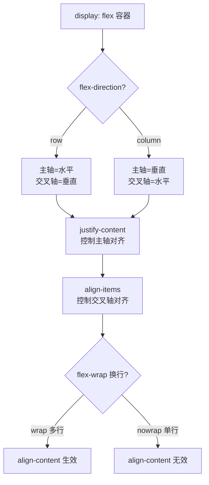

# 01 · 弹性布局（Flexbox）
> Flexbox 是一维布局模型，沿「主轴」一条线排列子项，轻松解决对齐、分配空间与自适应伸缩问题。

## 📖 知识讲解

Flexbox（Flexible Box Layout）以「容器 + 项目」两层模型工作。给容器设 `display: flex` 后，它的直接子元素就成为 flex 项目，沿**主轴（main axis）**排列，垂直方向是**交叉轴（cross axis）**。`flex-direction` 决定主轴方向：`row` 时主轴水平、交叉轴垂直；`column` 时两者互换——这是理解所有对齐属性的前提。

**容器属性：**
- `display: flex` —— 开启弹性布局。
- `flex-direction`：`row` / `row-reverse` / `column` / `column-reverse`，决定主轴方向。
- `flex-wrap`：`nowrap`（默认不换行，会压缩项目）/ `wrap` / `wrap-reverse`。
- `flex-flow`：`flex-direction` 与 `flex-wrap` 的简写，如 `flex-flow: row wrap`。
- `justify-content`：**主轴**对齐。`flex-start` / `center` / `flex-end` / `space-between`（两端贴边、间隔均分）/ `space-around`（每项左右等距，视觉上首尾半距）/ `space-evenly`（所有间隙完全相等）。
- `align-items`：**交叉轴**单行对齐。`stretch`（默认，无固定尺寸时撑满）/ `flex-start` / `center` / `flex-end` / `baseline`（按文字基线）。
- `align-content`：**多行**时行与行在交叉轴上的对齐，**仅在换行产生多行时生效**。
- `gap`：项目间距（`row-gap` / `column-gap`），比 margin 更干净。

**项目属性：**
- `order`：整数，控制排列顺序（默认 0，越小越靠前）。
- `flex-grow`：剩余空间的**放大比例**（默认 `0`，即不放大）。
- `flex-shrink`：空间不足时的**收缩比例**（默认 `1`）。
- `flex-basis`：分配前的**基准尺寸**（默认 `auto`，按内容）。
- `flex` 简写：`flex: 1` = `1 1 0%`（basis 为 0%，纯按 grow 比例分配）；`flex: auto` = `1 1 auto`（先按内容再分配）；`flex: none` = `0 0 auto`（不伸不缩）。
- `align-self`：覆盖单个项目的 `align-items`。

**易错点：** `flex-grow` 默认是 0，所以项目默认不会自动撑满；`align-content` 单行无效；`flex:1` 因为 basis=0% 会忽略内容宽度按比例均分。

## 🔄 流程图 / 原理图



## 💻 代码说明

容器开启 flex 并用 `gap` 设间距：

```css
.flex-demo {
  display: flex;
  justify-content: flex-start; /* JS 动态改 */
  align-items: stretch;        /* JS 动态改 */
  gap: 10px;
  min-height: 180px;           /* 留交叉轴高度才看得出 align 效果 */
}
```

JS 把下拉框的值同步到容器内联样式，实现实时切换：

```js
demo.style.flexDirection = dir.value;
demo.style.justifyContent = justify.value;
demo.style.alignItems = align.value;
```

flex-grow 比例分配，三块按 1:2:3 瓜分剩余空间：

```css
.g1 { flex-grow: 1; }
.g2 { flex-grow: 2; }
.g3 { flex-grow: 3; }
```

## ▶️ 运行方式

免构建：用浏览器直接打开本目录下的 `index.html` 即可。切换下拉框观察排列变化。

## ⚠️ 常见坑 / 最佳实践

- **`flex-grow` 默认 0**：想让项目填满父容器要显式写 `flex: 1`。
- **`align-content` 仅多行生效**：单行容器改它没反应，应该用 `align-items`。
- **`flex: 1` 的 basis 是 `0%`**：会忽略内容固有宽度按比例均分；想保留内容宽度用 `flex: auto`。
- **`margin: auto` 妙用**：在 flex 项目上设 `margin-left: auto` 可把它及之后的项目推到主轴末端（常用于导航栏「最后一项靠右」）。
- 用 `gap` 替代项目 `margin`，避免首尾多余间距。

## 🔗 官方文档

- [MDN · Flexbox 基本概念](https://developer.mozilla.org/zh-CN/docs/Web/CSS/CSS_flexible_box_layout/Basic_concepts_of_flexbox)
