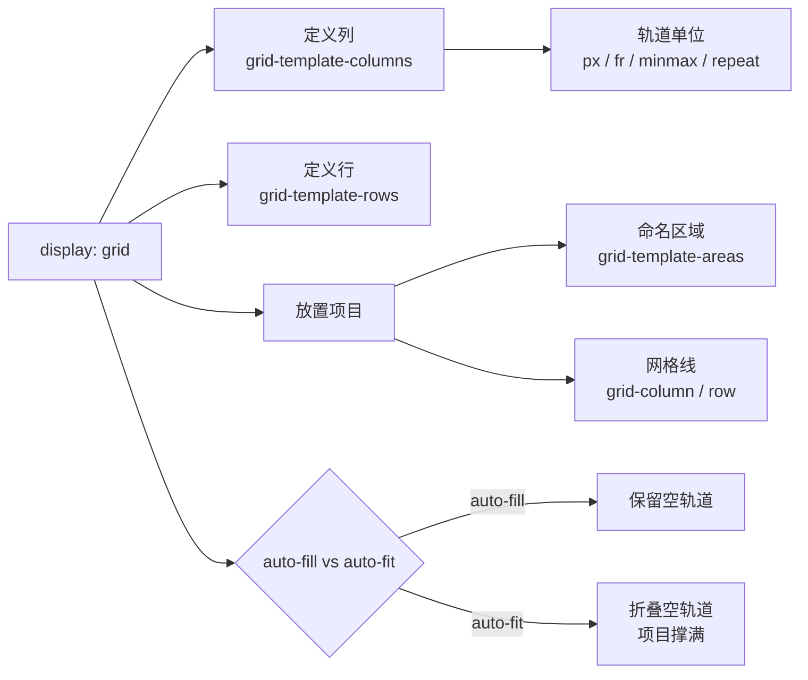

# 02 · 网格布局（Grid）
> Grid 是 CSS 唯一的二维布局系统，能同时按行和列精确摆放元素，是构建整页骨架与响应式卡片的首选。

## 📖 知识讲解

Grid 把容器划分为「行轨道」和「列轨道」组成的网格，子项落入一个个「网格单元」。给容器设 `display: grid` 后用以下属性定义结构：

**定义轨道：**
- `grid-template-columns` / `grid-template-rows`：定义列 / 行的尺寸，如 `200px 1fr 1fr`。
- `fr` 单位：剩余空间的「份数」，`1fr 2fr` 即按 1:2 分配剩余空间。
- `repeat(n, ...)`：重复轨道，`repeat(3, 1fr)` = `1fr 1fr 1fr`。
- `minmax(min, max)`：轨道尺寸下限与上限，如 `minmax(120px, 1fr)`。
- `gap`（`row-gap` / `column-gap`）：轨道间距。
- `grid-auto-rows` / `grid-auto-columns`：**隐式网格**轨道的尺寸（项目超出显式定义时自动生成）。

**放置项目：**
- `grid-template-areas`：用命名区域「画」出布局，配合项目的 `grid-area` 使用。
- `grid-column` / `grid-row`：按**网格线**定位，如 `grid-column: 1 / 3`（从第 1 线到第 3 线）或 `grid-column: span 2`（跨 2 列）；`1 / -1` 表示占满整行/列。

**对齐：**
- `justify-items` / `align-items`：单元格内项目在列 / 行方向的对齐。
- `place-items`：上面两者的简写。

**auto-fill vs auto-fit：** 配合 `repeat()` 自动算列数。`auto-fill` 会**保留**空轨道（占位），`auto-fit` 会**折叠**空轨道（让现有项目撑满）。

**易错点：** 网格线从 **1** 开始计数（不是 0）；`grid-template-areas` 的每个区域必须拼成**矩形**；`align-content` 只在网格总高小于容器时影响整体。

## 🔄 流程图 / 原理图



## 💻 代码说明

用命名区域定义页面骨架（字符串排布即可读出布局形状）：

```css
.layout {
  display: grid;
  grid-template-columns: 200px 1fr;
  grid-template-rows: 70px 1fr 60px;
  grid-template-areas:
    "header  header"
    "sidebar main"
    "footer  footer";
}
.header  { grid-area: header; }
.sidebar { grid-area: sidebar; }
```

响应式卡片网格，无需媒体查询自动增减列：

```css
.cards {
  display: grid;
  grid-template-columns: repeat(auto-fit, minmax(120px, 1fr));
  gap: 12px;
}
```

按网格线跨格：

```css
.span-a { grid-column: 1 / 3; }   /* 第 1 线到第 3 线，占 2 列 */
.span-b { grid-column: span 2; }  /* 跨 2 列 */
.span-c { grid-column: 1 / -1; }  /* 占满整行 */
```

## ▶️ 运行方式

免构建：用浏览器直接打开本目录下的 `index.html`。拖动窗口宽度可观察第二个卡片网格自动换列。

## ⚠️ 常见坑 / 最佳实践

- **网格线从 1 计数**：`grid-column: 1 / 3` 是跨 2 列而非 3 列；`-1` 是最后一条线。
- **auto-fill vs auto-fit**：项目少时 `auto-fill` 会留出空列（看起来项目不撑满），`auto-fit` 则让项目铺满整行——响应式卡片通常用 `auto-fit`。
- **areas 必须是矩形**：同名区域不能拼成 L 形或不连续，否则布局无效。
- 优先用 `fr` + `minmax()` 做弹性轨道，少写死像素；用 `gap` 而非 margin 控制间距。
- 一维排布（一行或一列）用 Flexbox 更简单，二维整页布局才上 Grid。

## 🔗 官方文档

- [MDN · Grid 基本概念](https://developer.mozilla.org/zh-CN/docs/Web/CSS/CSS_grid_layout/Basic_concepts_of_grid_layout)
