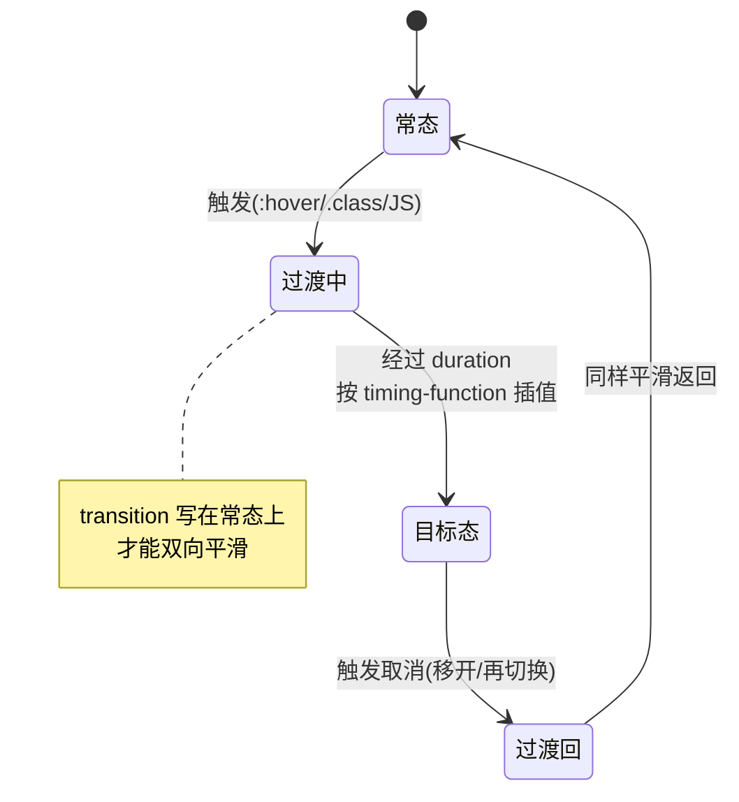

# 03 · 过渡（Transitions）
> Transition 让 CSS 属性在改变时按指定时长平滑过渡，而不是瞬间跳变，是最轻量的交互动画手段。

## 📖 知识讲解

CSS Transition 监听元素属性值的变化（由 `:hover`、`:focus`、切换 class、JS 改样式等触发），在新旧值之间插入一段时间的动画。四个核心子属性：

- `transition-property`：要过渡的属性，如 `transform` / `background` / `all`（所有可动画属性）。
- `transition-duration`：时长，如 `.4s` / `300ms`（**必须有时长否则无动画**）。
- `transition-timing-function`：速度曲线。
  - `linear`：匀速。
  - `ease`（默认）：慢→快→慢。
  - `ease-in` / `ease-out` / `ease-in-out`：进入 / 退出 / 两端缓动。
  - `cubic-bezier(x1,y1,x2,y2)`：自定义贝塞尔，y 超出 [0,1] 可做回弹。
  - `steps(n, end|start)`：分 n 段跳跃（适合精灵图/打字效果）。
- `transition-delay`：延迟开始的时间。

**简写：** `transition: property duration timing-function delay;`，如 `transition: all .4s ease;`。多个属性用逗号分隔：`transition: transform .3s, opacity .5s ease-in;`。

**触发方式：** `:hover` / `:focus` 等伪类、增删 class（`classList.toggle`）、JS 直接改 `el.style.xxx`、表单状态（`:checked`）等。

**易错点：** `display: none` 不可过渡（瞬间消失），要用 `visibility` + `opacity`；高度 `auto` 不可过渡，要用 `max-height` 或 grid 技巧；过渡声明要放在**常态**而非 `:hover` 上，移开才同样平滑；只有「可动画属性」（颜色、尺寸、transform、opacity 等）才能过渡。

## 🔄 流程图 / 原理图



## 💻 代码说明

把过渡写在**常态**，只声明一次即双向生效：

```css
.ball {
  transition-property: transform;
  transition-duration: .9s;
}
.ease   { transition-timing-function: ease; }
.linear { transition-timing-function: linear; }
.bezier { transition-timing-function: cubic-bezier(.68,-0.55,.27,1.55); } /* 回弹 */
.steps  { transition-timing-function: steps(4, end); }
.demo1.run .ball { transform: translateX(360px); } /* 加 .run 触发 */
```

hover 综合过渡，用 `all` 一次性平滑多个属性：

```css
.hover-box { transition: all .4s ease; }
.hover-box:hover {
  background:#8b5cf6;
  transform: scale(1.1) rotate(-3deg);
  border-radius:24px;
}
```

高度 auto 不能过渡，改用 `max-height`：

```css
.panel { max-height: 48px; overflow: hidden; transition: max-height .5s ease; }
.panel.open { max-height: 240px; }
```

JS 仅负责切换 class，动画交给 CSS：

```js
panel.classList.toggle('open');
```

## ▶️ 运行方式

免构建：用浏览器直接打开本目录下的 `index.html`。点击按钮看曲线对比、悬停盒子、点击面板展开。

## ⚠️ 常见坑 / 最佳实践

- **`display:none` 不能过渡**：会瞬间消失/出现；淡入淡出请用 `opacity` + `visibility`。
- **`height:auto` 不能过渡**：内容高度未知无法插值；用 `max-height`（给个够大的上限）或 grid 的 `grid-template-rows: 0fr→1fr` 技巧。
- **过渡写在常态上**：若只写在 `:hover` 里，鼠标移开时会瞬间还原而不平滑。
- **只过渡可动画属性**：优先动画 `transform` 和 `opacity`，它们走合成层、性能最好；避免过渡 `width/height/top/left` 引发重排。
- 多属性想要不同节奏时，分开写而非一律 `all`，可避免意外属性也跟着动。

## 🔗 官方文档

- [MDN · 使用 CSS 过渡](https://developer.mozilla.org/zh-CN/docs/Web/CSS/CSS_transitions/Using_CSS_transitions)
