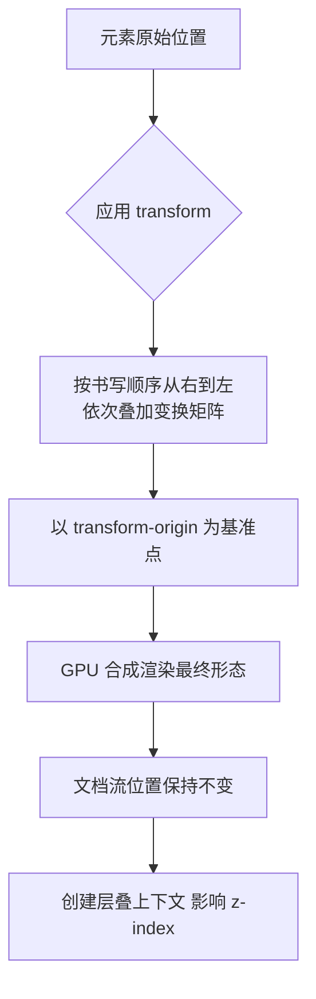

# 04 · 2D 变换（2D Transforms）

> 通过 `transform` 属性对元素进行平移、旋转、缩放、倾斜，而不改变文档流布局，常用于交互动效与视觉点缀。

## 📖 知识讲解

`transform` 是 CSS 中对元素做几何变换的属性，2D 变换包含以下核心函数：

| 函数 | 作用 | 示例 |
| --- | --- | --- |
| `translate(x, y)` / `translateX` / `translateY` | 平移 | `translate(20px, 10px)` |
| `scale(x, y)` / `scaleX` / `scaleY` | 缩放 | `scale(1.5)` 放大 1.5 倍 |
| `rotate(angle)` | 旋转，单位 `deg` 或 `turn` | `rotate(45deg)`、`rotate(0.25turn)` |
| `skew(x, y)` / `skewX` / `skewY` | 倾斜 | `skewX(20deg)` |
| `matrix(a,b,c,d,e,f)` | 矩阵，前面所有函数的底层统一形式 | `matrix(1,0,0,1,30,0)` |

几个关键特性：

- **transform-origin**：定义变换的「基准点」（旋转中心、缩放原点），默认 `center`（即 `50% 50%`），可设为 `top left`、`100% 100%`、具体像素等。
- **不脱离文档流**：变换后的元素在布局上仍占据原始位置，不会挤动周围元素（这点和 `position` 不同）。
- **创建层叠上下文**：一旦设置非 `none` 的 `transform`，元素会创建新的层叠上下文（影响 `z-index`），并通常被提升到 GPU 合成层。
- **百分比基准**：`translate` 的百分比相对于**元素自身尺寸**，例如 `translateX(50%)` 是向右移动自身宽度的一半。

## 🔄 流程图 / 原理图



## 💻 代码说明

`index.html` 中：

- 四个彩色盒子分别绑定一个 `range` 滑块，滑块的 `input` 事件实时拼接 `transform` 字符串：
  ```js
  box1.style.transform = `translateX(${r1.value}px)`;
  box2.style.transform = `rotate(${r2.value}deg)`;
  box3.style.transform = `scale(${r3.value})`;
  box4.style.transform = `skewX(${r4.value}deg)`;
  ```
- 第五个区块演示 `transform-origin`：盒子用 `@keyframes spin` 持续旋转，点击按钮切换 `transformOrigin`（如 `0% 0%`、`100% 100%`），可看到旋转中心点（红圈标记）发生改变，旋转轨迹随之变化。
- 多变换组合（顺序敏感）：`transform: rotate(45deg) translateX(50px)` 会先平移再连同坐标系一起旋转，与交换顺序结果完全不同。

## ▶️ 运行方式

免构建：直接用浏览器打开 `index.html` 即可。

```bash
open 04-transforms-2d/index.html   # macOS
```

## ⚠️ 常见坑 / 最佳实践

- **变换顺序影响结果**：多个函数从右到左依次应用，`A B` 表示「先做 B 再做 A」。`rotate` 后 `translate` 会沿旋转后的坐标轴移动。
- **行内元素无效**：`display: inline` 的元素无法应用 transform，需改为 `inline-block` / `block` / `flex` 等。
- **性能优先 transform / opacity**：动画尽量只改 `transform` 和 `opacity`，它们走 GPU 合成，不触发重排重绘；改 `top/left/width` 会引起回流。
- **百分比基准是自身**：`translate(100%)` 是移动自身尺寸，而非父容器尺寸。
- **层叠上下文副作用**：设置 transform 后 `z-index` 行为可能变化，定位元素层级需注意。
- 用 `will-change: transform` 可提示浏览器提前优化，但勿滥用（占用显存）。

## 🔗 官方文档

- MDN transform：https://developer.mozilla.org/zh-CN/docs/Web/CSS/transform
- MDN transform-origin：https://developer.mozilla.org/zh-CN/docs/Web/CSS/transform-origin
