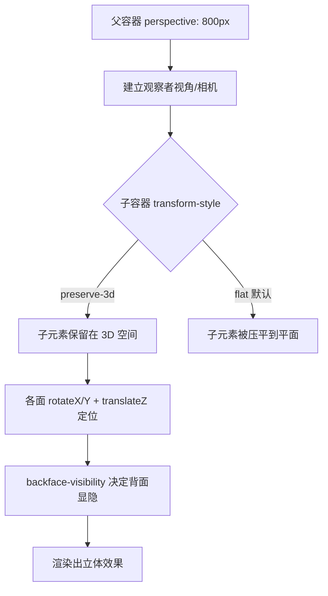

# 05 · 3D 变换（3D Transforms）

> 在 `transform` 基础上引入 Z 轴与透视（perspective），让平面元素拥有立体景深，可实现翻转卡片、3D 立方体等真实空间效果。

## 📖 知识讲解

3D 变换是 2D 变换的扩展，新增了 Z 轴（指向屏幕外/内）以及一套「透视」系统：

| 概念 | 说明 |
| --- | --- |
| `perspective`（容器属性） | 设在**父容器**上，定义观察者到屏幕的距离。值越小透视越夸张 |
| `perspective()`（函数） | 写在元素自身 `transform` 里的透视，只作用于该元素 |
| `perspective-origin` | 透视的「灭点」位置，默认 `center`，决定从哪个角度看 |
| `transform-style: preserve-3d` | 让子元素保留在三维空间，而非被压平到父元素平面 |
| `translateZ(n)` | 沿 Z 轴推近/推远（配合 perspective 才有近大远小） |
| `rotateX / rotateY / rotateZ` | 绕三个轴旋转 |
| `backface-visibility: hidden` | 元素背面朝向观察者时是否隐藏 |

**透视的两种写法区别**：

- 父容器 `perspective: 800px;` → 所有子元素共享同一个「相机」，多个 3D 元素空间关系一致。
- 元素自身 `transform: perspective(800px) rotateY(45deg);` → 每个元素独立透视，适合单个元素。

## 🔄 流程图 / 原理图



## 💻 代码说明

`index.html` 包含两个经典 3D 演示：

**1. 可翻转卡片**
- 外层 `.flip-scene` 设 `perspective: 900px` 提供透视。
- 内层 `.flip-card` 设 `transform-style: preserve-3d`，hover 时 `transform: rotateY(180deg)` 翻转。
- 正反两面 `.flip-front` / `.flip-back` 都设 `backface-visibility: hidden`；背面预先 `rotateY(180deg)`，翻过来才正向显示。

**2. preserve-3d 立方体**
- `.cube` 设 `transform-style: preserve-3d` 并用 `@keyframes` 绕 Y 轴匀速自转。
- 6 个面各自「先旋转到对应朝向、再 `translateZ(80px)` 推出半个边长」拼成立方体：
  ```css
  .front  { transform: rotateY(0deg)   translateZ(80px); }
  .right  { transform: rotateY(90deg)  translateZ(80px); }
  .top    { transform: rotateX(90deg)  translateZ(80px); }
  ```
- 按钮通过切换 `animation-play-state: paused` 暂停/继续旋转。

## ▶️ 运行方式

免构建：直接用浏览器打开 `index.html` 即可。

```bash
open 05-transforms-3d/index.html   # macOS
```

## ⚠️ 常见坑 / 最佳实践

- **perspective 必须在父容器**：写在被旋转元素自身（非函数形式）不会生效，看不到立体感。
- **preserve-3d 与 overflow 冲突**：父元素同时设 `overflow: hidden/scroll` 会强制扁平化（flat），立方体会塌成平面。
- **忘记 backface-visibility**：翻转卡片若不设 `hidden`，翻到一半会看到背面的镜像文字穿帮。
- **perspective 值的方向**：值越小透视越强（畸变明显），一般 `600px ~ 1200px` 较自然。
- **translateZ 需要透视才有效**：没有 perspective 时，translateZ 只是无视觉变化的位移。
- 3D 动画同样建议只动 `transform`，走 GPU 合成，性能更佳。

## 🔗 官方文档

- MDN perspective：https://developer.mozilla.org/zh-CN/docs/Web/CSS/perspective
- MDN transform-style：https://developer.mozilla.org/zh-CN/docs/Web/CSS/transform-style
- MDN backface-visibility：https://developer.mozilla.org/zh-CN/docs/Web/CSS/backface-visibility
