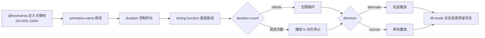

# 06 · 关键帧动画（@keyframes Animations）

> 用 `@keyframes` 定义动画的多个中间状态，再用 `animation` 系列属性驱动元素自动、循环、往返地播放，无需 JavaScript 或交互触发。

## 📖 知识讲解

CSS 动画分两步：**先用 `@keyframes` 定义关键帧，再用 `animation` 把它绑到元素上。**

**定义关键帧**（`from/to` 或百分比）：

```css
@keyframes pulse {
  0%   { transform: scale(0.85); }
  70%  { transform: scale(1.1); }
  100% { transform: scale(0.85); }
}
```

**animation 子属性一览**：

| 属性 | 作用 |
| --- | --- |
| `animation-name` | 引用的 @keyframes 名称 |
| `animation-duration` | 一次播放时长，如 `2s` |
| `animation-timing-function` | 速度曲线：`linear` / `ease` / `cubic-bezier()` / `steps()` |
| `animation-delay` | 延迟开始 |
| `animation-iteration-count` | 播放次数，`infinite` 为无限 |
| `animation-direction` | `normal` / `reverse` / `alternate`（往返）|
| `animation-fill-mode` | `forwards`（停终态）/ `backwards` / `both` |
| `animation-play-state` | `running` / `paused`（暂停）|

**简写顺序**（常用记法）：

```css
animation: name duration timing-function delay iteration-count direction fill-mode;
/* 例： */
animation: spin 0.9s linear 0s infinite normal none;
```

**`steps(n)`** 把动画切成 n 段离散跳变，常用于打字机、逐帧精灵图。

## 🔄 流程图 / 原理图



## 💻 代码说明

`index.html` 并排展示 4 个动画，并用一个按钮统一控制 `play-state`：

1. **脉冲呼吸 pulse**：`scale` + 扩散 `box-shadow`，`ease-in-out infinite`。
2. **加载 Spinner**：`rotate(360deg)`，`linear infinite` 匀速无限旋转。
3. **弹跳 bounce**：`translateY` 上下，`infinite alternate` 往返，`cubic-bezier` 模拟重力。
4. **steps() 打字机**：`@keyframes typing` 让 `width` 从 0 到 `11ch`，配 `steps(11)` 逐字符显现，另一条 `blink` 动画让右边框光标闪烁。

暂停逻辑：给容器 `.grid` 切换 `paused` 类，CSS 中统一对内部动画元素设 `animation-play-state: paused`，一键暂停/继续全部动画。

## ▶️ 运行方式

免构建：直接用浏览器打开 `index.html` 即可。

```bash
open 06-animations-keyframes/index.html   # macOS
```

## ⚠️ 常见坑 / 最佳实践

- **fill-mode: forwards 保留终态**：默认动画结束后元素会跳回初始样式，需要停在最后一帧时务必加 `forwards`。
- **简写顺序里的两个时间值**：`animation` 简写中，第一个时间是 `duration`，第二个时间是 `delay`，顺序不能错。
- **iteration-count: infinite**：拼写要完整，常见把无限循环写漏导致只播一次。
- **与 transition 的区别**：transition 需要状态变化（如 hover）触发、只能从 A 到 B 一段；animation 可自动播放、无限循环、定义多个关键帧。
- **性能优先 transform / opacity**：动画属性尽量选这两者，走 GPU 合成不触发回流；动 `width/top` 等会引起重排。
- **steps() 的 n 要对齐**：打字机的 `steps(n)` 应等于字符数，否则会出现半个字符跳变。
- 尊重用户偏好：可用 `@media (prefers-reduced-motion: reduce)` 为晕动症用户关闭动画。

## 🔗 官方文档

- MDN 使用 CSS 动画：https://developer.mozilla.org/zh-CN/docs/Web/CSS/CSS_animations/Using_CSS_animations
- MDN @keyframes：https://developer.mozilla.org/zh-CN/docs/Web/CSS/@keyframes
- MDN animation：https://developer.mozilla.org/zh-CN/docs/Web/CSS/animation
