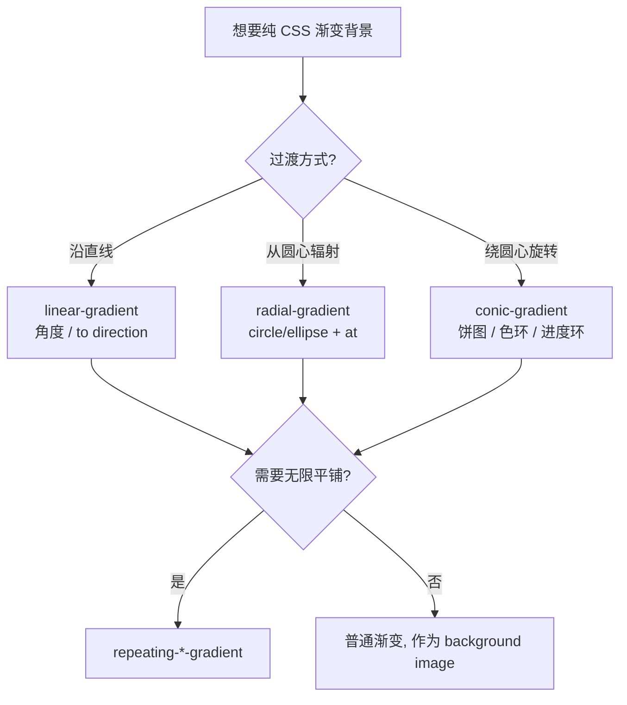

# 07 · 渐变（Gradients）
> 用纯 CSS 生成多色平滑过渡的「图像」，无需图片即可做出色卡、条纹、饼图、进度环等视觉效果。

## 📖 知识讲解

渐变（gradient）在 CSS 中本质是一种 `<image>` 类型的值，因此它只能出现在接受图像的属性里，最常见的是 `background` / `background-image`，而**不能**直接写在 `color` 上。

CSS 提供三大类渐变，每类又有「重复版」：

| 函数 | 说明 | 典型用途 |
| --- | --- | --- |
| `linear-gradient()` | 沿一条直线方向过渡 | 背景、按钮、条纹 |
| `radial-gradient()` | 从圆心向外辐射 | 高光球、聚光、晕影 |
| `conic-gradient()` | 颜色绕圆心旋转 | 饼图、色环、进度环 |
| `repeating-*-gradient()` | 把图案无限平铺 | 斑马纹、靶心、扇区 |

**1）线性渐变 linear-gradient**

```css
background: linear-gradient(45deg, #f472b6, #fb7185);   /* 角度方向 */
background: linear-gradient(to right, #06b6d4, #6366f1); /* 关键字方向 */
```

- 角度 `0deg` 指向**上方**，顺时针增大：`90deg` 向右、`180deg` 向下。
- 方向关键字 `to right`、`to bottom right` 等更语义化。
- **色标（color stop）** 可带位置：`#facc15 0%, #f97316 40%, #ef4444 100%`。
- **硬边 trick**：让相邻色标位置相同，颜色就会突变形成条纹：
  ```css
  linear-gradient(90deg, #22d3ee 0 25%, #a78bfa 25% 50%, ...);
  ```

**2）径向渐变 radial-gradient**

```css
background: radial-gradient(circle at top left, #f9a8d4, #7c3aed);
```

- 形状：`circle`（正圆）或 `ellipse`（椭圆，默认）。
- `at <位置>` 指定圆心，如 `at center`、`at 30% 30%`。
- 大小关键字：`closest-side`、`farthest-corner`（默认）等。

**3）圆锥渐变 conic-gradient**

```css
background: conic-gradient(red, yellow, lime, aqua, blue, magenta, red); /* 色环 */
background: conic-gradient(#ef4444 0 40%, #facc15 40% 70%, #22c55e 70% 100%); /* 饼图 */
```

- 角度从顶部开始顺时针。可用 `from <角度>` 设置起始角、`at <位置>` 设置中心。
- 配合硬边可直接画**饼图**；配合 `::before` 挖空可做**进度环**。

**4）重复渐变 repeating-***

把一段色标定义的图案沿方向无限重复，常用于条纹/靶心/扇区：
```css
repeating-linear-gradient(45deg, #1f2937 0 12px, #334155 12px 24px);
```

## 🔄 流程图 / 原理图



## 💻 代码说明

`index.html` 中的关键演示：

- **色卡网格**：用 `.lg-*` / `.rg-*` / `.cg-*` / `.rep-*` 类分别展示三类渐变及重复版，硬边条纹用相同百分比制造突变。
- **进度环**：`.ring` 用 `conic-gradient(#34d399 calc(var(--p)*1%), #334155 0)` 画进度，`::before { inset:18px }` 挖空中心成环；JS 把滑块值写入 CSS 变量 `--p`。
- **实时角度**：滑块把 `--ang` 写入 `linear-gradient(var(--ang), ...)`，直观感受 0° 朝上、顺时针的角度规则。
- **标题渐变文字**：用 `background-clip: text` + `color: transparent` 让文字本身呈现渐变。

## ▶️ 运行方式

免构建：直接用浏览器打开 `index.html` 即可。拖动两个滑块查看进度环与渐变角度的实时变化。

## ⚠️ 常见坑 / 最佳实践

- **渐变是图像不是颜色**：只能用于 `background`/`background-image` 等接受 `<image>` 的属性，不能赋给 `color`、`border-color`。
- **角度方向**：`0deg` 朝上、顺时针；很多人误以为从右开始或逆时针。
- **硬边条纹**：靠「相邻色标位置相同」实现，而不是加 `step()`。
- **透明发灰问题**：直接用 `transparent` 做渐变末端，在部分浏览器会过渡出灰边（因为 `transparent` 等价于 `rgba(0,0,0,0)`）。应使用**同色 0 透明度**，如从 `#38bdf8` 渐隐写成 `rgba(56,189,248,0)` 而非 `transparent`。
- **性能**：超大面积重复渐变 + 动画可能较吃性能，必要时改用 `background-position` 动画而非每帧重算渐变。

## 🔗 官方文档

- MDN 渐变总览：https://developer.mozilla.org/zh-CN/docs/Web/CSS/gradient
- linear-gradient：https://developer.mozilla.org/zh-CN/docs/Web/CSS/gradient/linear-gradient
- conic-gradient：https://developer.mozilla.org/zh-CN/docs/Web/CSS/gradient/conic-gradient
