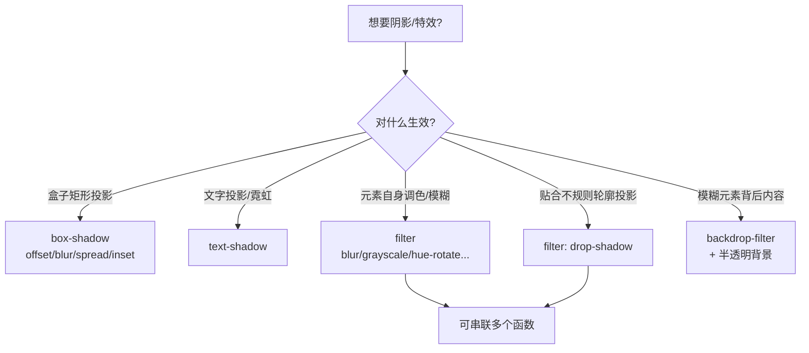

# 08 · 阴影与滤镜（Shadow & Filter）
> 用 box-shadow / text-shadow 制造立体层次，用 filter / backdrop-filter 做模糊、调色与毛玻璃等视觉特效。

## 📖 知识讲解

**1）box-shadow 盒阴影**

```css
box-shadow: offset-x offset-y blur-radius spread-radius color [inset];
```

- `offset-x / offset-y`：阴影水平 / 垂直偏移。
- `blur-radius`：模糊半径，越大越柔。
- `spread-radius`：**扩张半径**，正值让阴影整体变大、负值收缩（常用于做描边或收紧投影）。
- `inset`：变为**内阴影**（凹陷效果）。
- 多层阴影用逗号分隔，叠加多层小阴影通常比单层更自然柔和。

**2）text-shadow 文字阴影**

```css
text-shadow: x y blur color;
```
没有 `spread`/`inset`，但同样支持多层叠加，可做霓虹光晕、3D 立体字。

**3）filter 滤镜**

对**元素自身**（含内容）做图像处理，多个函数可串联：

| 函数 | 作用 |
| --- | --- |
| `blur(px)` | 高斯模糊 |
| `brightness(n)` | 亮度，1 为原始 |
| `contrast(n)` | 对比度 |
| `grayscale(n)` | 灰度，1 全灰 |
| `sepia(n)` | 怀旧棕褐 |
| `hue-rotate(deg)` | 色相旋转 |
| `invert(n)` | 反色 |
| `saturate(n)` | 饱和度 |
| `drop-shadow(x y blur color)` | 投影（贴合轮廓） |

**4）drop-shadow vs box-shadow**

`box-shadow` 永远沿元素的**矩形边框**画影子；而 `filter: drop-shadow()` 会沿元素**实际可见轮廓**（含 `clip-path` 切出的形状、透明 PNG 的非透明区域）投影。做不规则图标阴影时必须用 `drop-shadow`。

**5）backdrop-filter 毛玻璃**

对元素**背后**的内容应用滤镜（最常用 `blur`），实现 Glassmorphism 毛玻璃。
```css
background: rgba(255,255,255,.18);   /* 必须半透明，否则看不到背后 */
backdrop-filter: blur(12px) saturate(1.4);
```

## 🔄 流程图 / 原理图



## 💻 代码说明

`index.html` 中：

- **box-shadow 四态**：`.bs-basic` 基础投影、`.bs-spread` 用 spread 做描边、`.bs-inset` 内阴影、`.bs-multi` 三层叠加柔和投影。
- **悬浮卡片** `.hover-card`：`transition` + `:hover` 同时改变 `transform: translateY(-8px)` 与更大的 `box-shadow`，产生「浮起」效果。
- **text-shadow**：`.ts-neon` 三层同色光晕做霓虹，`.ts-3d` 多层 1px 递进做立体字。
- **filter 对比墙**：同一张 CSS 渐变「图」应用 8 种滤镜并排对比。
- **drop-shadow vs box-shadow**：用 `clip-path` 切出五角星，左边 `box-shadow` 只描矩形，右边 `drop-shadow` 贴合星形轮廓。
- **毛玻璃**：`.glass` 用 `rgba(255,255,255,.18)` 半透明背景 + `backdrop-filter: blur(12px)`，叠在彩色斑点背景上。

## ▶️ 运行方式

免构建：直接用浏览器打开 `index.html`。把鼠标悬停到「悬浮卡片」上观察阴影变化，对比五角星两种阴影与毛玻璃效果。

## ⚠️ 常见坑 / 最佳实践

- **spread 与 inset 易混**：`spread` 控制阴影大小（第 4 个长度值），`inset` 是关键字让阴影向内。
- **不规则形状要用 drop-shadow**：透明 PNG 图标、`clip-path` 形状用 `box-shadow` 会出现「方框影子」，必须改用 `filter: drop-shadow()`。
- **filter 会创建层叠上下文**：给父元素加 `filter` 会影响 `z-index`、`position: fixed` 子元素的定位行为，并可能触发额外合成层影响性能。
- **backdrop-filter 必须半透明背景**：背景若不透明就看不到背后内容；同时它兼容性较弱，记得加 `-webkit-` 前缀并提供降级方案。
- **性能**：大面积 `blur` / 频繁动画的 filter 较吃 GPU，移动端慎用。

## 🔗 官方文档

- filter：https://developer.mozilla.org/zh-CN/docs/Web/CSS/filter
- box-shadow：https://developer.mozilla.org/zh-CN/docs/Web/CSS/box-shadow
- backdrop-filter：https://developer.mozilla.org/zh-CN/docs/Web/CSS/backdrop-filter
