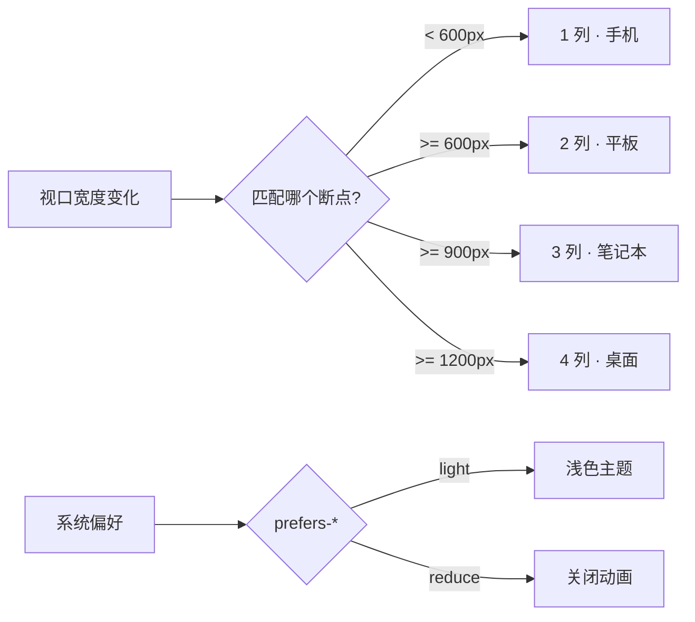

# 09 · 媒体查询与响应式（Media Queries）
> 用 @media 根据视口宽度、设备方向、用户偏好等条件应用不同样式，让同一套页面在手机、平板、桌面上都好用。

## 📖 知识讲解

**1）基本语法**

```css
@media (min-width: 600px) { /* 视口 >= 600px 时生效 */ }
@media (max-width: 599px) { /* 视口 <= 599px 时生效 */ }
@media (min-width: 600px) and (max-width: 900px) { /* 区间 */ }
```

现代浏览器还支持**范围语法**，更直观：
```css
@media (width >= 600px) { ... }
@media (400px <= width <= 900px) { ... }
```

**2）移动优先 min-width 策略**

推荐**先写小屏（手机）基础样式**，再用 `min-width` 逐级「向上增强」：

```css
/* 默认：手机，1 列 */
.cards { grid-template-columns: 1fr; }
@media (min-width: 600px)  { .cards { grid-template-columns: repeat(2,1fr); } } /* 平板 */
@media (min-width: 900px)  { .cards { grid-template-columns: repeat(3,1fr); } } /* 笔记本 */
@media (min-width: 1200px) { .cards { grid-template-columns: repeat(4,1fr); } } /* 桌面 */
```

好处：基础样式最简单、覆盖关系单向叠加、易维护；比从大屏往下用 `max-width` 减更不易出错。

**3）常用媒体特性**

| 特性 | 含义 |
| --- | --- |
| `min-width` / `max-width` | 视口宽度阈值 |
| `orientation` | `portrait` 竖屏 / `landscape` 横屏 |
| `prefers-color-scheme` | 系统深 / 浅色偏好 |
| `prefers-reduced-motion` | 用户是否要求减少动画 |
| `hover` / `pointer` | 设备是否支持悬停、指针精度（区分触屏/鼠标） |

**4）viewport meta**

响应式的前提，必须放在 `<head>`：
```html
<meta name="viewport" content="width=device-width, initial-scale=1.0" />
```
没有它，移动端会以约 980px 的「桌面宽度」渲染再整体缩小，媒体查询断点失效。

**5）配合弹性单位**

媒体查询负责「分段切换布局」，段内的平滑伸缩交给 `flex` / `grid` / 百分比 / `rem`，两者配合才完整。

## 🔄 流程图 / 原理图



## 💻 代码说明

`index.html` 全程**无 JavaScript**，纯 CSS 驱动：

- 定义 CSS 变量 `--bp-name`（断点名）、`--bp-color`（主题色）、`--cols`（列数），默认值对应手机。
- 三个 `min-width` 断点（600 / 900 / 1200px）依次覆盖这三个变量。
- 指示牌用 `.badge::after { content: "当前断点：" var(--bp-name); }` 把变量直接显示成文字；卡片用 `grid-template-columns: repeat(var(--cols), 1fr)` 联动列数与 `--bp-color` 联动配色。
- `@media (prefers-color-scheme: light)` 整体切换浅色主题；`@media (prefers-reduced-motion: reduce)` 关闭所有 `transition`。

## ▶️ 运行方式

免构建：直接用浏览器打开 `index.html`，然后**拖动窗口边缘改变宽度**，观察指示牌文字 / 颜色与卡片列数随断点切换。把系统外观切到「浅色」可看到暗色模式联动。

## ⚠️ 常见坑 / 最佳实践

- **忘记 viewport meta**：移动端不缩放、断点失效，是新手最常见的坑。
- **优先移动优先**：用 `min-width` 单向增强比 `max-width` 逐级覆盖更易维护。
- **边界重叠**：`max-width: 600px` 与 `min-width: 600px` 在恰好 600px 时会**同时命中**，造成样式打架。用移动优先（只用 min-width）或让上界用 `599.98px` / 范围语法 `width < 600px` 避免重叠。
- **按内容定断点，而非设备**：不要硬编码 iPhone/iPad 的具体像素，应在「布局开始变丑 / 文字被挤换行」时设断点（逻辑断点）。
- **尊重用户偏好**：用 `prefers-reduced-motion` 关闭非必要动画，用 `prefers-color-scheme` 跟随系统主题，提升可访问性。

## 🔗 官方文档

- 使用媒体查询：https://developer.mozilla.org/zh-CN/docs/Web/CSS/CSS_media_queries/Using_media_queries
- @media 规则：https://developer.mozilla.org/zh-CN/docs/Web/CSS/@media
- viewport meta：https://developer.mozilla.org/zh-CN/docs/Web/HTML/Guides/Viewport_meta_element
