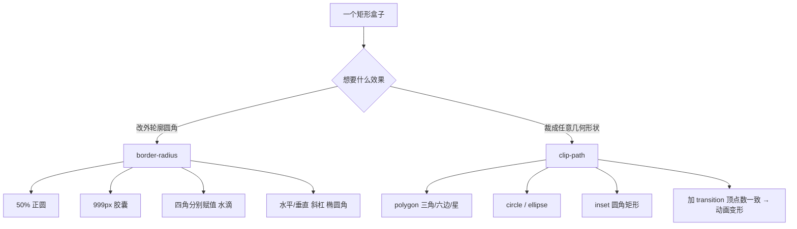

# 10 · 圆角与裁剪（Border-radius & clip-path）
> 用 border-radius 给盒子做圆角（圆、胶囊、水滴），用 clip-path 把盒子裁成三角、六边形、五角星、箭头、对话框等任意几何形状，并能用 transition 让裁剪动起来。

## 📖 知识讲解

### border-radius
- **四角简写**：`border-radius: 左上 右上 右下 左下`（顺时针）。给一个值则四角统一。
- **水平/垂直半径（elliptical）**：用斜杠分隔，`border-radius: 水平半径 / 垂直半径`，例如 `60px / 30px` 得到椭圆角。
- **做正圆**：宽高相等的盒子 + `border-radius: 50%`。
- **做胶囊（pill）**：`border-radius: 999px`（任意远大于高度一半的值），两端自动变成半圆。
- **做水滴/不规则**：四角分别给值，如 `50% 50% 50% 0` 让其中一角保持直角。
- **百分比**：水平方向的半径相对盒子**宽度**，垂直方向的半径相对盒子**高度**，两个方向各自计算。

### clip-path
把元素按指定路径裁剪，只显示路径内部，外部既不可见也**不响应鼠标事件**。常用函数：
- `polygon(x1 y1, x2 y2, …)`：多边形，列出每个顶点坐标（可用 % 或长度）。三角形 3 点、六边形 6 点、五角星 10 点。
- `circle(半径 at 圆心)`：圆形裁剪，如 `circle(50% at 50% 50%)`。
- `ellipse(rx ry at cx cy)`：椭圆裁剪。
- `inset(上 右 下 左 round 圆角)`：从四边向内裁出矩形，可带圆角。

### 动画化 clip-path
对 `clip-path` 加 `transition`，并保证**动画起止两端的顶点数量一致**，浏览器才能逐顶点插值出平滑形变。

## 🔄 流程图 / 原理图

## 💻 代码说明
- `index.html` 分四个演示区：
  1. **border-radius 形态**：circle / pill / drop / ellipse 四个盒子并排。
  2. **clip-path 形状**：六边形、三角、五角星用 `polygon()`；对话框用「圆角矩形 + 伪元素 `::after` 小三角」组合。
  3. **clip-path 动画**：`.morph` 默认六边形，`:hover` 变矩形，两端都是 6 个顶点，配 `transition: clip-path .5s`。
  4. **交互滑块**：JS 监听 range，实时把值写入 `box.style.borderRadius`，直观感受 0→50% 的变化。
- 所有盒子用线性渐变背景，方便看清被裁剪后的真实轮廓。

## ▶️ 运行方式
免构建：直接用浏览器打开 `index.html` 即可看到全部效果，拖动滑块、把鼠标悬停到「hover 我」盒子上体验动画。

## ⚠️ 常见坑 / 最佳实践
- **border-radius 百分比是分方向的**：水平半径相对宽度、垂直半径相对高度，非正方形时两方向数值不同属正常。
- **clip-path 裁掉的区域不响应事件**：裁成三角后，原矩形四角空白处点击不会触发该元素，做按钮时要注意热区。
- **clip-path 动画要求顶点数一致**：六边形(6点) ⇄ 矩形必须把矩形也写成 6 个点，否则不会平滑过渡，会瞬间跳变。
- **shape-outside 与 clip-path 区别**：`clip-path` 改变元素**可见 + 可点击区域**（视觉裁剪）；`shape-outside` 只改变**周围浮动文字的环绕轮廓**，不裁剪元素本身、也只在 `float` 元素上生效。两者常配合使用。
- 复杂多边形可用在线工具（如 Clippy）生成 `polygon()` 坐标，避免手算。

## 🔗 官方文档
- MDN clip-path：https://developer.mozilla.org/zh-CN/docs/Web/CSS/clip-path
- MDN border-radius：https://developer.mozilla.org/zh-CN/docs/Web/CSS/border-radius
