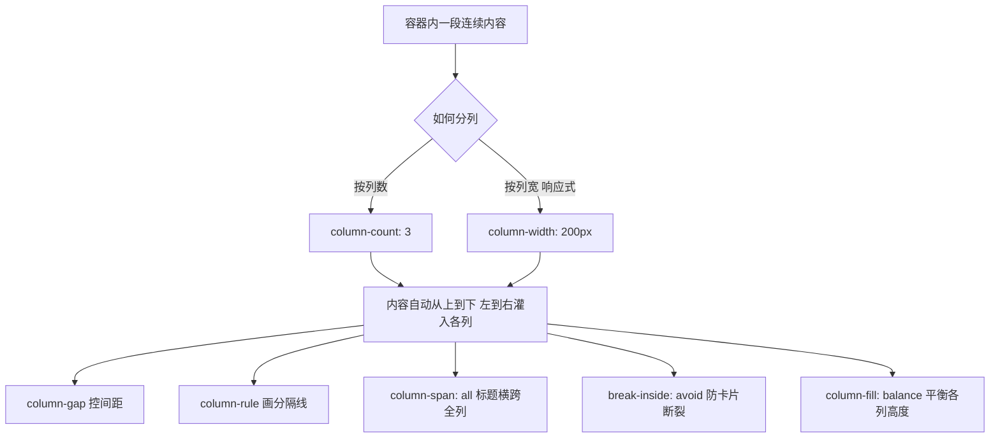

# 11 · 多列布局（Multi-column Layout）
> 用极少的 CSS 把一段连续文本自动分成多列（报纸/杂志式排版），并控制列数、列宽、列间距、分隔线、横跨标题与防止元素断裂。

## 📖 知识讲解

多列布局是 CSS 专为**连续文本流**设计的排版模块，浏览器会自动把内容从上到下、从左到右灌入各列。

### 核心属性
- **`column-count`**：固定列数，如 `column-count: 3` 分三列。
- **`column-width`**：每列理想宽度，浏览器按容器宽度尽量多放列，更具响应式。
- **`columns`**：简写，`columns: <width> <count>`，例如 `columns: 200px 3`。
- **`column-gap`**：列间距，默认约 `1em`。
- **`column-rule`**：列间分隔线，写法同 `border`，如 `2px dashed gray`（注意它占据 gap 内，不增加额外宽度）。
- **`column-span`**：`all` 让元素横跨**所有列**，常用于大标题；`none` 为默认。
- **`break-inside: avoid`**：禁止元素（如卡片）内部被分列断开，保持整体完整。
- **`column-fill`**：`balance`（默认）尽量平衡各列高度；`auto` 则依次填满。

## 🔄 流程图 / 原理图

## 💻 代码说明
- **报纸区**：容器 `.newspaper` 设 `column-count:3` + `column-gap:32px` + `column-rule:2px dashed`；大标题 `.span-all` 用 `column-span:all` 横跨三列；首段用 `::first-letter` 做首字下沉点缀。
- **卡片区**：容器 `.card-cols` 三列；绿色 `.card` 设 `break-inside:avoid`（含 `-webkit-` 前缀）保证整张不被切断；橙色 `.card.bad` 故意设 `break-inside:auto` 作对照，内容多时可能被列切断。

## ▶️ 运行方式
免构建：直接用浏览器打开 `index.html`。可缩放窗口宽度，观察列高自动平衡与卡片排布的变化。

## ⚠️ 常见坑 / 最佳实践
- **`column-span` 兼容性**：老旧浏览器（早期 Firefox）支持较晚，关键标题横跨需注意降级；现代浏览器已普遍支持。
- **卡片断裂**：多列默认允许元素跨列断开，给卡片/图片/段落统一加 `break-inside: avoid`（含 `-webkit-column-break-inside: avoid` 前缀）防止半张卡。
- **列高平衡**：`column-fill: balance` 是默认值，会让各列尽量等高；若想「填满一列再开下一列」用 `auto`（需配合固定高度才明显）。
- **适用场景区分**：多列适合**连续文本流**（文章正文、词条列表）；需要二维精确对齐的卡片网格、表单请用 **flex / grid**。多列里内容顺序是「先下后右」，不适合需要左右对齐的结构。
- 多列内不要放需要精确定位或全宽交互的复杂组件，容易被列规则打断。

## 🔗 官方文档
- MDN 使用多列布局：https://developer.mozilla.org/zh-CN/docs/Web/CSS/CSS_multicol_layout/Using_multicol_layouts
- MDN column-span：https://developer.mozilla.org/zh-CN/docs/Web/CSS/column-span
