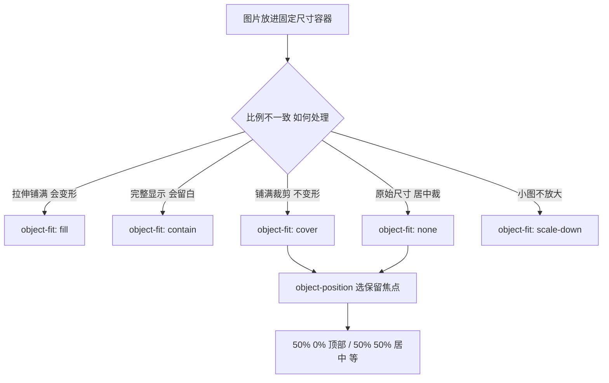

# 12 · 图片适配（object-fit & object-position）
> 让图片/视频在固定尺寸容器里优雅适配：object-fit 决定填充方式（填满/留白/裁剪），object-position 决定裁剪时保留哪块焦点区域。

## 📖 知识讲解

### object-fit（替换元素的内容适配）
作用于 ``、`<video>` 等**替换元素**，决定其内容如何填进自身盒子：
- **`fill`**（默认）：拉伸铺满整个盒子，**会变形**（不保持宽高比）。
- **`contain`**：完整显示整张图，保持比例，盒子比例不符时**留白**（letterbox）。
- **`cover`**：保持比例放大铺满，溢出部分**被裁剪**，不变形——最常用。
- **`none`**：保持图片**原始像素尺寸**，按 object-position 居中裁剪。
- **`scale-down`**：取 `none` 与 `contain` 中**较小**的结果（小图不放大、大图缩进来）。

### object-position
控制内容在盒子内的位置，默认 `50% 50%`（居中）。在 `cover`/`none` 裁剪时，它决定**保留哪一部分**（焦点），如 `object-position: 50% 0%` 保留顶部（人像常用，避免裁掉头）。

### aspect-ratio
给容器设 `aspect-ratio: 3 / 2` 锁定宽高比，配合 `object-fit` 才能稳定适配，避免容器塌陷。

### 与 background-size 对比
| | object-fit | background-size |
|---|---|---|
| 作用对象 | 替换元素 `/<video>`（真实 DOM 元素） | 任意元素的 `background-image` |
| 语义/SEO | 是文档内容，利于无障碍/SEO | 纯装饰背景 |
| 取舍 | 内容性图片（产品图、头像）优先 | 纯装饰、需多层背景时用 |

## 🔄 流程图 / 原理图

## 💻 代码说明
- **对比区**：5 个 `.frame` 容器尺寸完全相同（`aspect-ratio:3/2`），各放同一张图，分别加 `object-fit: fill/contain/cover/none/scale-down`。容器用棋盘渐变底，`contain` 留白时能看见底纹。
- **焦点区**：`.pos-frame` 用 `object-fit:cover`，JS 监听两个 range 滑块，实时改 `img.style.objectPosition`，并加 `transition` 让焦点平移更顺滑。
- 图片用 `https://picsum.photos` 在线占位图。

## ▶️ 运行方式
免构建：直接用浏览器打开 `index.html`。拖动第二区的 X/Y 滑块，观察 cover 裁剪焦点的移动。
> 离线说明：演示用的是 picsum.photos 在线图片，**无网络时图片不显示属正常**，容器边框与棋盘底仍能体现布局。

## ⚠️ 常见坑 / 最佳实践
- **只对替换元素有效**：`object-fit` 作用于 `/<video>` 等，对普通 `
` **无效**（div 要用 `background-size`）。
- **容器必须有确定宽高**：容器没有固定尺寸或 `aspect-ratio` 时，`object-fit` 没有可填充的盒子，效果不明显甚至塌陷。
- **cover 裁剪 vs contain 留白**：要铺满不留白选 `cover`（接受裁剪）；要看到完整内容选 `contain`（接受留白）。二选一是必然取舍。
- **裁剪焦点**：人像/重点在某侧时，用 `object-position`（如 `50% 20%`）避免 `cover` 裁掉关键部位。
- **与 background-size:cover 取舍**：内容性图片（SEO、无障碍、可右键保存）用 `+object-fit`；纯装饰、需多重背景叠加用 `background`。

## 🔗 官方文档
- MDN object-fit：https://developer.mozilla.org/zh-CN/docs/Web/CSS/object-fit
- MDN object-position：https://developer.mozilla.org/zh-CN/docs/Web/CSS/object-position
