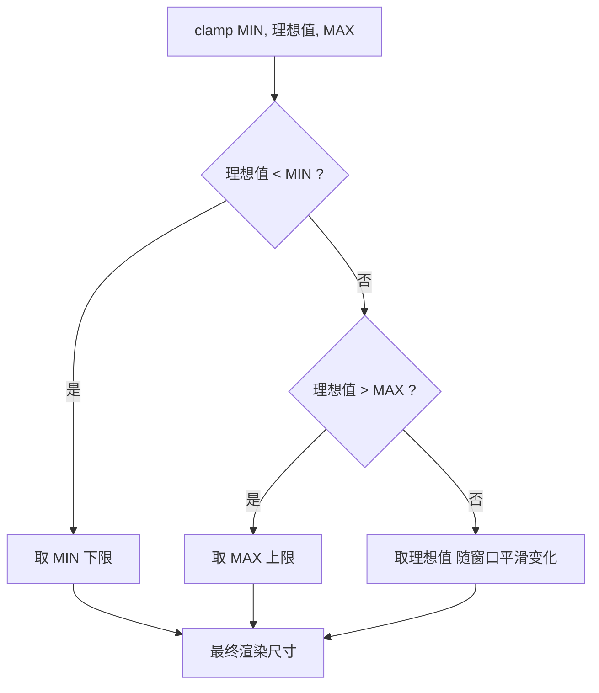

# 13 · 计算函数（calc / min / max / clamp）
> CSS 里的"数学函数"，让尺寸能混合单位做运算、设上下限、随视口流式缩放，写出真正响应式的布局与字号。

## 📖 知识讲解

CSS 提供了一组数学函数，可以在任何接受 `<length>`、`<number>`、`<angle>` 等数值的属性里直接做运算：

### calc()
在一个表达式里混合不同单位运算，是它最大的价值（`%`、`px`、`rem`、`vw` 等可以混着算）。
```css
width: calc(100% - 40px);   /* 百分比 - 像素，普通写法做不到 */
height: calc(100vh - 64px); /* 视口高减去固定导航栏 */
```
- 支持 `+ - * /` 四则运算。
- **加号、减号两侧必须各有一个空格**：`calc(100% - 40px)` 正确，`calc(100%-40px)` 失效。
- 乘除法只能有一侧是纯数字：`calc(100% / 3)`、`calc(2 * 10px)` 可以；`calc(50% * 50%)` 非法。

### min() / max()
传入一组值，分别取最小值 / 最大值。注意语义"反直觉"：
```css
width: min(90%, 320px);  /* 取较小者 → 等价于"最大不超过 320px" */
width: max(50%, 200px);  /* 取较大者 → 等价于"最小不低于 200px" */
```
记忆法：`min()` 选最小值，所以它实际充当**上限**；`max()` 选最大值，充当**下限**。

### clamp(MIN, 理想值, MAX)
一行搞定"夹在区间内的流式值"，等价于 `max(MIN, min(理想值, MAX))`：
```css
font-size: clamp(1rem, 2.5vw + 0.5rem, 2rem);
```
- `MIN` 下限，`MAX` 上限，中间是"理想值"。
- 中间值常用 `vw`（视口宽度百分比）实现随窗口平滑变化，最典型的就是流式字号 / 间距。

### 配合 var() 与嵌套
这些函数可以互相嵌套，也可以读取 CSS 变量，做出可调的布局系统：
```css
gap: calc(var(--gap) * 1px);
grid-template-columns: repeat(var(--cols), 1fr);
font-size: clamp(1rem, calc(0.8rem + 1vw), 1.5rem);
```

## 🔄 流程图 / 原理图



## 💻 代码说明

`index.html` 包含四个演示：
1. **calc(100% - 40px)**：容器宽度始终比父级少 40px，缩放窗口保持左右留白。
2. **clamp 流式字号**：标题字号 `clamp(1rem, 2.5vw + 0.5rem, 2rem)`，JS 用 `getComputedStyle` 实时读出最终像素值，拖动窗口可见它在 16~32px 间平滑变化并在边界卡住。
3. **range 滑块 + 变量 + calc**：滑块用 `style.setProperty('--cols', ...)` 改写 CSS 变量，网格通过 `repeat(var(--cols), 1fr)` 与 `gap: var(--gap)` 立即重排。
4. **min() / max() 对比**：两个盒子分别用 `min(90%, 320px)` 与 `max(50%, 200px)`，直观体会两者的"上限 / 下限"语义。

## ▶️ 运行方式

免构建：直接用浏览器打开 `index.html` 即可。建议拖动浏览器窗口宽度，观察字号与布局的实时变化。

## ⚠️ 常见坑 / 最佳实践

- **运算符空格**：`calc()` 中 `+` 和 `-` 两侧必须各留一个空格，否则整条声明失效（这是最常见的 bug）。
- **乘除限制**：`*` 和 `/` 至少一侧是纯数字，`/` 的右侧必须是数字。
- **min/max 语义**：别被名字骗了——`min()` 是上限、`max()` 是下限。
- **clamp 中间用 vw**：要实现"随窗口流式"必须让中间值含视口单位（如 `vw`），否则就是个固定值。
- **可访问性**：用 `vw` 做字号时建议加上 `rem` 部分（如 `2.5vw + 0.5rem`），保证用户缩放页面时字号仍能放大。
- **嵌套可读性**：`calc()` 内可嵌 `var()`，但层层嵌套会降低可读性，复杂时拆成多个变量。

## 🔗 官方文档

- MDN calc()：https://developer.mozilla.org/zh-CN/docs/Web/CSS/calc
- MDN clamp()：https://developer.mozilla.org/zh-CN/docs/Web/CSS/clamp
- MDN min()：https://developer.mozilla.org/zh-CN/docs/Web/CSS/min
- MDN max()：https://developer.mozilla.org/zh-CN/docs/Web/CSS/max
