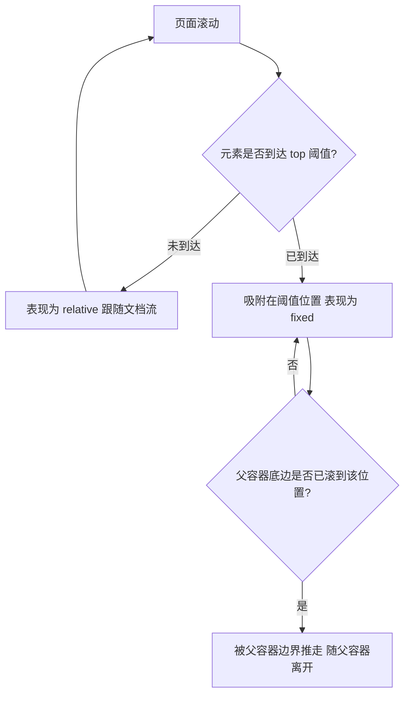

# 14 · 粘性定位（Position Sticky）
> 一种"半固定"定位：元素在滚动到设定阈值前像 relative 一样正常排版，到达阈值后像 fixed 一样吸附在那里，常用于吸顶标题与跟随侧边栏。

## 📖 知识讲解

`position: sticky` 是 `relative` 与 `fixed` 的混合体：

- **阈值之前**：表现得和 `position: relative` 完全一样，跟着文档流走。
- **到达阈值后**：被"粘"在指定位置（像 `fixed`），但不脱离文档流、不会让后续内容跳动。
- **父容器约束**：sticky 元素只能在它**父容器的范围内**吸附；当父容器整体滚出视口，sticky 元素也会被带走（这点和 fixed 完全不同）。

### 必备条件

1. **必须指定 `top` / `bottom` / `left` / `right` 至少一个**作为吸附阈值。只写 `position: sticky` 而不给阈值，等于没生效。
   ```css
   .title { position: sticky; top: 0; }   /* 吸到滚动容器顶部 */
   ```
2. **相对最近的"滚动祖先"定位**：它寻找最近的可滚动祖先（设置了 `overflow: auto/scroll/hidden` 的祖先，或视口）作为参照。

### 典型场景

- **分组列表吸顶**：通讯录 A/B/C 分组标题，滚动时当前分组标题吸在顶部，下一组标题把它顶走。
- **跟随侧边栏**：内容很长时，侧边导航 `top: 24px` 随滚动停在视口上方。
- **表格表头吸顶**：`thead th { position: sticky; top: 0; }`。

## 🔄 流程图 / 原理图



## 💻 代码说明

`index.html` 含两个演示：

1. **sticky 侧边栏**：`.sidebar { position: sticky; top: 24px; }`，整页向下滚动时停在距视口顶部 24px 处。在 grid 布局中加了 `align-self: start`，避免侧栏被拉伸到整列高度而失去吸附空间。
2. **通讯录分组吸顶**：`.contacts` 设 `height` + `overflow-y: auto` 形成**内部滚动容器**；每个 `.group-title` 设 `position: sticky; top: 0`，于是分组标题相对这个滚动容器吸顶，并用 `z-index: 2` 保证不被列表项遮挡。JS 动态生成 A~F 六组联系人数据。

## ▶️ 运行方式

免构建：直接用浏览器打开 `index.html`。整页向下滚动看侧边栏吸附；在右侧通讯录区域内部滚动看分组标题逐个吸顶 / 被顶走。

## ⚠️ 常见坑 / 最佳实践

- **祖先 overflow 导致失效**：如果某个祖先元素设了 `overflow: hidden`（或 `auto/scroll`），sticky 会以它为滚动容器；很多"sticky 不生效"其实是某个父级设了 `overflow: hidden` 把吸附范围限死了。排查时检查所有祖先的 overflow。
- **必须给阈值**：忘记写 `top/bottom/left/right` 是最常见的失效原因。
- **受父容器高度约束**：sticky 不会超出父容器；父容器太矮就几乎看不到吸附效果。
- **被遮挡**：吸顶标题要配合 `z-index` 抬高，否则会被后续内容盖住。
- **flex/grid 拉伸**：在 flex/grid 子项上用 sticky，注意 `align-self: start`，否则子项被拉满高度后没有可吸附的空间。
- **首个吸顶项间隙**：父容器的 `padding-top` 会让 `top: 0` 的元素与容器顶之间留缝，需要时把 padding 移到内部元素上。

## 🔗 官方文档

- MDN position（sticky 部分）：https://developer.mozilla.org/zh-CN/docs/Web/CSS/position#sticky_positioning
- MDN position：https://developer.mozilla.org/zh-CN/docs/Web/CSS/position
