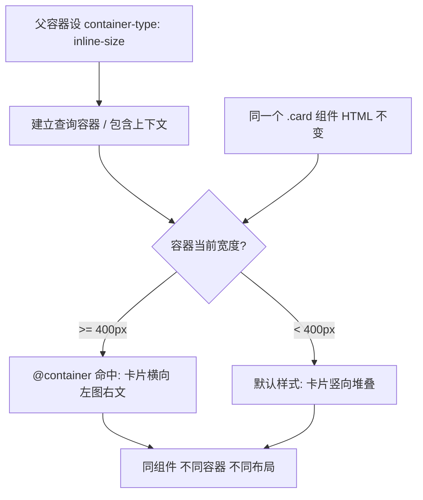

# 15 · 容器查询（Container Queries）
> 让样式根据"父容器的尺寸"而非"视口尺寸"来响应，从而让同一个组件在任何位置都能自适应、真正可复用。

## 📖 知识讲解

媒体查询 `@media` 看的是**视口**大小，但一个组件在页面上可能时而在宽的主区、时而在窄的侧栏，视口宽度并不能代表它真正可用的空间。**容器查询**解决了这个问题：组件根据**所在容器**的尺寸调整自己。

### 第一步：声明查询容器

要让某个元素能被查询，必须先在它的**父级**上建立"查询容器"：

```css
.container {
  container-type: inline-size;  /* 按容器的内联尺寸（宽度）响应 */
}
```

`container-type` 取值：
- `inline-size`：只查询**内联方向尺寸**（横排时即宽度），最常用，性能好。
- `size`：同时查询宽和高（要求容器尺寸不依赖内容，否则可能循环）。
- `normal`：默认值，不作为尺寸查询容器（但仍可用于 `style()` 查询）。

### 第二步：命名容器（可选但推荐）

```css
.sidebar { container-type: inline-size; container-name: side; }
/* 简写：container: side / inline-size; */
```

### 第三步：写 @container 查询

```css
/* 匿名：就近匹配最近的查询容器 */
@container (min-width: 400px) { .card { grid-template-columns: 200px 1fr; } }

/* 命名：精确指定查询哪个容器 */
@container side (min-width: 300px) { /* ... */ }

/* 范围语法 */
@container (400px <= width <= 700px) { /* ... */ }
```

### 容器查询单位

相对于查询容器尺寸的单位，配合容器查询使用：

| 单位 | 含义 |
| --- | --- |
| `cqw` | 容器宽度的 1% |
| `cqh` | 容器高度的 1% |
| `cqi` | 容器内联尺寸的 1%（横排=宽度） |
| `cqb` | 容器块级尺寸的 1% |
| `cqmin` | cqi / cqb 中较小者 |
| `cqmax` | cqi / cqb 中较大者 |

例如 `font-size: 5cqi` 会让字号随容器宽度缩放。

## 🔄 流程图 / 原理图



## 💻 代码说明

`index.html` 含两个演示：

1. **同组件放进宽 / 窄两种容器**：`.wide` 和 `.narrow` 都设 `container-type: inline-size`，里面放**完全相同的 `.card` HTML**。`.card` 默认竖向（单列 grid），`@container (min-width: 400px)` 命中时变成 `200px 1fr` 的左图右文横向布局。于是宽容器里是横版、窄容器里是竖版，HTML 一字未改。
2. **range 滑块实时改容器宽度**：`#resizable` 是查询容器，JS 用 `box.style.width` 改它的宽度，越过 400px 阈值时卡片在横 / 竖布局间实时切换，旁边状态标签同步显示。缩略图高度用了容器单位 `40cqw` 随容器缩放。

## ▶️ 运行方式

免构建：直接用浏览器打开 `index.html`。对比左右两个容器内同一组件的不同布局，并拖动下方滑块实时触发布局切换。

## ⚠️ 常见坑 / 最佳实践

- **必须先建容器**：不在父级设 `container-type`，`@container` 永远不命中。查询的是**祖先**容器，元素不能查询自身。
- **包含上下文副作用**：设了 `container-type: inline-size` 会建立布局/尺寸包含上下文，可能改变子元素的百分比参照或让该容器的尺寸不再被内容撑开（用 `size` 时尤其注意循环依赖）。
- **优先 inline-size**：绝大多数场景用 `inline-size` 即可，比 `size` 安全、性能好。
- **命名更稳健**：嵌套多层容器时用 `container-name` 精确指定查询目标，避免就近匹配匹配错。
- **容器单位随容器缩放**：`cqi/cqw` 适合做容器内的流式字号 / 间距，但别忘了设可读下限。
- **兼容性**：主流浏览器自 2023 年起已普遍支持；面向老旧浏览器时配合 `@supports (container-type: inline-size)` 做降级。

## 🔗 官方文档

- MDN 容器查询：https://developer.mozilla.org/zh-CN/docs/Web/CSS/CSS_containment/Container_queries
- MDN container-type：https://developer.mozilla.org/zh-CN/docs/Web/CSS/container-type
- MDN @container：https://developer.mozilla.org/zh-CN/docs/Web/CSS/@container
