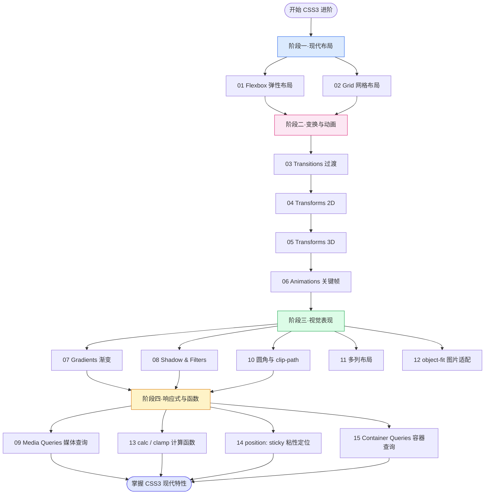
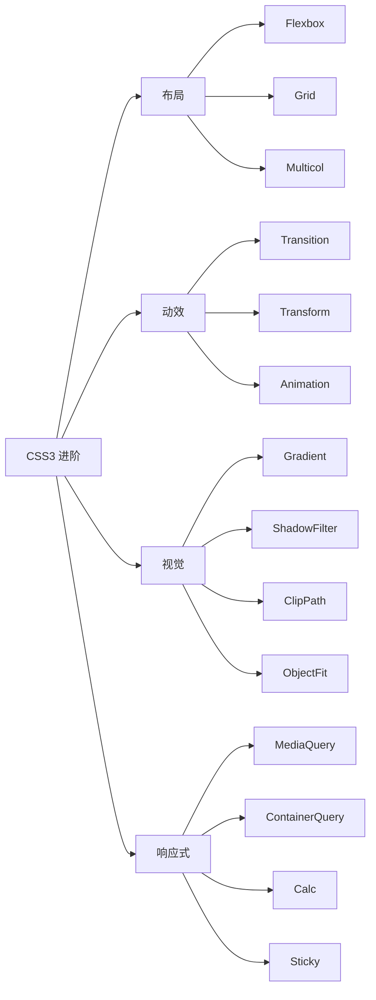

# 03 · CSS3 进阶（布局 / 动画 / 现代特性）

> CSS3 是 CSS 的现代化演进，带来了**强大的布局系统（Flexbox / Grid）**、**动画能力（transition / transform / animation）**、**丰富的视觉表现（渐变 / 阴影 / 滤镜 / 圆角裁剪）** 以及**响应式与组件化能力（媒体查询 / 容器查询 / calc / sticky）**。本工程聚焦 CSS3 新特性，避免与 `02-css` 基础语法重复，每个模块一个免构建 demo，浏览器直接打开即可看到效果。

> 说明：CSS3 并非单一版本号，而是对 CSS Level 3+ 一系列模块（Flexbox、Grid、Transitions、Animations、Transforms、Media Queries、Containment 等）的统称。本工程对照 MDN 整理，确保知识点不过时。

## 📚 模块索引

| 序号 | 模块 | 主题 | 核心知识点 |
| --- | --- | --- | --- |
| 01 | [flexbox](./01-flexbox/) | 弹性布局 | display:flex、主轴/交叉轴、justify-content、align-items、flex-grow/shrink/basis、gap |
| 02 | [grid](./02-grid/) | 网格布局 | grid-template-columns/rows、fr、repeat()、minmax()、areas、auto-fit/fill |
| 03 | [transitions](./03-transitions/) | 过渡动画 | transition-property/duration/timing-function/delay、缓动曲线、触发方式 |
| 04 | [transforms-2d](./04-transforms-2d/) | 2D 变换 | translate、rotate、scale、skew、transform-origin、变换组合顺序 |
| 05 | [transforms-3d](./05-transforms-3d/) | 3D 变换 | perspective、preserve-3d、rotateX/Y/Z、translateZ、backface-visibility |
| 06 | [animations-keyframes](./06-animations-keyframes/) | 关键帧动画 | @keyframes、iteration-count、direction、fill-mode、play-state、steps() |
| 07 | [gradients](./07-gradients/) | 渐变 | linear/radial/conic-gradient、色标、repeating 渐变、进度环/条纹 |
| 08 | [shadow-filters](./08-shadow-filters/) | 阴影与滤镜 | box-shadow、text-shadow、filter、backdrop-filter（毛玻璃） |
| 09 | [media-queries-responsive](./09-media-queries-responsive/) | 媒体查询/响应式 | @media、移动优先、断点、prefers-color-scheme、viewport |
| 10 | [border-radius-shapes](./10-border-radius-shapes/) | 圆角与裁剪 | border-radius、椭圆角、clip-path（polygon/circle/inset）、形状动画 |
| 11 | [multi-column](./11-multi-column/) | 多列布局 | column-count/width、column-gap/rule、column-span、break-inside |
| 12 | [object-fit-position](./12-object-fit-position/) | 图片适配 | object-fit（cover/contain…）、object-position、aspect-ratio |
| 13 | [calc-functions](./13-calc-functions/) | 计算函数 | calc()、min()、max()、clamp()、配合 CSS 变量做流式布局 |
| 14 | [position-sticky](./14-position-sticky/) | 粘性定位 | position:sticky、阈值 top/bottom、滚动祖先、吸顶效果 |
| 15 | [container-queries](./15-container-queries/) | 容器查询 | container-type、@container、cqi 单位、组件级响应式 |

## 🗺️ 学习路线

建议按"布局 → 变换与动画 → 视觉表现 → 响应式与函数"的顺序循序渐进。

### 知识体系一览

## ▶️ 运行说明

本工程全部为**免构建**，无需安装任何依赖：

1. 直接用浏览器（推荐 Chrome / Edge / Firefox / Safari 最新版）打开任意模块下的 `index.html` 即可看到可视化效果。
2. 多数 demo 含**交互控件**（按钮切换、range 滑块、hover 等），动手调节即可直观理解各属性。
3. 个别模块（如 `12-object-fit-position`）使用了在线占位图片（picsum.photos），离线环境下图片不显示属正常现象，不影响理解 object-fit 行为。
4. 阅读对应目录的 `README.md` 获取中文讲解、Mermaid 原理图、常见坑与 MDN 链接。

> 兼容性提示：`15-container-queries` 容器查询需要较新浏览器（2023 年后的主流版本均已支持）；`backdrop-filter`（毛玻璃）在部分浏览器需开启硬件加速。具体兼容性以各模块 README 与 [caniuse.com](https://caniuse.com) 为准。

## 🔗 参考文档

- [MDN · CSS](https://developer.mozilla.org/zh-CN/docs/Web/CSS)
- [MDN · Flexbox 基本概念](https://developer.mozilla.org/zh-CN/docs/Web/CSS/CSS_flexible_box_layout/Basic_concepts_of_flexbox)
- [MDN · Grid 基本概念](https://developer.mozilla.org/zh-CN/docs/Web/CSS/CSS_grid_layout/Basic_concepts_of_grid_layout)
- [MDN · 使用 CSS 过渡](https://developer.mozilla.org/zh-CN/docs/Web/CSS/CSS_transitions/Using_CSS_transitions)
- [MDN · 使用 CSS 动画](https://developer.mozilla.org/zh-CN/docs/Web/CSS/CSS_animations/Using_CSS_animations)
- [MDN · 使用 CSS 变换](https://developer.mozilla.org/zh-CN/docs/Web/CSS/CSS_transforms/Using_CSS_transforms)
- [MDN · 容器查询](https://developer.mozilla.org/zh-CN/docs/Web/CSS/CSS_containment/Container_queries)
