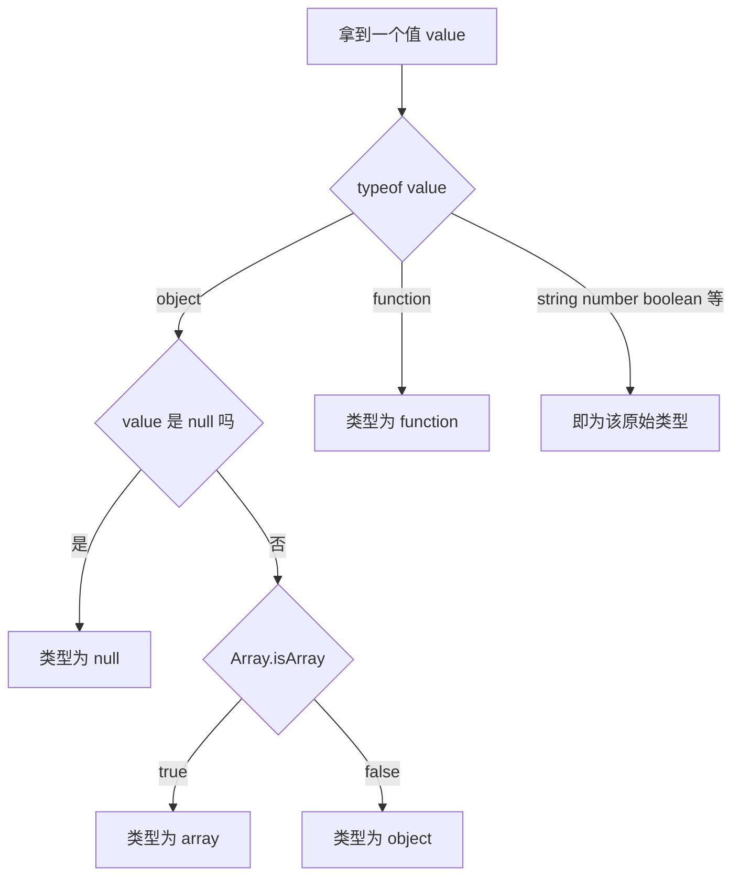

# 01 · 变量与数据类型（Variables & Types）

> 学习如何声明变量（var/let/const），以及 JavaScript 的 7 种原始类型 + object，并掌握用 typeof 和其他方式做类型判断。

## 📖 知识讲解

### 1. 变量声明：var / let / const

| 关键字 | 作用域 | 变量提升 | 重复声明 | 重新赋值 |
| ------ | ------ | -------- | -------- | -------- |
| `var` | 函数作用域 | 提升并初始化为 `undefined` | 允许 | 允许 |
| `let` | 块级作用域 | 提升但有暂时性死区(TDZ) | 不允许 | 允许 |
| `const` | 块级作用域 | 提升但有暂时性死区(TDZ) | 不允许 | 不允许（但对象内部可变） |

**最佳实践**：默认用 `const`，需要重新赋值才用 `let`，基本不用 `var`。

### 2. 数据类型

JavaScript 有 **7 种原始类型（primitive）**：

- `string` 字符串
- `number` 数字（整数和浮点统一）
- `boolean` 布尔
- `undefined` 声明未赋值
- `null` 表示"空"
- `symbol`（ES6）唯一标识
- `bigint`（ES2020）超大整数，结尾加 `n`

加上 1 种引用类型 **`object`**（包含数组、函数、日期等）。

### 3. typeof 运算符

返回类型字符串。核心易错点：

- `typeof null === 'object'`：历史遗留 bug，不是真的对象。
- `typeof []  === 'object'`：数组也是对象，区分要用 `Array.isArray`。
- `typeof function(){} === 'function'`：函数是唯一被特殊标记的对象。

### 4. 可靠的类型判断

- 数组：`Array.isArray(x)`
- `null`：`x === null`
- `NaN`：`Number.isNaN(x)`（注意 `NaN !== NaN`）
- 通用：`Object.prototype.toString.call(x)` 返回 `[object Type]`

## 🔄 流程图 / 原理图

## 💻 代码说明

- **作用域演示** `scopeDemo()`：`var a` 能在 if 块外访问，`let/const` 不能，证明块级作用域。
- **变量提升**：`typeof hoisted` 在声明前返回 `undefined`（var 被提升）；`let` 在声明前访问会报 TDZ 错误。
- **const 对象可变**：`obj.n = 2` 合法，改的是属性而非绑定。
- **typeof 表**：逐一打印各类型的 typeof 结果，重点观察 `null`、数组、函数。
- **typeOf() 工具函数**：用 `Object.prototype.toString.call()` 截取得到精确类型名，能区分 array/date/regexp。

## ▶️ 运行方式

- **浏览器**：直接双击打开 `index.html`，页面显示关键结果，按 F12 看控制台完整输出。
- **Node**：在本目录执行 `node demo.js`，终端打印全部结果。

## ⚠️ 常见坑 / 最佳实践

1. `typeof null` 返回 `'object'`，判断 null 必须用 `=== null`。
2. `NaN === NaN` 为 `false`，判断 NaN 用 `Number.isNaN`，不要用 `==`。
3. `const` 不是"常量不可变"，只是绑定不可重新赋值；对象/数组内部仍可改，需要冻结用 `Object.freeze`。
4. 不要用 `var`，它的函数作用域 + 提升容易制造隐藏 bug。
5. 区分数组用 `Array.isArray`，不要用 `typeof`。

## 🔗 官方文档

- [JavaScript 数据类型与数据结构 - MDN](https://developer.mozilla.org/zh-CN/docs/Web/JavaScript/Guide/Data_structures)
- [var - MDN](https://developer.mozilla.org/zh-CN/docs/Web/JavaScript/Reference/Statements/var)
- [let - MDN](https://developer.mozilla.org/zh-CN/docs/Web/JavaScript/Reference/Statements/let)
- [const - MDN](https://developer.mozilla.org/zh-CN/docs/Web/JavaScript/Reference/Statements/const)
- [typeof - MDN](https://developer.mozilla.org/zh-CN/docs/Web/JavaScript/Reference/Operators/typeof)
